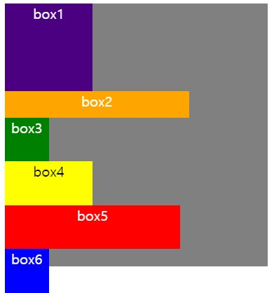
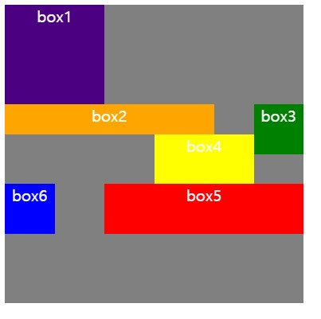

Float 요소끼리 배치되는 과정
===

float 요소들끼리 배치되는 상황일때<br> 박스크기가 남은라인의 크기보다 커서 다음 라인으로 밀려났을때, 다음 박스는 그전 박스가 밀려났었던 자리로 못간다.

---
## 예제1)


> 1. **box1,2**가 `float:left`이고 **box3**이` float:right`일때<br>
> 2. box2가 box1 다음자리로 이동했지만 크기가 안맞아 그밑에 라인으로 내려갔다.
> 3. 그이후 box3이 `float:right` 으로 오른쪽을 이동하려할때,<br> 이미 box2가 box1의 옆자리를 이동하려 했지만 크기가 안맞아 다음라인으로 갔을때 box1 옆 라인 공간들은 이동할수 없는 자리가 된다.
> 4. 그래서 box3는 box2의 right으로 이동후 box3의 크기가 맞아 이동한다.


```html
<div class="container">
  <div class="box1"></div>
  <div class="box2"></div>
  <div class="box3"></div>
</div>
```

```css
.container{
  width: 300px;
  height: 300px;
  background-color: gray;
}

.box1{
  float: left;
  width: 100px;
  height: 100px;
  background-color: indigo;
}

.box2{
  float: left;
  width: 210px;
  height: 30px;
  background-color: orange;
}
.box3{
  float: right;
  width: 20px;
  height: 20px;
  background-color: green;
}
```
----

## 예제2)


1. **Box1,2,6**은 `float:left`
2. **Box3,4,5**는 `float:rihgt`

> 1. **box1**이 `float:left` 이동
> 2. **box2** `float:left` 이동시 box1 옆에 쌓여야 하지만<br> **box2의** `width`값이커서 그다음 라인으로 이동하여 `left` 부터 쌓인다.
> 3. **box3** `float:right` 이동 할시, **box1** 옆 라인들은  **box2**가 이동하고<br> 실패한뒤, 그 라인의 자리들은 더이상 다른 `float`들은 못들어오게 된다.<br> 그래서 **box3**가 그다음 라인 `right` 부터쌓인다.
> 4. **box4** `float:right`으로 가장위의 오른쪽인 **box3**옆으로 쌓인다.
> 5. **box5** `float:right` 이동으로 `box4`의 옆자리로 쌓이려고 했으나 `width`가 커서 그다음 라인 `right`으로 쌓였다.
> 6. **box6** `float:left` 이동으로 `box4`왼쪽 라인들은<br>**box5**가 `float:right`으로 이동 실패하여 **box4** 옆 라인들이 `float`으로 쌓이지 못하게 하여 **box6**는 그다음 라인의 `left`로 이동했다.
```html
<div class="container">
  <div class="box box1">box1</div>
  <div class="box box2">box2</div>
  <div class="box box3">box3</div>
  <div class="box box4">box4</div>
  <div class="box box5">box5</div>
  <div class="box box6">box6</div>
  
</div>
```
```css
.container{
  width: 300px;
  height: 300px;
  background-color: gray;
}
.box{
  color: white;
  text-align: center;
}

.box1{
  float: left;
  width: 100px;
  height: 100px;
  background-color: indigo;
}

.box2{
  float: left;
  width: 210px;
  height: 30px;
  background-color: orange;
}
.box3{
  float: right;
  width: 50px;
  height: 50px;
  background-color: green;
}
.box4{
  float: right;
  width: 100px;
  height: 50px;
  background-color: yellow;
}
.box5{
  float:right;
  width: 200px;
  height: 50px;
  background-color: red;
}
.box6{
  float: left;
  width: 50px;
  height: 50px;
  background-color: blue;
}
```
