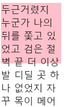
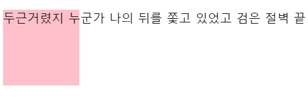
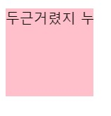
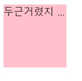

html 말줄임표
===
예전에는 글자가 넘어가는 경우를 대비해서 백엔드단계에서 글자수를 특정지어서 자르는 방법을 많이 사용하였다고 한다.

하지만 css3 에서 새로운 `text-overflow: ellipsis` 생겼다.

```css
p{
  background-color: pink;
  width: 100px;
  height: 100px;
  white-space: nowrap;
  overflow: hidden;
  text-overflow: ellipsis;
}
```
---



> 만약 글자수가 넘어가면 이렇게 box 자체를 넘어간다.
> 
---


> `white-space:nowrap`은 두칸이상(연속공백이 오는경우)을 하나로 합쳐준다. 줄을 바꿔주려면 `<br>`만 가능하다.

---


> 그다음 `overflow: hidden`을 하면 박스에 넘어가는 글자들이 숨겨지게 된다.
---


> `text-overflow: ellipsis`는 박스에 넘어가는 잘린 텍스트를 나타내준다.<br>
> 이미 `oveflow:hidden`으로 넘어가버린 텍스트들을 말줄임표로 만들어준다.
