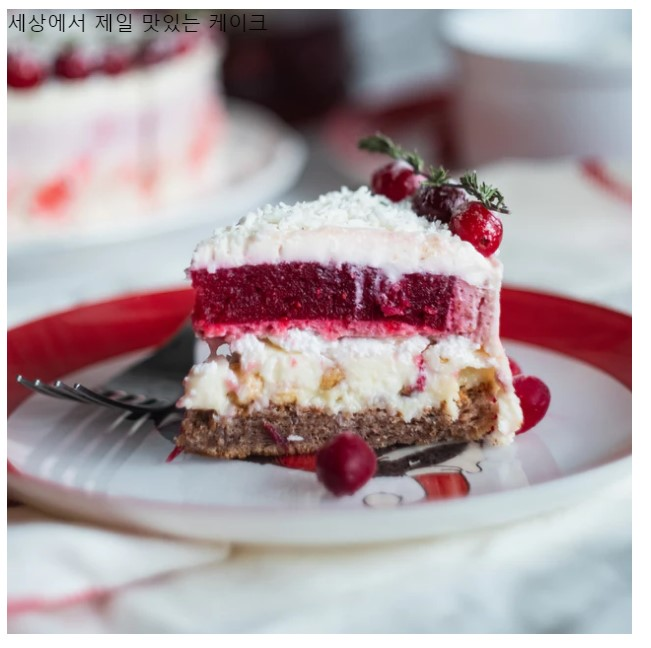

IS(Image Sprite), IR(Image Replacement) 기법
===

## IS(Image Sprite)
---
웹페이지의 첫 로딩 속도를 줄여주는 여러 방법이다. 서버로의 요청 횟수를 최소화 시켜준다. 여러 이미지 사진을 사진마다 각각 보내지 않고 하나의 큰 이미지에 모든 이미지를 합쳐놔서 원하는 부분만 잘라서 쓰면 되는 기법이다.

css의 `background-postion` 속성을 사용해서 특정 부분만 보이게 해준다.

첫번째로 사용하고자 하는 이미지의 width와 height 만큼의 박스 사이즈를 정해주어야한다.

두번째로 큰이미지에서 원하는 이미지의 정확한 위치를 알아야한다.

---


1. 첫번째로 사용하고자 하는 이미지의 width와 height만큼의 크기를 지정해준다 ('>'의 크기가 100px이라고 가정할때)
```css
width: 100px
height: 100px
```

2. 두번째로 >의 이미지를 가지고 올때. <br> >가 위치하고있는 가로 위치를 알고 그곳에 background-position을 주면된다.<br>(>의 가로 위치가 180에 위치하고 있다고 할때)
```css
background-position: 180px 0;
```

---

## IR(Image Replacement)

---

웹 접근성을 준수하기 위한 필수 사항 중 하나는 이미지에 대체 텍스트를 제공해야한다.<br>
스크린 리더로 읽을때 그 이미지에 대한 정확한 의미와 내용이 들어가야한다.<br><br>
보통 이미지의 alt속성으로 설명을 하지만 그 이미지에대한 긴 설명과 내용을 알려줘야 할때는 alt에 간단한 이미지의 정리를 해주고 IR 기법으로 설명 해준다.

또 img태그로 사진을 넣어주는 것이아니라 `background-image`을 사용할때는 alt속성을 사용할수가 없으므로 텍스트를 넣어준뒤 IR기법을 사용해준다.

---




> '세상에서 제일 맛있는 케이크' 라는 설명을 IR기법으로 없애주어야한다.<br>
> 
```html
<div>
  <div class="bg">세상에서 제일 맛있는 케이크</div>
</div>
```

```css
.bg{
  background: url(./image/cake.jpg);
  width: 500px;
  height: 500px;
  background-size: cover;
  background-position: center bottom;
}
```


### 방법1. text-indent
> text-indent는 글자를 들여쓰기 할때 사용한다.
> 1. `text-indent: -9999`같이 현재 사용하고 있는 디스플레이의 해상도 보다 작게 음수값을 주면 사라진다.
> 2. 두번째는 박스의 크기 만큼 indent 값을 주고
> `white-space: nowrap`을 주어서 한줄로 만들고 박스의 크기를 넘치게 한다음 `overflow:hidden` 속성으로 박스에서 사라지게 하면된다.

### 방법2. padding
> `padding-top`으로 박스의 `height`만큼 값을준다<br>
> 그렇게 되면 글자가 box밑으로 내려가게 된다.<br>
> 그후에 overflow:hidden으로 숨기면된다.

> `padding-right`도 마찬가지로 사용할수 있다.
> 하지만 글자가 여러줄로 밑으로 생기므로 `white-space: nowrap`을 해주면 한줄로 만든다.<br>
> 그후에 `padding-right`의 값을 박스의 `width`만큼 주어서 글자가 박스 밖으로 나가게 해주면된다.

### 가장쉬운 방법

```css
<div class="bg" aria-label="세상에서 제일 맛있는 케이크"></div>
```

`aria-label` 속성값을 넣어 설명을 해주면된다.