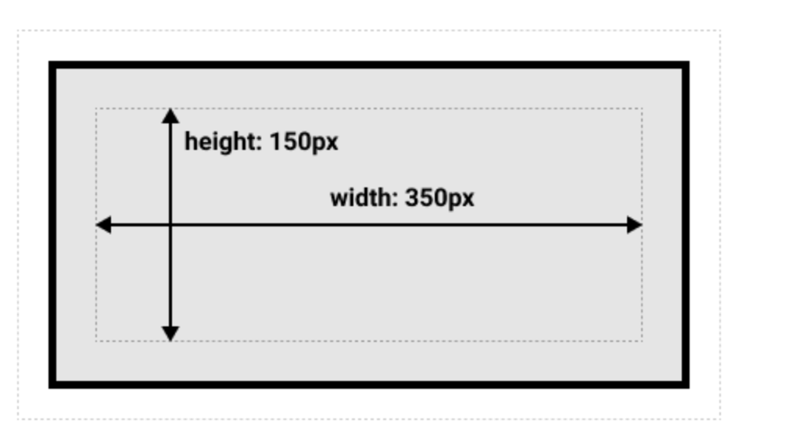
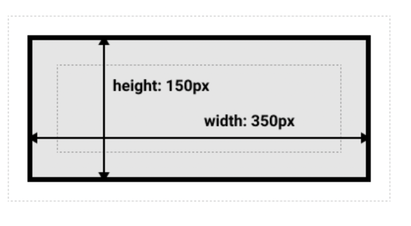

# box-sizing : border-box를 사용하는 이유

<br>

기본 box-sizing값은 content-box이다.

따라서 width와 height를 부여하면 content box의 너비와 높이가 정의된다.

그이후 패딩과 테두리는 박스의 너비와 높이에 추가되어 박스의 크기가 정해진다.

<br>

실제 박스가 차지하는 공간은 실제로 양쪽패딩과 테두리는 콘텐츠 박스에 사용되는 너비에 더해지게 된다.

<br>

실제로 너비 410px(350 + 25 + 25 + 5 + 5), 높이 210px(150 + 25 + 25 + 5 + 5)가 된다.

```css
.box {
  width: 350px;
  height: 150px;
  margin: 25px;
  padding: 25px;
  border: 5px solid black;
}
```



<br>

박스의 실제 크기를 얻기위해 테두리와 패딩을 추가하는것이 다소 불편하다고 생각할 수 있다.

<br>

### box-sizing: border-box

`box-sizing: border-box` 를 사용하면 width와 height값이 보더를 기준으로 적용된다.

따라서 콘텐츠 영역 너비는 너비에서 패딩 및 보더 너비를 뺀 너비이다.



<br>

참고

- [https://developer.mozilla.org/ko/docs/Learn/CSS/Building_blocks/The_box_model](https://developer.mozilla.org/ko/docs/Learn/CSS/Building_blocks/The_box_model)
