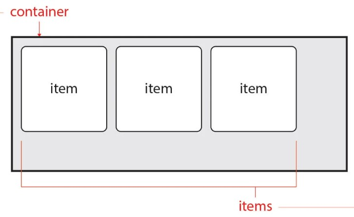
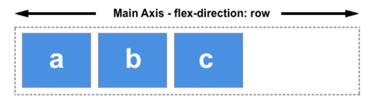
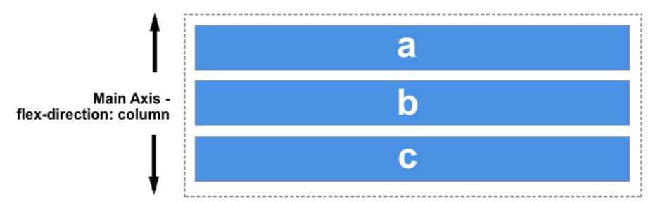
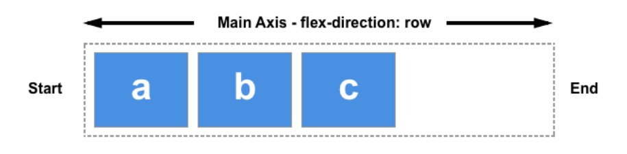

flex 레이아웃 구성
===

각 flex된 Item을 정렬하기 위해선 부모요소인 Container가 있어야한다. 



## 1. display
---

```css
display: flex;
display: inline-flex;
```

display값으로 
1. **flex**는 block 같은 요소로 container가 수직으로 쌓이고
2. **inline**-flex는 inline 같은 요소로 container가수평으로 쌓인다.

## 2. flex-flow
---
flex-flow는 flex-wrap과 flex-direction을 동시에 쓸수 있게 값을 가지고있다.

### 2.1 flex-direction
---

flex-direction은 item들의 쌓이는 방식을 나타내준다

1. row는 왼쪽에서 오른쪽
2. row-reverse는 `row` 의 반대반향
3. column은 위에서 아래
4. column-reverse는 `column`의 반대반향

### 2.2 flex-wrap
---

1. items 들이 한줄에만 있게하려면 기본값인 `nowrap`을 하면된다
2. wrap은 items들이 여러줄로 있게한다
3. `wrap-reverse` wrap의 역방향으로 여러줄 쌓인다
```css
flex-wrap: nowrap;
flex-wrap: wrap;
flex-wrap: wrap-reverse;
```
### 2.3 주축(Main-Axis)
---
`row`,`row-reverse`일때는 주축이 인라인 방향이다(왼쪽에서 오른쪽).

-mdn image-

`column`, `column-reverse`는 블록방향(위에서아래)이다


### 2.4 교차축(Cross-Axis)
---
주축이 `row` 나 `row-reverse` 라면 교차축은 가로방향이다

주축이 `column` 혹은 `column-reverse` 라면 교차축은 세로방향이다.

### 2.5 시작점(flex-start), 끝점(flex-end)
---
**주 축**이나 **교차 축**의 시작하는 지점과 끝나는 지점이다.



## 3. justify-content
---
주축으로 정렬방식을 설정한다

1. flex-start : 시작점에서 정렬.
   
2. flex-end : 끝점에서 정렬
   
3. center : 가운데 정렬
   
4. space-between : 시작 Item은 시작점에, 마지막 Item은 끝점에 정렬. 나머지는 사이에 고르게 정렬
   
5. space-around : 균등한 여백을 포함하여 정렬


## 4. align-content
---
교차축으로 정렬한다.
하지만 `flex-wrap`으로 2줄이상일때만 사용할수있다.

1. stretch :	Items를 늘림

2. flex-start: 시작점(flex-start)으로 정렬	
3. flex-end: 끝점(flex-end)으로 정렬	
4. center: 가운데 정렬	
5. space-between:	시작 Item은 시작점에, 마지막 Item은 끝점에 정렬. 나머지는 사이에 고르게 정렬	
6. pace-around: 균등한 여백을 포함하여 정렬

## 5. order
---
item들의 순서를 결정한다.<br>
기본값은 0 숫자를 늘릴수록 뒤로 적용된다.<br>
음수도 넣을수 있다.