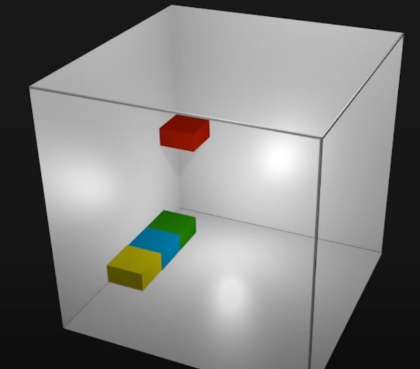

## 1. viewport
---
**viewport란**

화면에 보이는 영역
모바일은 모바일에서 보이는 영역이다.
즉 화면 Display상의 표시 영역을 뜻한다.

## 2. html 구성
---
각각의 header, main, footer 등등 height의 값은 고정시키지 않고 auto로 나중에 유동적이게 바꿀수 있도록 한다.

## 3. min-height

min-height 최소높이보다 크면 자연스럽게 늘어남

## vh,vw
10vh(viewport hight) 브라우저 높이의 1/100 이라는뜻

예) 
1. 브라우저 높이가 900px 일떄 1vh는 9px
2. 브라우저 너비가 1000px일때 1vw는 10px

## 3. box-sizing
---
box-sizing의 기본값은 content-box이다.

* content-box : 콘텐트 영역을 기준
* border-box : border 테투리 기준
* inherit : 부모 요소의 속성값 상속

박스의 크기가 100px일때 border의 크기를 1px 늘리면
border의 크기때문에 총 102가 된다.

하지만 border-box을 사용하면
border크기를 늘려도 widht은 100px이 된다.


## 4. float으로 레이아웃 구성하기.
---

float 을 사용하면 2차원적으로 위로 뜨게 된다.
공간을 차지하지만 다른요소들의 배치에는 영향이 안간다.

css 레이아웃을 위해 float을 사용하기도 하는데
기본적으로 가로로 배치하게된다.

float을 사용하여 레이아웃을 만들면 위로 뜨게되므로 그다음에 오는 태그들이 뭉게지거나 흐르게 되는경우 해결하는 방법이 있다

### 4.1 float레이아웃 해결방법

1. 가상 요소 `::after` 사용
2. `overflow: hidden`속성 사용
3. float의 요소들의 마지막에 빈태그를 만들어`clear` 속성 적용

#### 4.1.1 **첫번째** float 속성을 적용한 요소의 부모요소에 `::after`를 사용해주면 된다.
가상요소를 float의 자식들요소 마지막에 주어서 
css속성을 가지게되 해결이된다.
```css
div::after{
  content: '';
  display: block;
  clear: both;
}
```
css 속성에서 inline 요소로는 clear값을 줄수가 없다.<br>
display block으로 바꿔준다<br>
content의 값이 없으면 적용이 안되므로 빈값인 `''`을 주어야한다.

#### 4.1.2 **두번째** overflow을 이용한방법.
부모요소에 `overflow:hidden`을 사용하면된다.

부모요소에 oveflow을 주게되면 (BFC)block formatting context영역을 부모가 가지게 되는데 각각 자식들의 값이 새로운 독립영역을 가지게된다.


#### 4.1.3 **세번째** 직접적으로 html안에 float요소들의 마지막에 직접 빈태그를 만들고 css로 
```css
.clear{
  clear: both;
  height: 0;
  overflow: hidden;
}
```
clear:both로 부모가 자식요소들의 높이를 인식하게 한다.
또한 높이를 가지지않는 빈요소로 주면된다.