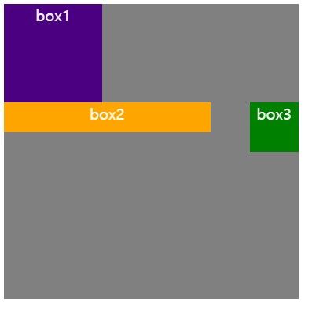

inline-box
===
float 요소들이 있을때



> 1. **box1,2**가 `float:left`이고 **box3**이` float:right`일때<br>
> 2. box2가 box1 다음자리로 이동했지만 크기가 안맞아 그밑에 라인으로 내려갔다.
> 3. 그이후 box3이 `float:right` 으로 오른쪽을 이동하려할때,<br> 이미 box2가 box1의 옆자리를 이동하려 했지만 크기가 안맞아 다음라인으로 갔을때 box1 옆 라인 공간들은 이동할수 없는 자리가 된다.
> 4. 그래서 box3는 box2의 right으로 이동후 box3의 크기가 맞아 이동한다.


```html
<div class="container">
  <div class="box1"></div>
  <div class="box2"></div>
  <div class="box3"></div>
</div>
```

```css
.container{
  width: 300px;
  height: 300px;
  background-color: gray;
}

.box1{
  float: left;
  width: 100px;
  height: 100px;
  background-color: indigo;
}

.box2{
  float: left;
  width: 210px;
  height: 30px;
  background-color: orange;
}
.box3{
  float: right;
  width: 20px;
  height: 20px;
  background-color: green;
}
```
