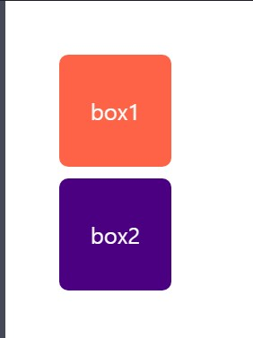
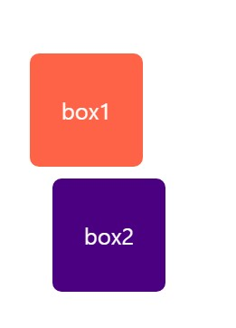
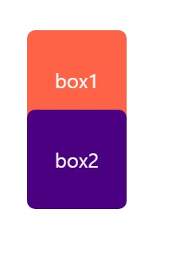

Margin negative(음수 마진)
===
margin에 음수 값을 주면 **이동**하거나 다른 값들을 **당기게** 된다.


## 1.일반적인 요소에 **top/left** margin 음수
---
그방향으로 음수 값만큼 이동하게된다.




```css
.box1{
  margin-left: -40px;
}
```
> box1이 left방향으로 40px 만큼이동했다.

## 2. **bottom/right** margin 값을 음수
---
1번처럼 이동하는것이 아니라 그다음에 오는 요소들을 **당기게**된다.


```css
.box1{
  margin-bottom: -20px;
}
```
> box1이 다음요소인 box2을 20px 만큼 당긴다.<br> 그리고 box2가 box1의 영역을 침범했다.

## 3. float요소에 margin 음수 경우
---
### *** 요소가 float인 경우 margin이 음수이면 일반적인 경우와 다르다.


만약 float 요소 다음에 일반요소가 온경우<br> float인 요소에 margin 음수를 주게되면<br> 위의 예제인 2번인 경우는 box2가 box1의 영역을 침범해 위로 올라갔지만<br>
box1에 float속성을 주면 box1 영역을 box2는 침범하지 못한다.


```css
.box1{
    float:left;
  margin-bottom: -20px;
}

.box2{
  background: indigo;
  clear:both;
}
```
> box1은 float속성, box2는 일반요소이다.<br>
> 그때 bottom: -20px을 주면 box2을 당기게 되고<br> box2가 box1의 영역을 침범하지 못한다.