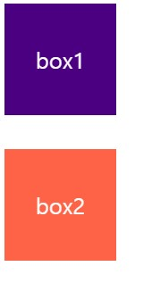
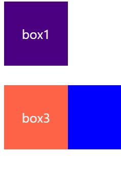
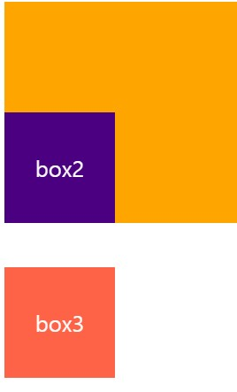

마진 중복
===
마진의 특정 값들이 '중복'되어 합쳐지는 현상

1. 형제 요소들의 **margin-top**과 **margin-bottom**이 만났을 때

```css
.box{
  font-size:20px;
  color:white;
  line-height:100px;
  text-align: center;
}

.box1{
  background-color: indigo;
  width: 100px;
  height: 100px;
  margin-bottom: 20px;
}

.box2{
  width: 100px;
  height: 100px;
  background-color: tomato;
  margin-top: 30px;
}
```
> box1의 `margin-bottom`과 box2의 `margin-top`이 겹쳤을때 더 큰값이 적용된다.

---

2. 부모 요소의 **margin-top**과 자식 요소의 **margin-top**이 만났을 때


```html
<div class="box1"></div>
<div class="box2">
  <div class="box3"></div>
</div>
```

```css
.box1{
  background-color: indigo;
  width: 100px;
  height: 100px;
}
.box2{
  background-color: blue;
  margin-top: 20px;
}
.box3{
  width: 100px;
  height: 100px;
  background-color: yellow;
  margin-top: 30px;
}
```
> 부모요소와 자식요소의 top이 맞닫았을때,<br> `margin-top`을 자식요소에 주면, 부모요소의 BFC가 있을때까지 계속 올라가다가 없으면 마지막 부모요소에 margin-top이 영향을 끼친다. 그래서 그 전의 보라색에서 30px만큼 떨어져있다.<br> 그리고 `margin` 중복된경우 큰값에 적용된다.

---
   
3. 부모 요소의 **margin-bottom**과 자식 요소의 **margin-bottom**이 만났을 때



부모요소인 orange 배경색을 가진 박스와<br>
자식요소인 box2가 각각 `margin-bottom:20px`, `margin-bottom:40px` 받았을때 더큰 값인 자식요소의 40px 만큼 `margin` 이 생긴다.

---
## 마진 중복 계산법

1. 둘다 양수 일때
    - 더큰값으로 적용됨.
2. 둘다 음수 일때
    - 더 작은 값으로 적용됨.
3. 각각 양수와 음수 일때
    - 두값을 더한 값으로 적용됨.

