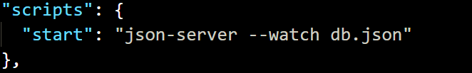

# JSON Server

<br>

## npm 초기화해준다.

```bash
$ npm init -y
```

<br>

## json 서버 설치해준다.

```bash
$ npm install json-server --save-dev
```

<br>

## db.json 파일 생성해준다.

생성해준 json파일에 json 형식으로 데이터를 넣는다.

```bash
{
  "todos": [
    {
      "id": 1,
      "content": "HTML",
      "completed": true
    },
    {
      "id": 2,
      "content": "CSS",
      "completed": false
    },
    {
      "id": 3,
      "content": "Javascript",
      "completed": true
    }
  ]
}
```

<br>

## JSON Server 실행

package.json 파일에서

scripts의 부분에서 start를 넣어준다.




json서버를 열기 위해서 터미널에서

npm start 명령어를 입력한다.