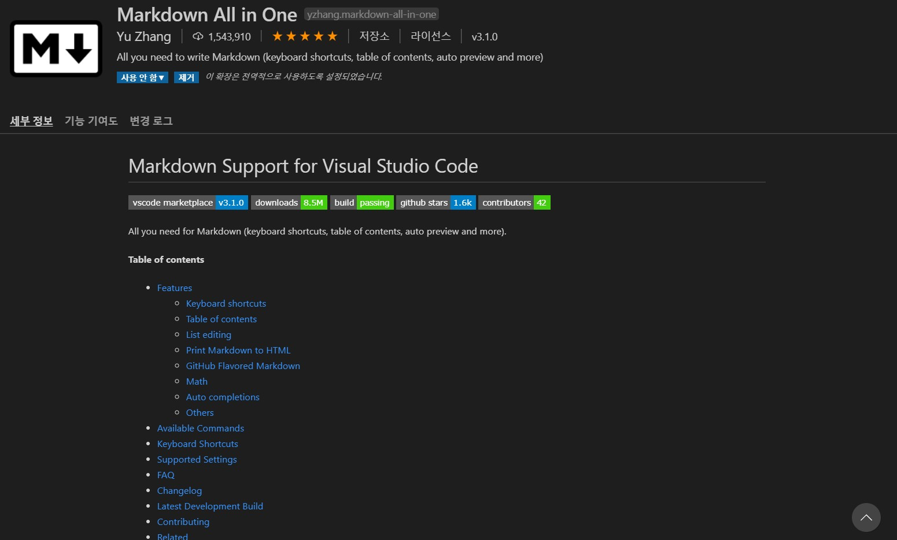
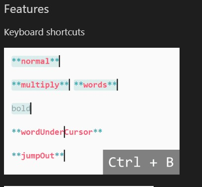
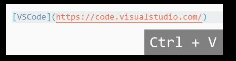

VScode에서 마크다운 쉽게쓰기
===
## 1. 마크다운 설치하기
----
VScode의 마켓플레이스를 켠후 markdown All in One 을 설치하면 된다

 

---
## 2. 마크다운 유용한 단축키 사용 및 설명
---
### Ctrl + B bold 처리

### Ctrl + V 주소 복사넣기 하면 링크 까지 생긴다.

더자세한 단축키들은 세부정보에서 볼수있다.
