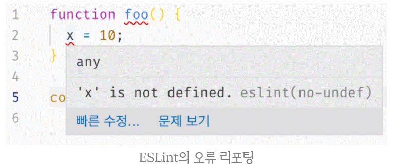

# Strict mode

[Notion](https://www.notion.so/20-Strict-mode-35853d5182714c0f8fa322eadf98afc6)

## 1. strict mode 란?

<br>

```jsx
function foo() {
  x = 10;
}
foo();

console.log(x); // ?
```

<br>

**예제풀이)**

<br>

함수내 x가 **선언되지 않아**

스코프 체인을 통해

x변수가 선언된 곳을을 검색한다.

<br>

존재하지 않기 때문에

**암묵적으로 전역객체에**

**x 프로퍼티를 동적 생성한다.**

<br>

이러한 것을

**암묵적 전역(implicit global)[용어]** 이라고한다.

(함수 내부 뿐만아니라 어디서든지 선언하지 않으면 일어난다.)

<br>

**단점**

암묵적 전역은 오류를 발생시키기 쉽다.

<br>

**때문에**

ES5부터 **strict mode(엄격모드)[용어]** 가 추가됬다.

<br>

**strict mode는** 

**자바스크립트 언어의 문법을** 

**좀더 엄격히 적용해 에러를 발생시킨다.**

<br>

**ESLint**

ESLint 도구를 사용하면

strict mode와 유사한 효과가 있다.

<br>

**소스코드 실행전**

<br>

**소스코드를 스캔해서**

**문법적 오류, 잠재적 오류까지 찾아내**

**오류의 이류를 리포팅 해주는 도구이다.**

<br>



## 2. strict mode의 적용

<br>

**strict mode를 적용하려면** 

**전역의 선두 또는 함수 몸체의 선두에** 

**'use strict';를 추가한다.**

```jsx
'use strict';

function foo() {
  x = 10; // ReferenceError: x is not defined
}
foo();
```

<br>

함수에 추가하면

해당 함수와 **중첩함수에도 적용된다.**

```jsx
function foo() {
  'use strict';

  x = 10; // ReferenceError: x is not defined
}
foo();
```

<br>

**주의!**

코드 선두에 위치하지 않으면 

제대로 작동하지 않는다.

```jsx
function foo() {
  x = 10; // 에러를 발생시키지 않는다.
  'use strict';
}
foo();
```

<br>

## 3. 전역에 strict mode를 적용하는 것은 피하자

<br>

**strict mode는** 

**해당 스크립트 단위로 적용된다.**

```jsx
<!DOCTYPE html>
<html>
<body>
  <script>
    'use strict';
  </script>
  <script>
    x = 1; // 에러가 발생하지 않는다.
    console.log(x); // 1
  </script>
  <script>
    'use strict';

    y = 1; // ReferenceError: y is not defined
    console.log(y);
  </script>
</body>
</html>
```

<br>

strict mode 스크립트와 non-strict mode 스크립트를 

혼용하는 것은 오류를 발생시킬 수 있다.

<br>

**전역에 strict mode를** 

**적용하는 것은 권장하지 않는다.**

<br>

**때문에**

**즉시 실행 함수로 스크립트 전체를 감싸서**

**스코프를 구분하고**

**strict mode를 적용한다.**

```jsx
// 즉시 실행 함수의 선두에 strict mode 적용
(function () {
  'use strict';

  // Do something...
}());
```

<br>
<br>

## 4. 함수 단위로 strict mode를 적용하는 것도 피하자

<br>

strict mode를 

함수에 일일이 적용하는 번거로움,

<br>

불규칙한 strict mode 적용은 좋지않다.

```jsx
(function () {
  // non-strict mode
  var lеt = 10; // 에러가 발생하지 않는다.

  function foo() {
    'use strict';

    let = 20; // SyntaxError: Unexpected strict mode reserved word
  }
  foo();
}());
```

<br>

따라서 strict mode는

즉시 실행 함수로 

감싼 스크립트 단위로 적용하는 것이 바람직하다.

<br>
<br>

## 5. strict mode가 발생시키는 에러

<br>

### 5.1. 암묵적 전역

<br>

**선언하지 않은 변수를** 

**참조하면 ReferenceError가 발생**

```jsx
(function () {
  'use strict';

  x = 1;
  console.log(x); // ReferenceError: x is not defined
}());
```

<br>

### 5.2. 변수, 함수, 매개변수의 삭제

<br>

**delete 연산자로** 

**변수, 함수, 매개변수를 삭제하면** 

SyntaxError가 발생한다.

```jsx
(function () {
  'use strict';

  var x = 1;
  delete x;
  // SyntaxError: Delete of an unqualified identifier in strict mode.

  function foo(a) {
    delete a;
    // SyntaxError: Delete of an unqualified identifier in strict mode.
  }
  delete foo;
  // SyntaxError: Delete of an unqualified identifier in strict mode.
}());
```

<br>

### 5.3. 매개변수 이름의 중복

<br>

**중복된 매개변수 이름을 사용하면** 

**SyntaxError가 발생한다.**

```jsx
(function () {
  'use strict';

  //SyntaxError: Duplicate parameter name not allowed in this context
  function foo(x, x) {
    return x + x;
  }
  console.log(foo(1, 2));
}());
```

<br>

### 5.4. with 문의 사용

<br>

**What? with문은 무엇일까?**

**with 문은 전달된 객체를** 

**스코프 체인에 추가한다.**

<br>

동일한 객체의 프로퍼티를 

반복해서 사용할 때

<br>

객체 이름을 생략할 수 있어서 코드가 간단해지는 효과가 있지만 

**성능과 가독성이 나빠지는 문제가 있다**.

```jsx
(function () {
  'use strict';

  // SyntaxError: Strict mode code may not include a with statement
  with({ x: 1 }) {
    console.log(x);
  }
}());
```

<br>

## 6. strict mode 적용에 의한 변화

<br>

### 6.1. 일반 함수의 this

<br>

strict mode 에서 

<br>

**함수를 일반 함수로서 호출하면** 

**this에 undefined가 바인딩된다.**

→ 일반 함수 내부에서 사용할 이유가 없어서

<br>

에러는 발생하지 않는다.

```jsx
(function () {
  'use strict';

  function foo() {
    console.log(this); // undefined
  }
  foo();

  function Foo() {
    console.log(this); // Foo
  }
  new Foo();
}());
```

<br>

### 6.2. arguments 객체

<br>

**매개변수에 전달된 인수를** 

**재할당하여 변경하여도** 

**arguments 객체에 반영되지 않는다.**

```jsx
(function (a) {
  'use strict';
  // 매개변수에 전달된 인수를 재할당하여 변경
  a = 2;

  // 변경된 인수가 arguments 객체에 반영되지 않는다.
  console.log(arguments); // { 0: 1, length: 1 }
}(1));
```