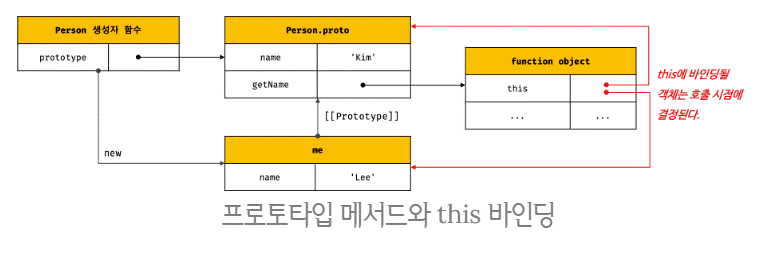
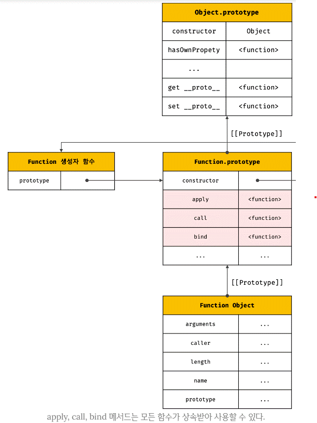
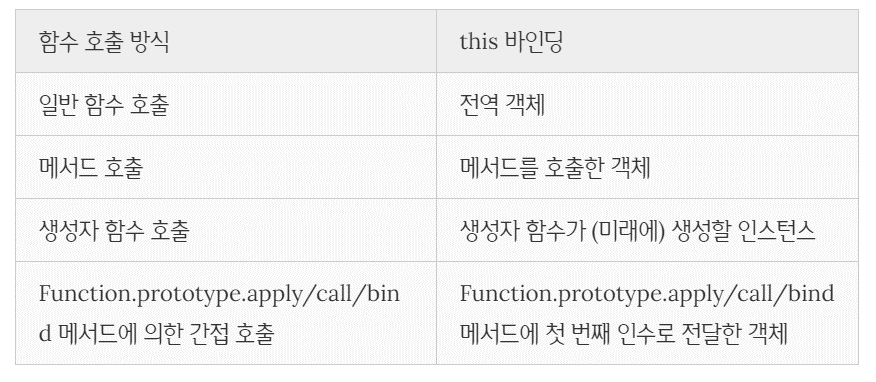

# this

[Notion](https://www.notion.so/22-this-f5363acd2783465397d680f5b820a56f)

## 1. this 키워드

<br>

객체내에서 동작을 나타내는 메서드는

상태를 나타내는 데이터를 참조 / 변경할 수 있어야한다.

<br>

**메서드는 자신이 속한** 

**객체의 프로퍼티를 참조하려면**

<br>

**먼저 자신이 속한 객체를 가리키는** 

**식별자를 참조해야한다.**

```jsx
const circle = {
  // 프로퍼티: 객체 고유의 상태 데이터
  radius: 5,
  // 메서드: 상태 데이터를 참조하고 조작하는 동작
  getDiameter() {
    // 이 메서드가 자신이 속한 객체의 프로퍼티나 다른 메서드를 참조하려면
    // 자신이 속한 객체인 circle을 참조할 수 있어야 한다.
    return 2 * circle.radius;
  }
};

console.log(circle.getDiameter()); // 10
```

<br>

재귀적으로 참조하는 방식은 

바람직하지 않다.

<br>

**생성자 함수 방식으로 인스턴스를 생성하는 경우**

```jsx
function Circle(radius) {
  // 이 시점에는 생성자 함수 자신이 생성할 인스턴스를 가리키는 식별자를 알 수 없다.
  ????.radius = radius;
}

Circle.prototype.getDiameter = function () {
  // 이 시점에는 생성자 함수 자신이 생성할 인스턴스를 가리키는 식별자를 알 수 없다.
  return 2 * ????.radius;
};

// 생성자 함수로 인스턴스를 생성하려면 먼저 생성자 함수를 정의해야 한다.
const circle = new Circle(5);
```

<br>

**예제풀이)**

**생성자 함수가 만들어낼** 

**인스턴스의 식별자를 알 수 가없다.**

<br>

**때문에** 

자신이 생성할

인스턴스를 가리키는 특수한 식별자가 필요하다.

<br>

**this는** 

<br>

**자신이 속한 객체 또는** 

**자신이 생성할 인스턴스를 가리키는** 

<br>

**자기 참조 변수(self-referencing variable)이다.**

<br>

**How? 어떻게 this가 생기는것일까?**

함수가 호출되면

arguments 객체와 this가 

암묵적으로 함수 내부에 전달된다.

<br>

**주의!**

this가 가리키는 값, 

<br>

즉 this 바인딩은 

**함수 호출 방식에 의해 동적으로 결정**된다.

```jsx
// 객체 리터럴
const circle = {
  radius: 5,
  getDiameter() {
    // this는 메서드를 호출한 객체를 가리킨다.
    return 2 * this.radius;
  }
};

console.log(circle.getDiameter()); // 10
```

<br>

**this는 매서드를 호출한 객체,**

**circle을 가리킨다.**

<br>

```jsx
// 생성자 함수
function Circle(radius) {
  // this는 생성자 함수가 생성할 인스턴스를 가리킨다.
  this.radius = radius;
}

Circle.prototype.getDiameter = function () {
  // this는 생성자 함수가 생성할 인스턴스를 가리킨다.
  return 2 * this.radius;
};

// 인스턴스 생성
const circle = new Circle(5);
console.log(circle.getDiameter()); // 10
```

<br>

**How? this는 무엇을 가리킬까?**

생성자 함수 내부의 this는

생성자 함수가 생성할 인스턴스를 가리킨다.

<br>

**이처럼!**

**this는 상황에 따라 가리키는 대상이 다르다.**

<br>

**TIP!**

C++ 같은 클래스 기반언어들은

언제나 클래스가 생성하는 인스턴스를 가리킨다.

<br>

**하지만!**

자바스크립트 this는 

**함수가 호출되는 방식에 따라**

**this 바인딩이 동적으로 결정된다.**

<br>

**TIP2!**

this는 코드 어디서든 참조 가능하다.

```jsx
// this는 어디서든지 참조 가능하다.
// 전역에서 this는 전역 객체 window를 가리킨다.
console.log(this); // window

function square(number) {
  // 일반 함수 내부에서 this는 전역 객체 window를 가리킨다.
  console.log(this); // window
  return number * number;
}
square(2);

const person = {
  name: 'Lee',
  getName() {
    // 메서드 내부에서 this는 메서드를 호출한 객체를 가리킨다.
    console.log(this); // {name: "Lee", getName: ƒ}
    return this.name;
  }
};
console.log(person.getName()); // Lee

function Person(name) {
  this.name = name;
  // 생성자 함수 내부에서 this는 생성자 함수가 생성할 인스턴스를 가리킨다.
  console.log(this); // Person {name: "Lee"}
}

const me = new Person('Lee');
```

<br>

**그렇다면 어디서든지 this를 사용해도 되는것일까?**

this는 

객체의 프로퍼티나 메서드를 

참조하기 위한 자기 참조 변수이므로 

<br>

**일반적으로 객체의 메서드 내부 또는** 

**생성자 함수 내부에서만 의미가 있다.**

<br>
<br>

## 2. 함수 호출 방식과 this 바인딩

<br>

this 바인딩(this에 바인딩될 값)은 

**함수가 어떻게 호출되었는지에 따라 동적으로 결정**된다.

<br>

**How? 함수 호출은 어떻게 할까?**

**함수 호출방식 4가지**

1. **일반 함수 호출**
2. **메서드 호출**
3. **생성자 함수 호출**
4. **Function.prototype.apply/call/bind 메서드에 의한 간접 호출**

```jsx
// this 바인딩은 함수 호출 방식에 따라 동적으로 결정된다.
const foo = function () {
  console.dir(this);
};

// 동일한 함수도 다양한 방식으로 호출할 수 있다.

// 1. 일반 함수 호출
// foo 함수를 일반적인 방식으로 호출
// foo 함수 내부의 this는 전역 객체 window를 가리킨다.
foo(); // window

// 2. 메서드 호출
// foo 함수를 프로퍼티 값으로 할당하여 호출
// foo 함수 내부의 this는 메서드를 호출한 객체 obj를 가리킨다.
const obj = { foo };
obj.foo(); // obj

// 3. 생성자 함수 호출
// foo 함수를 new 연산자와 함께 생성자 함수로 호출
// foo 함수 내부의 this는 생성자 함수가 생성한 인스턴스를 가리킨다.
new foo(); // foo {}

// 4. Function.prototype.apply/call/bind 메서드에 의한 간접 호출
// foo 함수 내부의 this는 인수에 의해 결정된다.
const bar = { name: 'bar' };

foo.call(bar);   // bar
foo.apply(bar);  // bar
foo.bind(bar)(); // bar
```

<br>

### 2.1. 일반 함수 호출

<br>

기본적으로 this에는 

**전역 객체(global object)가 바인딩된다.**

```jsx
function foo() {
  console.log("foo's this: ", this);  // window
  function bar() {
    console.log("bar's this: ", this); // window
  }
  bar();
}
foo();
```

<br>

**주의!**

일반함수에서 this는 의미가 없기때문에

<br>

**strict mode에서**

**this는 undefined가 바인딩된다.**

```jsx
function foo() {
  'use strict';

  console.log("foo's this: ", this);  // undefined
  function bar() {
    console.log("bar's this: ", this); // undefined
  }
  bar();
}
foo();
```

<br>

중첩함수도

일반함수로 호출되면 

this는 전역객체이다.

<br>

```jsx
// var 키워드로 선언한 전역 변수 value는 전역 객체의 프로퍼티다.
var value = 1;
// const 키워드로 선언한 전역 변수 value는 전역 객체의 프로퍼티가 아니다.
// const value = 1;

const obj = {
  value: 100,
  foo() {
    console.log("foo's this: ", this);  // {value: 100, foo: ƒ}
    console.log("foo's this.value: ", this.value); // 100

    // 메서드 내에서 정의한 중첩 함수
    function bar() {
      console.log("bar's this: ", this); // window
      console.log("bar's this.value: ", this.value); // 1
    }

    // 메서드 내에서 정의한 중첩 함수도 일반 함수로 호출되면 중첩 함수 내부의 this에는 전역 객체가 바인딩된다.
    bar();
  }
};

obj.foo();
```

<br>

콜백함수가

일반함수로 호출되어도

this는 전역객체에 바인딩된다.

<br>

**즉,**

**어떤함수라도**

**일반함수로 호출되면**

**this에 전역객체가 바인딩된다.**

<br>

```jsx
var value = 1;

const obj = {
  value: 100,
  foo() {
    console.log("foo's this: ", this); // {value: 100, foo: ƒ}
    // 콜백 함수 내부의 this에는 전역 객체가 바인딩된다.
    setTimeout(function () {
      console.log("callback's this: ", this); // window
      console.log("callback's this.value: ", this.value); // 1
    }, 100);
  }
};

obj.foo();
```

<br>

**단점**

중첩함수 or 메서드에게 전달된 콜백함수는

<br>

외부함수롤 돕는 헬퍼함수 역활로 쓰이기 때문에

**this가 외부함수와 일치 하지 않으면** 

**헬퍼 함수로 동작하기 어렵다.**

<br>

**How? 어떻게 중첩 함수 / 콜백 함수의 this를 메서드의 this로 바인딩할까?**

```jsx
var value = 1;

const obj = {
  value: 100,
  foo() {
    // this 바인딩(obj)을 변수 that에 할당한다.
    const that = this;

    // 콜백 함수 내부에서 this 대신 that을 참조한다.
    setTimeout(function () {
      console.log(that.value); // 100
    }, 100);
  }
};

obj.foo();
```

<br>

**다른방법2**

- Function.prototype.apply 메서드
- Function.prototype.call 메서드
- Function.prototype.bind 메서드

```jsx
var value = 1;

const obj = {
  value: 100,
  foo() {
    // 콜백 함수에 명시적으로 this를 바인딩한다.
    setTimeout(function () {
      console.log(this.value); // 100
    }.bind(this), 100);
  }
};

obj.foo();
```

<br>

**다른방법3**

화살표 함수 사용

```jsx
var value = 1;

const obj = {
  value: 100,
  foo() {
    // 화살표 함수 내부의 this는 상위 스코프의 this를 가리킨다.
    setTimeout(() => console.log(this.value), 100); // 100
  }
};

obj.foo();
```

<br>

### 2.2. 메서드 호출

**메서드 내부의 this는**

**메서드를 호출한 객체에 바인딩된다.**

```jsx
const person = {
  name: 'Lee',
  getName() {
    // 메서드 내부의 this는 메서드를 호출한 객체에 바인딩된다.
    return this.name;
  }
};

// 메서드 getName을 호출한 객체는 person이다.
console.log(person.getName()); // Lee
```

<br>

geName 프로퍼티의 this는

person 내부에 포함된 것이아니라

<br>

독립적으로 존재하는 별도의 객체이다.

<br>

```jsx
const anotherPerson = {
  name: 'Kim'
};
// getName 메서드를 anotherPerson 객체의 메서드로 할당
anotherPerson.getName = person.getName;

// getName 메서드를 호출한 객체는 anotherPerson이다.
console.log(anotherPerson.getName()); // Kim

// getName 메서드를 변수에 할당
const getName = person.getName;

// getName 메서드를 일반 함수로 호출
console.log(getName()); // ''
// 일반 함수로 호출된 getName 함수 내부의 this.name은 브라우저 환경에서 window.name과 같다.
// 브라우저 환경에서 window.name은 브라우저 창의 이름을 나타내는 빌트인 프로퍼티이며 기본값은 ''이다.
// Node.js 환경에서 this.name은 undefined다.
```

<br>

**메서드는 어디에 바인딩 되어있는 것일까?**

**메서드 내부의 this는**

<br>

**프로퍼티로 메서드를 가리키고 있는** 

**객체와는 관계가 없고**

<br>

**메서드를 호출한 객체에 바인딩된다.**

<br>


<br>

```jsx
function Person(name) {
  this.name = name;
}

Person.prototype.getName = function () {
  return this.name;
};

const me = new Person('Lee');

// getName 메서드를 호출한 객체는 me다.
console.log(me.getName()); // ① Lee

Person.prototype.name = 'Kim';

// getName 메서드를 호출한 객체는 Person.prototype이다.
console.log(Person.prototype.getName()); // ② Kim
```



<br>

### 2.3. 생성자 함수 호출

<br>

생성자 함수 내부의 this에는

**생성자 함수가 (미래에) 생성할 인스턴스가 바인딩**된다.

<br>

```jsx
// 생성자 함수
function Circle(radius) {
  // 생성자 함수 내부의 this는 생성자 함수가 생성할 인스턴스를 가리킨다.
  this.radius = radius;
  this.getDiameter = function () {
    return 2 * this.radius;
  };
}

// 반지름이 5인 Circle 객체를 생성
const circle1 = new Circle(5);
// 반지름이 10인 Circle 객체를 생성
const circle2 = new Circle(10);

console.log(circle1.getDiameter()); // 10
console.log(circle2.getDiameter()); // 20
```

<br>

생성자 함수로 호출하지 않으면

일반 함수로 동작한다.

```jsx
// new 연산자와 함께 호출하지 않으면 생성자 함수로 동작하지 않는다. 즉, 일반적인 함수의 호출이다.
const circle3 = Circle(15);

// 일반 함수로 호출된 Circle에는 반환문이 없으므로 암묵적으로 undefined를 반환한다.
console.log(circle3); // undefined

// 일반 함수로 호출된 Circle 내부의 this는 전역 객체를 가리킨다.
console.log(radius); // 15
```

<br>

### 2.4. Function.property.apply/call/bind 메서드에 의한 간접 호출

<br>

**apply, call, bind 메서드는** 

**Function.prototype의 메서드다.**

<br>

이들 메서드는 

**모든 함수가 상속받아 사용할 수 있다.**

<br>



```jsx
function getThisBinding() {
  return this;
}

// this로 사용할 객체
const thisArg = { a: 1 };

console.log(getThisBinding()); // window

// getThisBinding 함수를 호출하면서 인수로 전달한 객체를 getThisBinding 함수의 this에 바인딩한다.
console.log(getThisBinding.apply(thisArg)); // {a: 1}
console.log(getThisBinding.call(thisArg)); // {a: 1}
```

<br>

**apply와 call 메서드의 본질적인 기능은** 

**함수를 호출하는 것이다.**

<br>

**첫번째 인수의 객체는** 

**호출한 함수의 this에 바인딩 된다.**

<br>

```jsx
function getThisBinding() {
  console.log(arguments);
  return this;
}

// this로 사용할 객체
const thisArg = { a: 1 };

// getThisBinding 함수를 호출하면서 인수로 전달한 객체를 getThisBinding 함수의 this에 바인딩한다.
// apply 메서드는 호출할 함수의 인수를 배열로 묶어 전달한다.
console.log(getThisBinding.apply(thisArg, [1, 2, 3]));
// Arguments(3) [1, 2, 3, callee: ƒ, Symbol(Symbol.iterator): ƒ]
// {a: 1}

// call 메서드는 호출할 함수의 인수를 쉼표로 구분한 리스트 형식으로 전달한다.
console.log(getThisBinding.call(thisArg, 1, 2, 3));
// Arguments(3) [1, 2, 3, callee: ƒ, Symbol(Symbol.iterator): ƒ]
// {a: 1}
```

<br>

**apply 메서드는** 

**호출할 함수의 인수를 배열로 묶어 전달한다.**

<br>

**call 메서드는** 

**호출할 함수의 인수를 쉼표로 구분한 리스트 형식으로 전달한다.**

<br>

**What? apply와 call 메서드의 용도는 무엇일까?**

대표적인 용도는

<br>

arguments 객체와 같은 

**유사 배열 객체에 배열 메서드를 사용하는 경우다.**

```jsx
function convertArgsToArray() {
  console.log(arguments);

  // arguments 객체를 배열로 변환
  // Array.prototype.slice를 인수없이 호출하면 배열의 복사본을 생성한다.
  const arr = Array.prototype.slice.call(arguments);
  // const arr = Array.prototype.slice.apply(arguments);
  console.log(arr);

  return arr;
}

convertArgsToArray(1, 2, 3); // [1, 2, 3]
```

<br>

**Function.prototype.bind 메서드는** 

apply와 call 메서드와 달리 

<br>

**함수를 호출하지 않고** 

**this로 사용할 객체만 전달한다.**

```jsx
function getThisBinding() {
  return this;
}

// this로 사용할 객체
const thisArg = { a: 1 };

// bind 메서드는 함수에 this로 사용할 객체를 전달한다.
// bind 메서드는 함수를 호출하지는 않는다.
console.log(getThisBinding.bind(thisArg)); // getThisBinding
// bind 메서드는 함수를 호출하지는 않으므로 명시적으로 호출해야 한다.
console.log(getThisBinding.bind(thisArg)()); // {a: 1}
```

<br>

**How? bind 메서드는 어떤용도로 사용될까?**

bind 메서드는 

<br>

**메서드의 this와** 

**메서드 내부의 중첩 함수** 

**또는 콜백 함수의 this가** 

<br>

**불일치하는 문제를 해결하기 위해** 유용하게 사용된다.

```jsx
const person = {
  name: 'Lee',
  foo(callback) {
    // ①
    setTimeout(callback, 100);
  }
};

person.foo(function () {
  console.log(`Hi! my name is ${this.name}.`); // ② Hi! my name is .
  // 일반 함수로 호출된 콜백 함수 내부의 this.name은 브라우저 환경에서 window.name과 같다.
  // 브라우저 환경에서 window.name은 브라우저 창의 이름을 나타내는 빌트인 프로퍼티이며 기본값은 ''이다.
  // Node.js 환경에서 this.name은 undefined다.
});
```

<br>

콜백함수가 일반 함수로 호출되어

this가 전역객체를 가리킨다.

<br>

**따라서** 

**콜백함수 내부의 this를**

**외부 함수 내부의 this와 일치시켜 주어야한다.**

```jsx
const person = {
  name: 'Lee',
  foo(callback) {
    // bind 메서드로 callback 함수 내부의 this 바인딩을 전달
    setTimeout(callback.bind(this), 100);
  }
};

person.foo(function () {
  console.log(`Hi! my name is ${this.name}.`); // Hi! my name is Lee.
});
```

<br>

