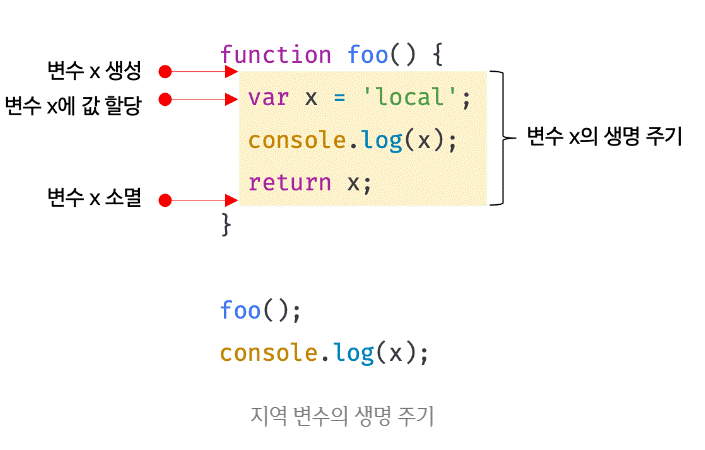
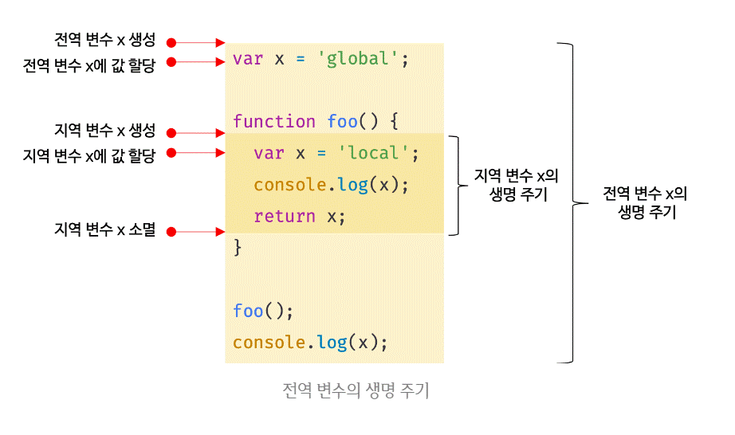

# 전역 변수의 문제점

<br>

전역 변수의 무분별한 사용은 위험하다.

<br>

**Why? 어째서 안좋은지 알아보자!**

<br>
<br>

## 1. 변수의 생명 주기

<br>

### 1.1. 지역 변수의 생명 주기

<br>

변수는 생물과 유사하게 생성되고

소멸하는 **생명주기(life cycle)[용어]** 가 있다.

<br>

**Why? 왜 생명 주기가 있을까?**

생명주기가 없으면 한번 선언된 변수는

**프로그램을 종료 하지 않는 한** 영원히

**메모리 공간을 점유 할 것이다.**

<br>

**전역 변수 VS 지역 변수 생명주기**

**전역 변수의 생명주기는** 

**애플리케이션의 생명주기와 같다.**

<br>

**지역변수는 함수가 호출되면 생성되고**

**종료되면 소멸한다.**

```jsx
function foo() {
  var x = 'local';
  console.log(x); // local
  return x;
}

foo();
console.log(x); // ReferenceError: x is not defined
```

<br>

**예제풀이)**

지역변수 x는 foo함수 호출전에

생성되지 않는다.

<br>

**주의!**

**함수가 호출된후** 선언문이 JS엔진에 의해

**가장먼저 실행되어** 변수x가 **선언되고**

**undefined로 초기화 된다.**

<br>

또한 **함수가 종료되면** 변수x도

소멸되어 **생명주기가 종료된다.**

<br>

**즉!**

**지역변수의 생명주기는**

**함수의 생명주기와 일치한다.**

<br>



"전역 변수의 문제점 | PoiemaWeb," PoiemaWeb,2020년 09월 10일 수정, https://poiemaweb.com/fastcampus/global-variable.

<br>

**정리!**

변수의 생명주기는 **메모리 공간이 확보(allocate)**

된 시점부터 **메모리가 해제(release)되어**

가용 **메모리 풀(memory pool)** 에 반환되는 시점까지이다.

<br>

**스코프도 마찬가지이다.**

스코프도 **렉시컬 환경[용어]** 이라 부르는

물리적 실체가 존재한다.

<br>

**누군가 스코프를 참조하면**

**스코프는 소멸하지 않고 생존한다.**

```jsx
var x = 'global';

function foo() {
  console.log(x); // ①
  var x = 'local';
}

foo();
console.log(x); // global
```

<br>

**예제풀이)**

**지역변수 x**는 이미 실행되어 있고

undefined로 초기화 되어있어

**호이스팅이 발생한다.**

<br>

**이처럼!**

**호이스팅은 스코프를 단위로 동작한다.**

<br>

### 1.2. 전역 변수의 생명 주기

**전역코드**는 **특별한 진입점(entry point)[용어]** 이 없고

코드가 로드 되자마자 **곧바로 실행된다.**

<br>

**How? 그렇다면 전역변수의 생명주기는 어떻게 될까?**

var 키워드로 선언된 **전역 변수**는

**전역 객체의 프로퍼티가 된다.**

<br>

**즉**

**전역변수의 생명주기는**

**전역객체의 생명주기와 일치한다.**

<br>

**What? 전역객체가 무엇일까?**

전역객체는 코드가 **실행되기전**

JS엔진이 **가장먼저** **생성하는 특수한 객체**이다.

<br>

전역객체는

- **브라우저에서는 window**
- **서버사이드 환경에서는 global**

이다.

<br>

**중요!**

환경에 따라 전역객체를

**부르는 식별자**가 각각 달랐지만

**ES11에서 globalThis로 통일되었다.**

<br>

브라우저 환경에서의 전역객체는 window이므로

**웹페이지를 닫기전까지**

**전역변수의 생명주기는 유효하다.**

<br>

**즉! 따라서**

var키워드로 선언한 **전역변수**는

**전역객체의 생명주기와 동일하다.**

<br>



"전역 변수의 문제점 | PoiemaWeb," PoiemaWeb,2020년 09월 10일 수정, https://poiemaweb.com/fastcampus/global-variable.

<br>

## 2. 전역 변수의 문제점

<br>

**1 . 암묵적 결합(implicit coupling)[용어]**

모든코드가 전역변수를 참조하고

변경할 수 있는 **암묵적 결합**을 허용한다.

<br>

**→변수의 유효범위가 크면**

- **가독성이 나빠지고**
- **위험성이 높아진다.**

<br>

**2 . 긴 생명 주기**

전역변수의 긴 생명 주기는

**메모리 리소스도 오랜기간 소비**한다.

<br>

또한 변수의 이름이 중복되면

**의도치 않게 재할당**이 이뤄진다.

```jsx
var x = 1;

// ...

// 변수의 중복 선언. 기존 변수에 값을 재할당한다.
var x = 100;
console.log(x); // 100
```

<br>

**따라서**

**지역변수**는 

**메모리 리소스도 짧고**

**생명주기도 짧아** 

**오류 확률이 적어 권장된다.**

<br>

**3 . 스코프 체인 상에서 종점에 존재**

전역변수는 **최상위의 스코프에 위치해**

전역 변수의 **검색 속도가 가장 느리다.**

<br>

**4 . 네임스페이스 오염**

파일이 분리되있어도 전역스코프를 공유해

예기치 못한 결과 발생확률이 높다.

<br>
<br>

## 3. 전역 변수의 사용을 억제하는 방법

<br>

이렇게 단점이 있어

전역변수를 굳이 쓸 이유가 없으면

지역변수를 쓰는 것이 좋다.

<br>

**즉, 변수의 스코프는 좁을수록좋다.**

<br>

**How? 어떻게 해야 전역변수 사용을 억제할까?**

<br>

### 3.1 즉시 실행 함수

<br>

즉시 실행 함수는 

단 한번만 호출되므로

<br>

모든 코드를 **즉시 실행 함수로 감싸면**

**모든 변수는 지역변수가 된다.**

```jsx
(function () {
  var foo = 10; // 즉시 실행 함수의 지역 변수
  // ...
}());

console.log(foo); // ReferenceError: foo is not defined
```

<br>

### 3.2 네임스페이스 객체

<br>

네임스페이스 역활을 담당할 객체를 생성후

<br>

전역 변수처럼 사용하고 싶은 변수를

프로퍼티에 추가하는 방법이다.

```jsx
var MYAPP = {}; // 전역 네임스페이스 객체

MYAPP.name = 'Lee';

console.log(MYAPP.name); // Lee
```

<br>

네임스페이스 객체 안에 네임스페이스 객체를 중복해서 넣을 수 도있다.

```jsx
var MYAPP = {}; // 전역 네임스페이스 객체

MYAPP.person = {
  name: 'Lee',
  address: 'Seoul'
};

console.log(MYAPP.person.name); // Lee
```

<br>

**BUT!**

어차피 **네임스페이스 객체 자체**도

**전역변수**에 할당되므로 유용하지 않다.

<br>

### 3.3 모듈 패턴

<br>

변수와 함수를 **즉시 실행 함수로 감싸**

**하나의 모듈**로 만들어

<br>

- **전역 변수의 억제**
- **캡슐화 구현**

<br>

을 하게 한다.

<br>

**What? 캡슐화가 무엇일까?**

캡슐화는 프로퍼티와 메소드를 하나로

묶는 것을 말한다.

<br>

**Why? 왜 어떤 용도로 캡슐화를 할까?**

- **프로퍼티나 메소드를** **감출 목적**으로 사용하기도 한다

**→ 정보 은닉(information hiding)[용어]**

- **네임스페이스의 오염**을 막는 기능도 한다.

<br>

```jsx
var Counter = (function () {
  // private 변수
  var num = 0;

  // 외부로 공개할 데이터나 메서드를 프로퍼티로 추가한 객체를 반환한다.
  return {
    increase() {
      return ++num;
    },
    decrease() {
      return --num;
    }
  };
}());

// private 변수는 외부로 노출되지 않는다.
console.log(Counter.num); // undefined

console.log(Counter.increase()); // 1
console.log(Counter.increase()); // 2
console.log(Counter.decrease()); // 1
console.log(Counter.decrease()); // 0
```

<br>

**예제풀이)**

<br>

위의 **반환되는 객체**의 프로퍼티는

**객체의 프로퍼티**가 **외부에 노출**되는

**퍼블릭 멤버(public menber)[용어]** 이다.

<br>

**외부에 노출하고 싶지 않은** 코드는

**반환하는 객체에 담지 않으면**

**프라이빗 멤버(private member)[용어]** 이다.

<br>

### 3.4 ES6 모듈

<br>

ES6 모듈을 사용하면 더는 전역변수를 사용할 수 없다.

<br>

**즉,**

ES6 모듈은 **파일자체의 독자적인 모듈스코프**를 제공한다.

→ window 객체의 프로퍼티도 아니게된다.

<br>

**How? 어떻게 모듈을 사용하는 것일까?**

- script태그에 `type="module"` 를 추가하면 동작한다.
- 모듈의 파일 확장자는 mjs를 권장한다.

```jsx
<script type="module" src="lib.mjs"></script>
<script type="module" src="app.mjs"></script>
```

<br>

**주의!**

- 모던브라우저(Chrome 61, FF 60, SF 10.1, Edge 16 이상)에서만 사용 가능하다.
- 트랜스파일링이나 번들리이 필요하다.

<br>

**따라서**

아직까지는 ES6 모듈보다 

Webpack등 모듈 번들로 사용하는 것이 일반적이다.

[Notion](https://www.notion.so/14-e0a17fd2c323462da80cb10afc252298)