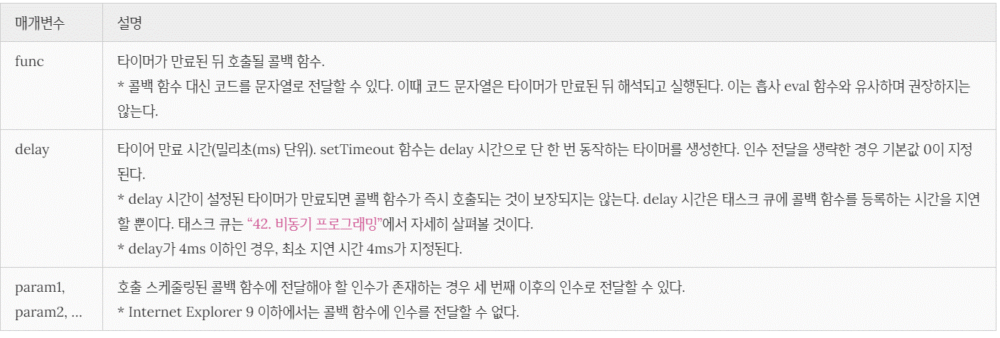
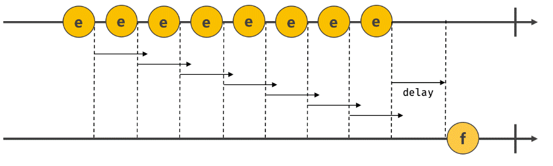
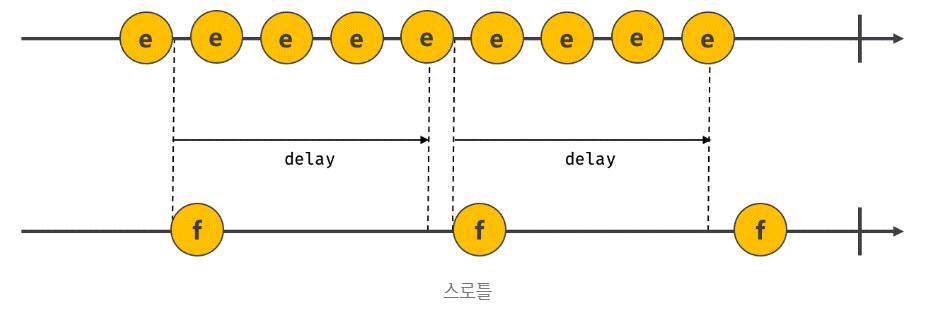

# 타이머

<br>

## 1. 호출 스케줄링

<br>

함수를 명시적으로 호출하면 함수가 즉시 실행된다. 

만약 함수를 명시적으로 호출하지 않고 일정 시간이 경과된 이후에 호출되도록 함수 호출을 예약하려면 타이머 함수를 사용한다. 

이를 **호출 스케줄링(scheduling a call**)이라 한다.

<br>

자바스크립트는 타이머를 생성할 수 있는 타이머 함수 setTimeout과 setInterval, 타이머를 제거할 수 있는 타이머 함수 clearTimeout과 clearInterval을 제공한다. 

타이머 함수는 ECMAScript 사양에 정의된 빌트인 함수가 아니다. 하지만 브라우저 환경과 Node.js 환경에서 모두 전역 객체의 메서드로서 타이머 함수를 제공한다. 

**즉, 타이머 함수는 호스트 객체다.**

<br>

자바스크립트 엔진은 단 하나의 실행 컨텍스트 스택을 갖기 때문에 두가지 이상의 태스크를 동시에 실행할 수 없다. 

즉, 자바스크립트 엔진은 **싱글 스레드(single thread)** 로 동작한다. 이런 이유로 타이머 함수 setTimeout과 setInterval은 **비동기(asynchronous)** 처리 방식으로 동작한다.

<br>

## 2. 타이머 함수

<br>

### 2.1. setTimeout / clearTimeout

<br>

setTimeout 함수는 두 번째 인수로 전달받은 시간(ms, 1/1000초)으로 단 한 번 동작하는 타이머를 생성한다.

이후 타이머가 만료되면 첫 번째 인수로 전달받은 콜백 함수가 호출된다.

<br>

```jsx
const timeoutId = setTimeout(func|code[, delay, param1, param2, ...]);
```

<br>



<br>

```jsx
// 1초(1000ms) 후 타이머가 만료되면 콜백 함수가 호출된다.
setTimeout(() => console.log('Hi!'), 1000);

// 1초(1000ms) 후 타이머가 만료되면 콜백 함수가 호출된다.
// 이때 콜백 함수에 'Lee'가 인수로 전달된다.
setTimeout(name => console.log(`Hi! ${name}.`), 1000, 'Lee');

// 두 번째 인수(delay)를 생략하면 기본값 0이 지정된다.
setTimeout(() => console.log('Hello!'));
```

<br>

setTimeout 함수는 생성된 타이머를 식별할 수 있는 고유한 타이머 id를 반환한다. setTimeout 함수가 반환한 타이머 id는 브라우저 환경인 경우 숫자이며 Node.js 환경인 경우 객체다.

<br>

setTimeout 함수가 반환한 타이머 **id를 clearTimeout 함수의 인수로 전달**하여 타이머를 취소할 수 있다. 즉, clearTimeout 함수는 호출 스케줄링을 취소한다.

```jsx
// 1초(1000ms) 후 타이머가 만료되면 콜백 함수가 호출된다.
// setTimeout 함수는 생성된 타이머를 식별할 수 있는 고유한 타이머 id를 반환한다.
const timerId = setTimeout(() => console.log('Hi!'), 1000);

// setTimeout 함수가 반환한 타이머 id를 clearTimeout 함수의 인수로 전달하여 타이머를 취소한다.
// 타이머가 취소되면 setTimeout 함수의 콜백 함수가 실행되지 않는다.
clearTimeout(timerId);
```

<br>

### 2.2 setlnterval / clearInterval

<br>

setInterval 함수는 두 번째 인수로 전달받은 시간(ms, 1/1000초)으로 반복 동작하는 타이머를 생성한다. 이후 타이머가 만료될 때마다 첫 번째 인수로 전달받은 콜백 함수가 반복 호출된다. 이는 타이머가 취소될 때까지 계속된다.

```jsx
let count = 1;

// 1초(1000ms) 후 타이머가 만료될 때마다 콜백 함수가 호출된다.
// setInterval 함수는 생성된 타이머를 식별할 수 있는 고유한 타이머 id를 반환한다.
const timeoutId = setInterval(() => {
  console.log(count); // 1 2 3 4 5
  // count가 5이면 setInterval 함수가 반환한 타이머 id를 clearInterval 함수의 인수로 전달하여
  // 타이머를 취소한다. 타이머가 취소되면 setInterval 함수의 콜백 함수가 실행되지 않는다.
  if (count++ === 5) clearInterval(timeoutId);
}, 1000);
```

<br>

setInterval 함수는 생성된 타이머를 식별할 수 있는 고유한 타이머 id를 반환한다. setInterval 함수가 반환한 타이머 id는 브라우저 환경인 경우 숫자이며 Node.js 환경인 경우 객체다.

<br>

setInterval 함수가 반환한 타이머 id를 clearInterval 함수의 인수로 전달하여 타이머를 취소할 수 있다. 즉, clearInterval 함수는 호출 스케줄링을 취소한다.

<br>

## 3. 디바운스와 스로틀

<br>

scroll, resize, input, mousemove, mouseover 같은 이벤트는 짧은 시간 간격으로 연속해서 발생한다. 이러한 이벤트에 바인딩한 이벤트 핸들러는 과도하게 호출되어 성능에 문제를 일으킬 수 있다. 

디바운스와 스로틀은 짧은 시간 간격으로 연속해서 발생하는 이벤트를 그룹화해서 과도한 이벤트 핸들러의 호출을 방지하는 프로그래밍 기법이다.

```jsx
<!DOCTYPE html>
<html>
<body>
  <button>click me</button>
  <pre>일반 클릭 이벤트 카운터    <span class="normal-msg">0</span></pre>
  <pre>디바운스 클릭 이벤트 카운터 <span class="debounce-msg">0</span></pre>
  <pre>스로틀 클릭 이벤트 카운터   <span class="throttle-msg">0</span></pre>
  <script>
    const $button = document.querySelector('button');
    const $normalMsg = document.querySelector('.normal-msg');
    const $debounceMsg = document.querySelector('.debounce-msg');
    const $throttleMsg = document.querySelector('.throttle-msg');

    const debounce = (callback, delay) => {
      let timerId;
      return event => {
        if (timerId) clearTimeout(timerId);
        timerId = setTimeout(callback, delay, event);
      };
    };

    const throttle = (callback, delay) => {
      let timerId;
      return event => {
        if (timerId) return;
        timerId = setTimeout(() => {
          callback(event);
          timerId = null;
        }, delay, event);
      };
    };

    $button.addEventListener('click', () => {
      $normalMsg.textContent = +$normalMsg.textContent + 1;
    });

    $button.addEventListener('click', debounce(() => {
      $debounceMsg.textContent = +$debounceMsg.textContent + 1;
    }, 500));

    $button.addEventListener('click', throttle(() => {
      $throttleMsg.textContent = +$throttleMsg.textContent + 1;
    }, 500));
  </script>
</body>
</html>
```

<br>

디바운스와 스로틀은 이벤트를 처리할 때 매우 유용하다.

<br>

### 3.1. 디바운스

<br>

디바운스(debounce)는 짧은 시간 간격으로 이벤트가 연속해서 발생하면 이벤트 핸들러를 호출하지 않다가 일정 시간이 경과한 이후에 이벤트 핸들러가 한 번만 호출되도록 한다.

```jsx
<!DOCTYPE html>
<html>
<body>
  <input type="text">
  <div class="msg"></div>
  <script>
    const $input = document.querySelector('input');
    const $msg = document.querySelector('.msg');

    const debounce = (callback, delay) => {
      let timerId;
      // debounce 함수는 timerId를 기억하는 클로저를 반환한다.
      return event => {
        // delay가 경과하기 이전에 이벤트가 발생하면 이전 타이머를 취소하고
        // 새로운 타이머를 재설정한다.
        // 따라서 delay보다 짧은 간격으로 이벤트가 발생하면 callback은 호출되지 않는다.
        if (timerId) clearTimeout(timerId);
        timerId = setTimeout(callback, delay, event);
      };
    };

    // debounce 함수가 반환하는 클로저가 이벤트 핸들러로 등록된다.
    // 300ms보다 짧은 간격으로 input 이벤트가 발생하면 debounce 함수의 콜백 함수는
    // 호출되지 않다가 300ms 동안 input 이벤트가 더 이상 발생하면 한 번만 호출된다.
    $input.oninput = debounce(e => {
      $msg.textContent = e.target.value;
    }, 300);
  </script>
</body>
</html>
```

<br>

사용자가 입력을 완료했는지 여부는 정확히 알 수 없으므로 일정 시간 동안 텍스트 입력필드에 값을 입력하지 않으면 입력이 완료된 것으로 간주한다. 

이를 위해 debounce 함수가 반환한 함수는 debounce 함수에 두 번째 인수로 전달한 시간(delay)보다 짧은 간격으로 이벤트가 발생하면 이전 타이머를 취소하고 새로운 타이머를 재설정한다. 

따라서 delay보다 짧은 간격으로 이벤트가 연속해서 발생하면 debounce 함수의 첫 번째 인수로 전달한 콜백 함수는 호출되지 않다가 delay 동안 input 이벤트가 더 이상 발생하지 않으면 한 번만 호출된다.

<br>



<br>

### 3.2 스로틀

<br>

스로틀(throttle)은 짧은 시간 간격으로 이벤트가 연속해서 발생하더라도 일정 시간 간격으로 이벤트 핸들러가 최대 한 번만 호출되도록 한다. 즉, 스로틀은 짧은 시간 간격으로 연속해서 발생하는 이벤트를 그룹화해서 일정 시간 단위로 이벤트 핸들러가 호출되도록 호출 주기를 만든다.

```jsx
<!DOCTYPE html>
<html>
<head>
  <style>
    .container {
      width: 300px;
      height: 300px;
      background-color: rebeccapurple;
      overflow: scroll;
    }

    .content {
      width: 300px;
      height: 1000vh;
    }
  </style>
</head>
<body>
  <div class="container">
    <div class="content"></div>
  </div>
  <div>
    일반 이벤트 핸들러가 scroll 이벤트를 처리한 횟수:
    <span class="normal-count">0</span>
  </div>
  <div>
    스로틀 이벤트 핸들러가 scroll 이벤트를 처리한 횟수:
    <span class="throttle-count">0</span>
  </div>

  <script>
    const $container = document.querySelector('.container');
    const $normalCount = document.querySelector('.normal-count');
    const $throttleCount = document.querySelector('.throttle-count');

    const throttle = (callback, delay) => {
      let timerId;
      // throttle 함수는 timerId를 기억하는 클로저를 반환한다.
      return event => {
        // delay가 경과하기 이전에 이벤트가 발생하면 아무것도 하지 않다가
        // delay가 경과했을 때 이벤트가 발생하면 새로운 타이머를 재설정한다.
        // 따라서 delay 간격으로 callback이 호출된다.
        if (timerId) return;
        timerId = setTimeout(() => {
          callback(event);
          timerId = null;
        }, delay, event);
      };
    };

    let normalCount = 0;
    $container.addEventListener('scroll', () => {
      $normalCount.textContent = ++normalCount;
    });

    let throttleCount = 0;
    // throttle 함수가 반환하는 클로저가 이벤트 핸들러로 등록된다.
    $container.addEventListener('scroll', throttle(() => {
      $throttleCount.textContent = ++throttleCount;
    }, 100));
  </script>
</body>
</html>
```

<br>

scroll 이벤트는 사용자가 스크롤할 때 짧은 시간 간격으로 연속해서 발생한다. 이처럼 짧은 시간 간격으로 연속해서 발생하는 이벤트의 과도한 이벤트 핸들러의 호출을 방지하기 위해 throttle 함수는 이벤트를 그룹화해서 일정 시간 단위로 이벤트 핸들러가 호출되도록 호출 주기를 만든다.

<br>

throttle 함수가 반환한 함수는 throttle 함수에 두 번째 인수로 전달한 시간(delay)이 경과하기 이전에 이벤트가 발생하면 아무것도 하지 않다가 delay 시간이 경과했을 때 이벤트가 발생하면 콜백 함수를 호출하고 새로운 타이머를 재설정한다. 따라서 delay 시간 간격으로 콜백 함수가 호출된다.

<br>



<br>

이처럼 짧은 시간 간격으로 연속해서 발생하는 이벤트를 그룹화해서 일정 시간 간격으로 이벤트 핸들러를 호출하는 스로틀은 scroll 이벤트 처리나 무한 스크롤(infinite scrolling) UI 구현 등에 유용하게 사용된다.