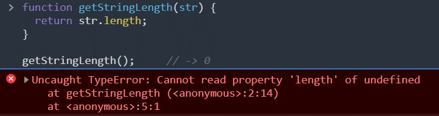

# 타입 변환과 단축평가

## 1. 타입 변환이란?

<br>

값의 타입을 **개발자의 의도**에 따라 변환 시키는 것을

1. **명시적 타입변환(explicit coercion)[용어]**
2. **타입 캐스팅(type casting)[용어]**

이렇게 둘로 부른다.

<br>  

**반대로!**

개발자의 의도와 관계없이

표현식을 평가도중 타입이 **암묵적 자동**으로 변환 하는 것을

1. **암묵적 타입 변환(implicit coercion)[용어]**
2. **타입 강제 변환(type coercion)[용어]**

이렇게 둘로 부른다.

<br>

```jsx
var x = 10;

// 명시적 타입 변환
// 숫자를 문자열로 타입 캐스팅한다.
var str = x.toString();
console.log(typeof str, str); // string 10

// x 변수의 값이 변경된 것은 아니다.
console.log(typeof x, x); // number 10
```

<br>

**주의!**

명시적 타입 변환 / 암묵적 타입 변환이

**기존 원시값을 직접 변경 하진 않는다**.

<br>

원시값은 **변경 불가능한 값(immutable value)** 이기 때문이다.

<br>

**What? 그렇다면 타입변환은 무엇을 변환 하는 걸까?**

**타입 변환[용어]** 이란 **기존 원시값을 사용**해

다른 타입의 **새로운** 원시값을 **생성** 하는 것이다.

<br>

**즉!**

타입변경이란!

**기존 원시값 → 변경X**

**새로운 원시값 → 생성!**

<br>

```jsx
var x = 10;

// 암묵적 타입 변환
// 문자열 연결 연산자는 숫자 타입 x의 값을 바탕으로 새로운 문자열을 생성한다.
var str = x + '';
console.log(typeof str, str); // string 10

// x 변수의 값이 변경된 것은 아니다.
console.log(typeof x, x); // number 10
```

<br>

**예제 풀이)**

1 . `x + ''` 을 평가하기 위한 **x변수 숫자값을 바탕**으로 **문자열 '10'을 생성**한다.

2 . '`10' + ''` 를 표현식으로 평가한다.

**→ 주의! x 숫자값 바탕으로 생성된 문자열 '10'은**

**x 변수에 재할당 되지 않음.**

3 . 암묵적 생성된 **'10'은 아무도 참조 하지 않아**

 평가가 끝나면 **가비지 콜렉터** 가 **메모리를 해제**한다.

<br>

**즉!**

**변수의 값을 바탕**으로 자바스크립트 에러 없이 평가 하기 위해

 **'암묵적 타입 변환[용어]'** 하여

**새로운 값**을 만들고 **단 한번 사용하고 버린다.**

<br>

**중요!**

**암묵적 타입 변환**이 발생하면

개발자의 의도와 상관없이 **자동으로 발생**하므로

표현식이 어떻게 평가 될지 **예측 해야한다.**

<br>

**Why? 왜 예측해야 할까?**

**예측 하지 못하거**나 **결과와 일치 하지 않으면**

**오류 생산** 가능성이 높아진다.

<br>

**명시적 타입 변환 VS 암묵적 타입 변환**

때때로 **가독성 면**에서 보면 **암묵적 타입 변환** 이 더 좋다.

Ex)

`(10).toString()`보다 `10 + ''`이 더욱 간결하고 이해하기 쉽다.

<br>

## 2. 암묵적 타입 변환

<br>

### 2.1 문자열 타입으로 변환

<br>

```jsx
1 + '2' // -> "12"
```

<br>

**예제풀이)**

예제의 `+` 연산자를 **피연산자중 하나가 문자열** 이므로,

문자열 **연결 연산자로 동작**한다.

<br>

**코드 문맥상** 문자열 값을 만들기 위해

**모든 피연산자가 모두 문자열 타입**이어야 한다.

<br>

**따라서!**

문자열이 아닌 **피연산자를 문자열 타입**으로

**'암묵적 타입 변환'** 한다.

<br>

### 2.1.1 템플릿 리터럴

<br>

ES6에서 도입된 템플릿 리터럴의 **표현식 삽입**은

표현식의 **평가 결과를 문자열**로

**암묵적 타입 변환**한다.

<br>

→ '**평과 결과'** 라는건

템플릿 리터럴의 **표현식을 계산한 다음** 이다.

<br>

```jsx
`1 + 1 = ${1 + 1}` // -> "1 + 1 = 2"
```

<br>

**What? 문자열타입으로 변환하는건 어떤것이 있을까?**

<br>

```jsx
// 숫자 타입
0 + ''         // -> "0"
-0 + ''        // -> "0"
1 + ''         // -> "1"
-1 + ''        // -> "-1"
NaN + ''       // -> "NaN"
Infinity + ''  // -> "Infinity"
-Infinity + '' // -> "-Infinity"

// 불리언 타입
true + ''  // -> "true"
false + '' // -> "false"

// null 타입
null + '' // -> "null"

// undefined 타입
undefined + '' // -> "undefined"

// 심벌 타입
(Symbol()) + '' // -> TypeError: Cannot convert a Symbol value to a string

// 객체 타입
({}) + ''           // -> "[object Object]"
Math + ''           // -> "[object Math]"
[] + ''             // -> ""
[10, 20] + ''       // -> "10,20"
(function(){}) + '' // -> "function(){}"
Array + ''          // -> "function Array() { [native code] }"
```

<br>

### 2.2 숫자 타입

<br>

```jsx
1 - '1'   // -> 0
1 * '10'  // -> 10
1 / 'one' // -> NaN
```

### 2.2.1 산술 연산자

<br>

**산술 연산자**의 역활은 **숫자값을 만드는 것**이다.

<br>

**즉!** 

**코드 문맥상** 모든 피연산자는 숫자 타입 이어야한다.

<br>

**그렇기 때문에!**

JS엔진은 **숫자타입이 아닌 피연산자들**을

**암묵적 타입 변환**한다.

<br>

**주의!**

만약 **숫자 타입으로 변환되지 않는**

**피연산자**는 **NaN**으로 평가 결과를 나타낸다.

<br>

### 2.2.2 비교 연산자

<br>

**비교연산자** 또한 **크기를 비교**해야 하므로

산술 연산자와 같이 **암묵적 타입 변환**한다.

<br>

**What? 숫자타입으로 변환하는 타입은 무엇이 있을까?**

```jsx
// 문자열 타입
+''       // -> 0
+'0'      // -> 0
+'1'      // -> 1
+'string' // -> NaN

// 불리언 타입
+true     // -> 1
+false    // -> 0

// null 타입
+null     // -> 0

// undefined 타입
+undefined // -> NaN

// 심벌 타입
+Symbol() // -> ypeError: Cannot convert a Symbol value to a number

// 객체 타입
+{}             // -> NaN
+[]             // -> 0
+[10, 20]       // -> NaN
+(function(){}) // -> NaN
```

<br>

**주의!**

**빈 문자열(‘’), 빈 배열([]), null, false ⇒** **0**

**true ⇒** **1**

**객체와 빈 배열이 아닌 배열, undefined ⇒ NaN**

<br>

### 2.3 불리언 타입으로 변환

<br>  

**if문 / for문** 같은 제어문,

**삼항 조건 연산자**의 조건식은

**불리언 값**으로 평가 되어야 하므로

<br>

😛 **암묵적 타입 변환** 한다.

```jsx
if ('')    console.log('1');
if (true)  console.log('2');
if (0)     console.log('3');
if ('str') console.log('4');
if (null)  console.log('5');

// 2 4
```

<br>

**What? 불리언 타입이 아닌 값은 어떻게 구분 될까?**

<br>

**불리언이 아닌 값**을

1. **Truthy** 값(참으로 평가되는 값)
2. **Falsy** 값(거짓으로 평가되는 값)

으로 **구분한다.**

**즉!**

**Truthy ⇒ true**

**Falsy ⇒ false**

으로 불리언이 아닌 값이 **암묵적 타입** 변환된다.

**What? 그럼 Falsy와 Truthy는 무엇이 있을까?**

false로 평가되는 falsy 값

1. false
2. undefined
3. null
4. 0,-0
5. NaN
6. ''(빈문자열)

총 6가지

<br>

true로 평가되는 Truthy값

- falsy 값 외의 모든값

<br>

## 3. 명시적 타입 변환

<br>

개발자의 의도에 따라 의도적 으로 명시적 타입 변환을 시킨다.

<br>

### 3.1 문자열 타입으로 변환

<br>

문자열이 아닌 값을 문자열 타입으로 바꾸는 방법은 3가지 이다.

<br>

**문자열 타입이 아닌값 ⇒ 문자열 타입 변환**

1. String 생성자 함수를 new 연산자 없이 호출하는 방법
2. Object.prototype.toString 메서드를 사용하는 방법
3. 문자열 연결 연산자를 이용하는 방법

<br>

```jsx
// 1. String 생성자 함수를 new 연산자 없이 호출하는 방법
// 숫자 타입 => 문자열 타입
String(1);        // -> "1"
String(NaN);      // -> "NaN"
String(Infinity); // -> "Infinity"
// 불리언 타입 => 문자열 타입
String(true);     // -> "true"
String(false);    // -> "false"

// 2. Object.prototype.toString 메서드를 사용하는 방법
// 숫자 타입 => 문자열 타입
(1).toString();        // -> "1"
(NaN).toString();      // -> "NaN"
(Infinity).toString(); // -> "Infinity"
// 불리언 타입 => 문자열 타입
(true).toString();     // -> "true"
(false).toString();    // -> "false"

// 3. 문자열 연결 연산자를 이용하는 방법
// 숫자 타입 => 문자열 타입
1 + '';        // -> "1"
NaN + '';      // -> "NaN"
Infinity + ''; // -> "Infinity"
// 불리언 타입 => 문자열 타입
true + '';     // -> "true"
false + '';    // -> "false"
```

<br>

### 3.2 숫자 타입으로 변환

<br>

숫자 타입이 아닌 값을 숫자 타입으로 바꾸는 방법은 4가지 이다.

<br>

**숫자타입이 아닌 값 ⇒ 숫자 타입 변환**

1. Number 생성자 함수를 new 연산자 없이 호출하는 방법
2. parseInt, parseFloat 함수를 사용하는 방법(문자열만 숫자 타입으로 변환 가능)
3. `+` 단항 산술 연산자를 이용하는 방법
4. 산술 연산자를 이용하는 방법

```jsx
// 1. Number 생성자 함수를 new 연산자 없이 호출하는 방법
// 문자열 타입 => 숫자 타입
Number('0');     // -> 0
Number('-1');    // -> -1
Number('10.53'); // -> 10.53
// 불리언 타입 => 숫자 타입
Number(true);    // -> 1
Number(false);   // -> 0

// 2. parseInt, parseFloat 함수를 사용하는 방법(문자열만 변환 가능)
// 문자열 타입 => 숫자 타입
parseInt('0');       // -> 0
parseInt('-1');      // -> -1
parseFloat('10.53'); // -> 10.53

// 3. + 단항 산술 연산자를 이용하는 방법
// 문자열 타입 => 숫자 타입
+'0';     // -> 0
+'-1';    // -> -1
+'10.53'; // -> 10.53
// 불리언 타입 => 숫자 타입
+true;    // -> 1
+false;   // -> 0

// 4. * 산술 연산자를 이용하는 방법
// 문자열 타입 => 숫자 타입
'0' * 1;     // -> 0
'-1' * 1;    // -> -1
'10.53' * 1; // -> 10.53
// 불리언 타입 => 숫자 타입
true * 1;    // -> 1
false * 1;   // -> 0
```

<br>

### 3.3 불리언 타입으로 변환

<br>

불리언 타입이 아닌 값을 불리언 타입으로 바꾸는 방법은 2가지 이다.

<br>

**불리언 타입이 아닌 값 ⇒ 불리언 타입 변환**

1. Boolean 생성자 함수를 new 연산자 없이 호출하는 방법
2. ! 부정 논리 연산자를 두 번 사용하는 방법

<br>

→ **두번 사용하는 이유?**

부정 논리 연산자( ! ) 한번이면

Falsy를 Truthy로

Truthy를 Falsy로 바뀌므로 한번더 하여

원래 **불리언 타입으로 만드는 방식**이다.

<br>

## 4. 단축 평가

<br>

### 4.1 논리 연산자를 사용한 단축평가

<br>

**논리합** / **논리곱**의 평가 결과는 **불리언 값이 아닐수도 있다.**

**논리합(||), 논리곱(&&) 연산자** 표현식은

언제나 **2개의 피연산자 중 어느 한쪽으로 평가된다.**”라는 것이다.

```jsx
'Cat' && 'Dog' // -> "Dog"
```

<br>

### 4.1.1 논리합( || )

**논리합( || )** 은 **두개의 피연산자중 하나만 true**로 평가되어도 **true를 반환한다.**

<br>

```jsx
'Cat' || 'Dog' // -> "Cat"
```

<br>

**예제 풀이)**

첫번째 피연산자 `'cat'` 은 **채워진 문자열(Truthy)** true 이므로

**뒤의 피연산자**를 **보지 않아도 평가 할수 있다**.

→**두개의 피연산자중 하나만 true**로 평가되어도 **true를 반환하므로**

<br>

**즉!**

이때 **논리합( || ) 연산자**는 **결과를 결정**한

**첫번째 피연산자(`'cat'`) 을 반환**한다.

<br>

### 4.1.2 논리곱( && )

<br>

**논리곱( && )** 은 **두개의 피연산자 모두 true**로 평가되어야 **true를 반환한다.**

<br>

```jsx
'Cat' && 'Dog' // -> "Dog"
```

<br>

**예제 풀이)**

첫번째 피연산자 `'cat'` 은 **채워진 문자열(Truthy)** true 이다.

이 시점까지는 위 표현식을 평가 할수 없다.

<br>

두번째 피연산자 `'Dog'` 는 **채워진 문자열(Truthy)** true 이므로

**논리곱 평과 결과를 결정하므로!**

**평과 결과를 결정한 두번째 피연산자(`'Dog'`)를 반환한다!**

<br>

**즉!**

이때 **논리합( && ) 연산자**는 **결과를 결정**한

두번째 **피연산자(`'Dog'`) 을 반환**한다.

<br>  

**중요!**

**논리 연산의 결과를 결정하는** 

피연산자를 **타입 변환하지 않고 그대로 반환한다**. 

이를 **단축 평가(short-circuit evaluation)[용어]** 라 한다. 

<br>

✨**즉!**

**단축 평가는 표현식을 평가하는 도중에 평가 결과가 확정된 경우**

**나머지 평가 과정을 생략하는 것을 말한다.**

[단축평가](https://www.notion.so/e43df5a5131549cd9313e8316e7f67b3)

<br>

```jsx
// 논리합(||) 연산자
'Cat' || 'Dog'  // -> "Cat"
false || 'Dog'  // -> "Dog"
'Cat' || false  // -> "Cat"

// 논리곱(&&) 연산자
'Cat' && 'Dog'  // -> "Dog"
false && 'Dog'  // -> false
'Cat' && false  // -> false
```

<br>

**TIP!**

단독 평가를 이용하여 **if문을 대체 할 수 있다.**

<br>

논리곱( && )

```jsx
var done = true;
var message = '';

// 주어진 조건이 true일 때
if (done) message = '완료';

// if 문은 단축 평가로 대체 가능하다.
// done이 true라면 message에 '완료'를 할당
message = done && '완료';
console.log(message); // 완료
```

논리합( || )

```jsx
var done = false;
var message = '';

// 주어진 조건이 false일 때
if (!done) message = '미완료';

// if 문은 단축 평가로 대체 가능하다.
// done이 false라면 message에 '미완료'를 할당
message = done || '미완료';
console.log(message); // 미완료
```

<br>

**if문은 연산자 챕터때 배웠던 삼항조건 연산자로도 가능 했었다는 것을 기억하자!**

<br>

**TIP2!**

**객체**를 가리키기를 기대하는 **변수**가 **null 또는 undefined**이 아닌지 확인하고 **프로퍼티를 참조**할 때

<br>

변수의 값이 null 또는 undefined 일 경우

타입에러(TypeError)가 발생한다.

```jsx
var elem = null;
var value = elem.value; // TypeError: Cannot read property 'value' of null
```

<br>

이때 단축평가를 사용하면 에러가 나지않는다.

```jsx
	var elem = null;
// elem이 null이나 undefined와 같은 Falsy 값이면 elem으로 평가되고
// elem이 Truthy 값이면 elem.value로 평가된다.
var value = elem && elem.value; // -> null
```

<br>

**TIP3!**

**함수 매개변수(파라미터)에 기본값을 설정할 때**

<br>

함수를 호출 할때 파라미터 값이

없으면 undefined를 갖는다.  

<br>

**이때!**

단축평가를 사용해 기본값을 설정하여 undefined로

인한 에러 방지가 가능하다.

<br>



<br>

```jsx
// 단축 평가를 사용한 매개변수의 기본값 설정
function getStringLength(str) {
  str = str || '';
  return str.length;
}

getStringLength();     // -> 0
getStringLength('hi'); // -> 2

// ES6의 매개변수의 기본값 설정
function getStringLength(str = '') {
  return str.length;
}

getStringLength();     // -> 0
getStringLength('hi'); // -> 2
```

<br>

### 4.2 옵셔널 체이닝 연산자

<br>

ES11부터 도입된 **옵셔널 체이닝(optional chaining) 연산자[용어]** 는

**좌항의 피연산자**가 **null 또는 undefined**인 경우 **undefined를 반환**하고

**그렇지 않으면** **우항의 프로퍼티 참조**를 이어간다.

<br>

```jsx
var elem = null;

// elem이 Falsy 값이면 elem으로 평가되고 elem이 Truthy 값이면 elem.value로 평가된다.
var value = elem?.value;
console.log(value); // null
```

<br>

**도입 이전**에는 **null, undefined** 인지 

확인하기 위해 **논리곱 연산자**를 이용해 확인했다.

```jsx
var elem = null;

// elem이 Falsy 값이면 elem으로 평가되고 elem이 Truthy 값이면 elem.value로 평가된다.
var value = elem && elem.value;
console.log(value); // null
```

<br>

**주의!**

논리곱 연산자는 좌항 피연산자가 Falsy 값이면

좌항의 피연산자를 그대로 반환한다.

<br>

**But!** 하지만 `0` 이나 `''` 이 둘은 **객체로 평가 될때도 있어**

예측하지 못한 결과가 나올수도 있다.

<br>

```jsx
var str = '';

// 문자열의 길이(length)를 참조한다.
var length = str && str.length;

// 문자열의 길이(length)를 참조하지 못한다.
console.log(length); // ''
```

<br>

**하지만 옵셔널 체이닝 연산자는 Falsy 값이  `0` 이나 `''` 이 둘이여도**

**잘 평가해 예측하기 쉽다.**

<br>

### 4.3 null 병합 연산자

<br>

ES11에서 도입된 **null 병합 연산자(nullish coalescing)[용어]** 는

**좌항의 피연산자가 null** 또는 **undefined**인 경우

**우항의 피연산자를 반환**하고, 그렇지 않으면 **좌항의 피연산자를 반환한다.**

<br>

```jsx
// 좌항의 피연산자가 null 또는 undefined이면 우항의 피연산자를 반환하고, 그렇지 않으면 좌항의 피연산자를 반환한다.
var foo = null ?? 'default string';
console.log(foo); // "default string"
```

<br>

**When? 언제 이런 null 병합 연산자를 사용할까?**

.✨**변수 기본값 설정때 매우 유용하다!**

<br>

**도입 이전**에는 **논리합 연산자**로 기본값을 설정했다.

<br>

옵셔널 체이닝 연산자 도입이전에 논리곱을

사용한 문제점 처럼

<br>

**Falsy 값이 `0` 이나 `''` 이었을때 예기치 못한 에러가 발생할수도 있다.**

```jsx
// Falsy 값인 0이나 ''도 기본값으로서 유효하다면 예기치 않은 동작이 발생할 수 있다.
var foo = '' || 'default string';
console.log(foo); // "default string"
```

<br>

**하지만 null 병합 연산자는 Falsy 값이  `0` 이나 `''` 이 둘이여도**

**잘 평가해 예측하기 쉽다.**