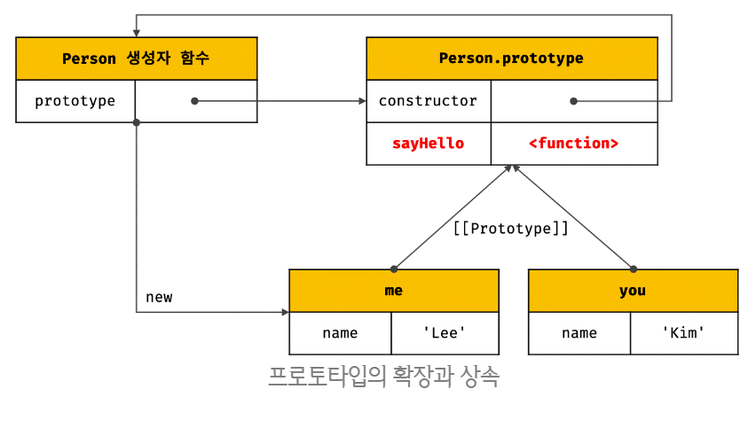
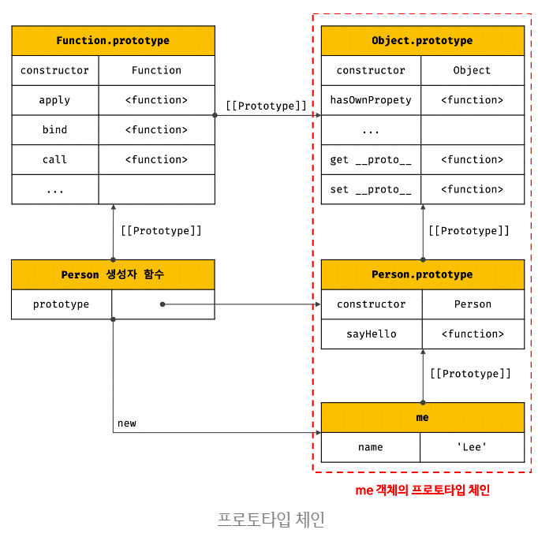

# 프로토타입 - 2

[Notion](https://www.notion.so/19-2-c31ad9379d284bbaba80f44b6f0f618c)

## 5. 프로토타입의 생성 시점

<br>

**프로토타입은** 

**생성자 함수가 생성되는 시점에** 

**더불어 생성된다.**

<br>

**Why? 왜 같이 생성될까?**

**프로토타입과 생성자 함수는** 

**단독으로 존재 할수 없고**

**언제나 쌍으로 존재하기 때문이다.**

<br>

### 5.1. 사용자 정의 생성자 함수와 프로토타입 생성 시점

<br>

constructor는

**함수 정의가 평가되어**

**함수 객체를 생성하는 시점에**

**프로토타입도 생성된다.(런타임 이전)**

```jsx
// 함수 정의(constructor)가 평가되어 함수 객체를 생성하는 시점에 프로토타입도 더불어 생성된다.
console.log(Person.prototype); // {constructor: ƒ}

// 생성자 함수
function Person(name) {
  this.name = name;
}
```

<br>

non-constructor는 프로토타입이 생성되지 않는다.

```jsx
// 화살표 함수는 non-constructor다.
const Person = name => {
  this.name = name;
};

// non-constructor는 프로토타입이 생성되지 않는다.
console.log(Person.prototype); // undefined
```

<br>

생성된 [[Prototype]] 객체의 프로토타입은 

언제나 Object.prototype이다.

<br>

### 5.2 빌트인 생성자 함수와 프로토타입 생성 시점

<br>

Object, String, Number, Function, Array, RegExp, Date, Promise 등과 

같은 빌트인 생성자 함수도

<br>

**빌트인 생성자 함수가 생성되는 시점에** 

**프로토타입이 생성된다.**

<br>

**When? 언제 빌트인 생성자 함수가 생성될까?**

**빌트인 생성자함수는**

**전역객체가 생성되는 시점에 생성된다.**

<br>

**What? 전역객체란 무엇일까?**

**런타임 이전**에 JS엔진에 의해

**생성되는 특수한 객체**이다.

<br>

**전역객체의 프로퍼티는**

- 표준 빌트인 객체
- 환경에 따른 호스트 객체(클라이언트 web API or Node.js의 호스트 API)
- var키워드로 선언한 전역변수, 전역함수

```jsx
// 전역 객체 window는 브라우저에 종속적이므로 아래 코드는 브라우저 환경에서 실행해야 한다.
// 빌트인 객체인 Object는 전역 객체 window의 프로퍼티다.
window.Object === Object // true
```

<br>

이처럼 객체가 생성되기 이전에 

생성자 함수와 프로토타입은 이미 객체화되어 존재한다. 

<br>

이후 생성자 함수 또는 리터럴 표기법으로 객체를 생성하면

프로토타입은 생성된 객체의 [[Prototype]] 내부 슬롯에 할당된다.

<br>
<br>

## 6. 객체 생성 방식과 프로토타입의 결정

<br>

객체는 다음과 같이 다양한 생성 방법이 있다.

- 객체 리터럴
- Object 생성자 함수
- 생성자 함수
- Object.create 메서드
- 클래스 (ES6)

<br>

생성 방식 차이는 있으나

**추상 연산 OrdinaryObjectCreate에 의해** 

**생성된다는 공통점이 있다.**

<br>

**What? OrdinaryObjectCreate 의 인수는 무엇일까?**

**첫번째 인수**로

**프로토타입**을 전달 받는다.

<br>

**두번째 인수**로

자신이 생성할 객체에 

**추가할 프로퍼티 목록을 옵션**으로 전달 가능하다.

<br>

**How? 어떻게 OrdinaryObjectCreate 를통해 객체를 생성 할까?**

1 . 추상 연산 OrdinaryObjectCreate는 **빈 객체를 생성한 후**

2 . 객체에 추가할 프로퍼티 목록이 인수로 전달된 경우 **프로퍼티를 객체에 추가한다.**

3 . 인수로 전달받은 **프로토타입을** 자신이 생성한 객체의 **[[Prototype]] 내부 슬롯에 할당한 다음**

4 . **생성한 객체를 반환**한다.

<br>

**즉,** 

**프로토타입은** 

**추상 연산 OrdinaryObjectCreate에 전달되는 인수에 의해 결정된다.** 

<br>

**프로토타입은 객체 생성 방식에 의해 결정**된다.

<br>

### 6.1. 객체 리터럴에 의해 생성된 객체의 프로토타입

<br>

**객체 리터럴로 객체를 생성할때,**

추상연산 **OrdinaryObjectCreate를 호출한다.**

<br>

**OrdinaryObjectCreate 에 전달되는 프로토타입은**

**Object.prototype이다.**

<br>

**즉! 따라서**

객체 리터럴에 의해 생성되는 

**객체의 프로토타입은 Object.prototype**이다.

<br>

```jsx
const obj = { x: 1 };
```

obj 객체는 

constructor 프로퍼티와 hasOwnProperty 메서드 등을 소유하지 않지만

<br>

자신의 프로토타입인 Object.prototype의 

constructor 프로퍼티와 hasOwnProperty 메서드를 

**자신의 자산인 것처럼 자유롭게 사용**할 수 있다.

<br>

**Object.prototype 객체를 상속받았기 때문이다.**

```jsx
const obj = { x: 1 };

// 객체 리터럴에 의해 생성된 obj 객체는 Object.prototype을 상속받는다.
console.log(obj.constructor === Object); // true
console.log(obj.hasOwnProperty('x'));    // true
```

<br>

### 6.2. Object 생성자 함수에 의해 생성된 객체의 프로토타입

<br>

객체리터럴과 마찬가지로

**Object 생성자 함수로 객체를 생성시**

**OrdinaryObjectCreate가 호출된다.**

<br>

**전달되는 프로토타입은 Object.prototype이다.**

<br>

또한 이 객체의 **프로토타입도 Object.prototype**이다.

```jsx
const obj = new Object();
obj.x = 1;
```

<br>

**OrdinaryObjectCreate에 의해**

**서로 연결되게 된다.**

(객체리터럴과 같은 구조)

**당연히 Object.prototype을 상속받으며**

**프로퍼티를 사용할 수 있다.**

```jsx
const obj = new Object();
obj.x = 1;

// Object 생성자 함수에 의해 생성된 obj 객체는 Object.prototype을 상속받는다.
console.log(obj.constructor === Object); // true
console.log(obj.hasOwnProperty('x'));    // true
```

<br>

**What? 그렇다면 객체리터럴과 Object 생성자 함수의 차이점은 무엇일까?**

**객체 리터럴 방식**은 

**객체 리터럴 내부에 프로퍼티를 추가**하지만

<br>

**Object 생성자 함수** 방식은 

일단 **빈 객체를 생성한 이후 프로퍼티를 추가**해야 한다.

<br>

### 6.3. 생성자 함수에 의해 생성된 객체의 프로토타입

<br>

이것 또한

**new 연산자와 생성자 함수로 객체를 생성하면**

**OrdinaryObjectCreate가 호출된다.**

<br>

**전달되는 프로토타입은**

**생성자 함수의 prototype 프로퍼티에 바인딩되어 있는 객체다.**

(생성자 함수의 본인의 프로토타입 객체)

<br>

**Object.prototype**은 

**다양한 빌트인 메서드(hasOwnProperty, propertyIsEnumerable 등)를 갖고 있다.**

<br>

**하지만!**

생성된 프로토타입 Person.prototype의 

**프로퍼티는 constructor 뿐이다.**

<br>

**응용!**

**프로토타입 Person.prototype에 프로퍼티를 추가**하여 

**하위(자식) 객체가 상속받을 수 있도록 구현**할 수 있다.

<br>

**Why? 어떻게 추가가 가능할까?**

**프로토타입은 객체다.**

**따라서 일반 객체와 같이**

**프로퍼티를 추가/삭제가 가능하다.**

```jsx
function Person(name) {
  this.name = name;
}

// 프로토타입 메서드
Person.prototype.sayHello = function () {
  console.log(`Hi! My name is ${this.name}`);
};

const me = new Person('Lee');
const you = new Person('Kim');

me.sayHello();  // Hi! My name is Lee
you.sayHello(); // Hi! My name is Kim
```



<br>

## 7. 프로토타입 체인

```jsx
function Person(name) {
  this.name = name;
}

// 프로토타입 메서드
Person.prototype.sayHello = function () {
  console.log(`Hi! My name is ${this.name}`);
};

const me = new Person('Lee');

// hasOwnProperty는 Object.prototype의 메서드다.
console.log(me.hasOwnProperty('name')); // true
```

<br>

**me 객체는** 

**Object.prototype의 메서드인 hasOwnProperty를 호출할 수 있다.**

<br>

**Why? 어째서 가능할까?**

```jsx
Object.getPrototypeOf(me) === Person.prototype; // -> true
```

**프로토타입의 프로토타입은** 

**언제나 Object.prototype이다.**

```jsx
Object.getPrototypeOf(Person.prototype) === Object.prototype; // -> true
```

<br>



<br>

**객체의 프로퍼티(메서드 포함)에 접근하려고 할 때**

<br>

**해당 객체에 접근하려는 프로퍼티가 없다면** 

**[[Prototype]] 내부 슬롯의 참조를 따라** 

<br>

**자신의 부모 역할을 하는** 

**프로토타입의 프로퍼티를 순차적으로 검색한다.**

<br>

**이를 프로토타입 체인[용어]이라고 한다.**

```jsx
// hasOwnProperty는 Object.prototype의 메서드다.
// me 객체는 프로토타입 체인을 따라 hasOwnProperty 메서드를 검색하여 사용한다.
me.hasOwnProperty('name'); // -> true
```

```jsx
Object.prototype.hasOwnProperty.call(me, 'name');
```

<br>

**프로토타입 체인의 최상위**에 위치하는 객체는 

**언제나 Object.prototype이다.** 

<br>

**따라서 모든 객체는 Object.prototype을 상속받는다.**

<br>

**Object.prototype을** 

**프로토타입 체인의 종점(end of prototype chain)이라 한다.**

<br>

**주의!**

**Object.prototype의** 

**프로토타입([[prototype]])은 null이다.**

<br>

**더이상 검색할 수 없는 경우**

**undefined를 반환한다.**

```jsx
console.log(me.foo); // undefined
```

<br>

**프로토타입 체인은** 

**상속과 프로퍼티 검색을 위한 메커니즘이라고 할 수 있다.**

<br>

프로퍼티가 아닌 식별자는 스코프 체인에서 검색한다.

<br>

**따라서 스코프 체인은** 

**식별자 검색을 위한 메커니즘 이라고 할 수 있다.**

```jsx
me.hasOwnProperty('name');
```

<br>

**예제풀이)**

1 . **스코프체인에서** me 식별자를 검색

2 . **프로토타입 체인에서** hasOwnProperty 메서드 검색

<br>

스코프 체인과 프로토타입 체인은 

<br>

**서로 연관없이 동작하는 것이 아니라** 

**협력하여 식별자와 프로퍼티를 검색하는 데 사용된다.**

<br>
<br>

## 8. 오버라이딩과 프로퍼티 새도잉

<br>

```jsx
const Person = (function () {
  // 생성자 함수
  function Person(name) {
    this.name = name;
  }

  // 프로토타입 메서드
  Person.prototype.sayHello = function () {
    console.log(`Hi! My name is ${this.name}`);
  };

  // 생성자 함수를 반환
  return Person;
}());

const me = new Person('Lee');

// 인스턴스 메서드
me.sayHello = function () {
  console.log(`Hey! My name is ${this.name}`);
};

// 인스턴스 메서드가 호출된다. 프로토타입 메서드는 인스턴스 메서드에 의해 가려진다.
me.sayHello(); // Hey! My name is Lee
```

<br>

프로토타입 프로퍼티와 

**같은 이름의 프로퍼티를 인스턴스에 추가**하면

<br>

**인스턴스 메서드 sayHello는** 

**프로토타입 메서드 sayHello를 오버라이딩**했고 

프로토타입 메서드 sayHello는 가려진다.

<br>

**이처럼** 

**상속 관계에 의해 프로퍼티가** 

**가려지는 현상을 프로퍼티 섀도잉(property shadowing)이라 한다.**

<br>

**What? 오버라이딩?**

상위 클래스가 가지고 있는 메서드를

하위 클래스가 재정의하여 사용하는 방식이다.

<br>

**What? 오버로딩(overloading)?**

**함수의 이름은 동일하지만** 

매개변수의 타입 또는 개수가 다른 메서드를 구현했을때,

<br>

**매개변수에 의해 메서드를 구별하여 호출하는 방식이다.**

<br>

```jsx
// 인스턴스 메서드를 삭제한다.
delete me.sayHello;
// 인스턴스에는 sayHello 메서드가 없으므로 프로토타입 메서드가 호출된다.
me.sayHello(); // Hi! My name is Lee
```

<br>

**예제풀이)**

프로토타입 메서드가 아닌

인스턴스 메서드 sayHello가 삭제된다.

<br>

```jsx
// 프로토타입 체인을 통해 프로토타입 메서드가 삭제되지 않는다.
delete me.sayHello;
// 프로토타입 메서드가 호출된다.
me.sayHello(); // Hi! My name is Lee
```

<br>

**예제풀이)**

**하위 객체를 통해** 

**프로토타입의 프로퍼티를** 

**변경 또는 삭제하는 것은 불가능하다.**

<br>

프로토타입 프로퍼티를 변경 또는 삭제 하려면

**프로토타입에 직접 접근 해야한다.**

```jsx
// 프로토타입 메서드 변경
Person.prototype.sayHello = function () {
  console.log(`Hey! My name is ${this.name}`);
};
me.sayHello(); // Hey! My name is Lee

// 프로토타입 메서드 삭제
delete Person.prototype.sayHello;
me.sayHello(); // TypeError: me.sayHello is not a function
```

<br>
<br>

## 9. 프로토타입의 교체

<br>

프로토타입은 임의의 다른 객체로 변경할 수 있다.

<br>

**때문에** 

객체 간의 **상속 관계를 동적으로 변경할 수 있다.**

<br>

프로토타입은 

1. **생성자 함수**
2. **인스턴스**

를 통해 교체할 수 있다.

<br>

### 9.1. 생성자 함수에 의한 프로토타입의 교체

<br>

```jsx
const Person = (function () {
  function Person(name) {
    this.name = name;
  }

  // ① 생성자 함수의 prototype 프로퍼티를 통해 프로토타입을 교체
  Person.prototype = {
    sayHello() {
      console.log(`Hi! My name is ${this.name}`);
    }
  };

  return Person;
}());

const me = new Person('Lee');
```

<br>

**예제풀이)**

Person 생성자함수가

생성할 객체의 프로퍼티를 교체했다.

<br>

constructor 프로퍼티도 없어

**프로토타입 체인 검색을 통해 Object 가나온다.**

```jsx
// 프로토타입을 교체하면 constructor 프로퍼티와 생성자 함수 간의 연결이 파괴된다.
console.log(me.constructor === Person); // false
// 프로토타입 체인을 따라 Object.prototype의 constructor 프로퍼티가 검색된다.
console.log(me.constructor === Object); // true
```

<br>

프로토타입을 교체하면

**constructor 프로퍼티가 없어**

<br>

**생성자 함수와 인스턴스 간의** 

**연결이 파괴된다.**

<br>

**How? 어떻게 다시 연결할까?**

**constructor을 추가하여** 

**생성자 함수를 값으로 넣어주면된다.**

```jsx
const Person = (function () {
  function Person(name) {
    this.name = name;
  }

  // 생성자 함수의 prototype 프로퍼티를 통해 프로토타입을 교체
  Person.prototype = {
    // constructor 프로퍼티와 생성자 함수 간의 연결을 설정
    constructor: Person,
    sayHello() {
      console.log(`Hi! My name is ${this.name}`);
    }
  };

  return Person;
}());

const me = new Person('Lee');

// constructor 프로퍼티가 생성자 함수를 가리킨다.
console.log(me.constructor === Person); // true
console.log(me.constructor === Object); // false
```

<br>

### 9.2. 인스턴스에 의한 프로토타입의 교체

<br>

**인스턴스의 __proto__ 접근자 프로퍼티**

**(또는 Object.setPrototypeOf 메서드)를 통해** 

**프로토타입을 교체할 수 있다.**

<br>

```jsx
function Person(name) {
  this.name = name;
}

const me = new Person('Lee');

// 프로토타입으로 교체할 객체
const parent = {
  sayHello() {
    console.log(`Hi! My name is ${this.name}`);
  }
};

// ① me 객체의 프로토타입을 parent 객체로 교체한다.
Object.setPrototypeOf(me, parent);
// 위 코드는 아래의 코드와 동일하게 동작한다.
// me.__proto__ = parent;

me.sayHello(); // Hi! My name is Lee
```

<br>

마차가지로

constructor 프로퍼티가 없어

생성자 함수와 인스턴스 간의 연결이 파괴되었다.

<br>

프로토타입 체인 검색에 따라

Object가 검색된다.

```jsx
// 프로토타입을 교체하면 constructor 프로퍼티와 생성자 함수 간의 연결이 파괴된다.
console.log(me.constructor === Person); // false
// 프로토타입 체인을 따라 Object.prototype의 constructor 프로퍼티가 검색된다.
console.log(me.constructor === Object); // true
```

<br>

**What? 생성자 함수로 교체 VS 인스턴스로 교체 차이점?**

<br>

**예제풀이)**

me 인스턴스의 새로지정한 프로토타입이

parent를 가리킨다.

<br>

때문에 인스턴스의 프로토타입과

생성자 함수의 프로토타입이 서로 연결되지 않아있다.

<br>

**How? 어떻게 연결시킬까?**

```jsx
function Person(name) {
  this.name = name;
}

const me = new Person('Lee');

// 프로토타입으로 교체할 객체
const parent = {
  // constructor 프로퍼티와 생성자 함수 간의 연결을 설정
  constructor: Person,
  sayHello() {
    console.log(`Hi! My name is ${this.name}`);
  }
};

// 생성자 함수의 prototype 프로퍼티와 프로토타입 간의 연결을 설정
Person.prototype = parent;

// me 객체의 프로토타입을 parent 객체로 교체한다.
Object.setPrototypeOf(me, parent);
// 위 코드는 아래의 코드와 동일하게 동작한다.
// me.__proto__ = parent;

me.sayHello(); // Hi! My name is Lee

// constructor 프로퍼티가 생성자 함수를 가리킨다.
console.log(me.constructor === Person); // true
console.log(me.constructor === Object); // false

// 생성자 함수의 prototype 프로퍼티가 교체된 프로토타입을 가리킨다.
console.log(Person.prototype === Object.getPrototypeOf(me)); // true
```

<br>

**따라서!**

프로토타입 교체를 통해 

객체 간의 상속 관계를 동적으로 변경하는 것은 꽤나 번거롭다. 

<br>

**따라서 프로토타입은 직접 교체하지 않는 것이 좋다.**

<br>

**How? 그렇다면 어떻게 상속관계를 변경할까?**

**직접 상속**이 편리하고 안전하다.

<br>

또는

<br>

ES6에서 추가된 **클래스**를 쓰면된다.