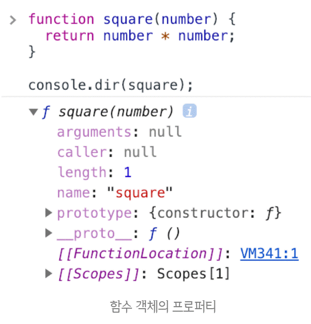
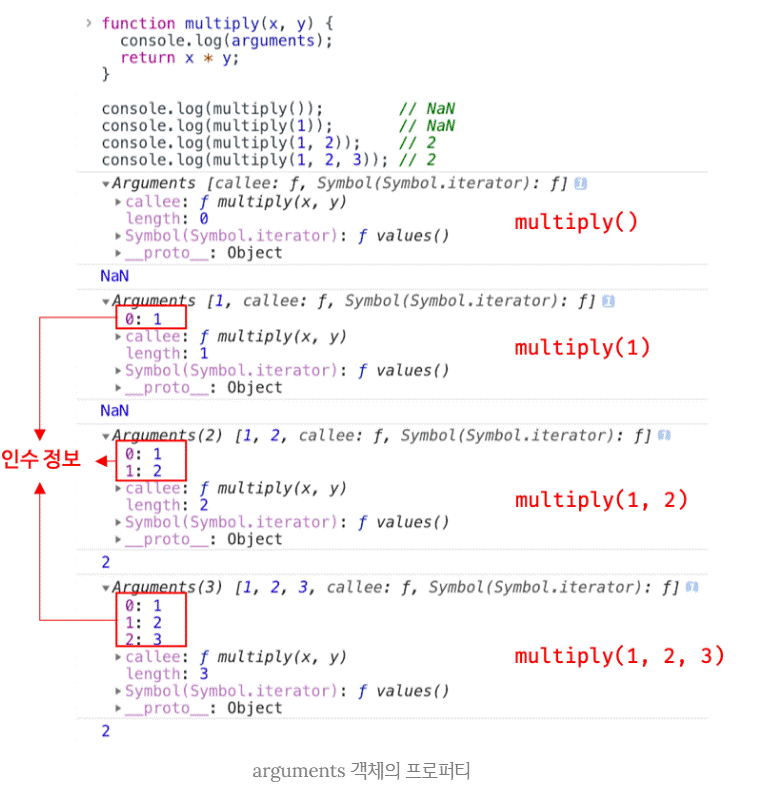

# 함수와 일급 객체

- 출처 [모던 자바스크립트 Deep Dive](http://www.yes24.com/Product/Goods/92742567?OzSrank=1)을 보고 정리한 내용입니다.

[Notion](https://www.notion.so/18-8e37d9c40cf44b46a1e8a774bcc87921)

## 1. 일급 객체

<br>

다음 조건을 만족하는 객체를

**일급 객체(first-class object)[용어]** 라고 한다.

<br>

1. 무명의 리터럴로 생성할 수 있다. 즉, **런타임에 생성이 가능**하다.
2. 변수나 **자료구조(객체, 배열 등)에 저장**할 수 있다. → 값
3. 함수의 **매개변수에게 전달**할 수 있다. → 값
4. 함수의 **반환값으로 사용**할 수 있다. - 값

<br>

즉, 값으로 사용가능한 객체를 일급객체라고 한다.

```jsx
// 1. 함수는 무명의 리터럴로 생성할 수 있다.
// 2. 함수는 변수에 저장할 수 있다.
// 런타임(할당 단계)에 함수 리터럴이 평가되어 함수 객체가 생성되고 변수에 할당된다.
const increase = function (num) {
  return ++num;
};

const decrease = function (num) {
  return --num;
};

// 2. 함수는 객체에 저장할 수 있다.
const predicates = { increase, decrease };

// 3. 함수의 매개변수에게 전달할 수 있다.
// 4. 함수의 반환값으로 사용할 수 있다.
function makeCounter(predicate) {
  let num = 0;

  return function () {
    num = predicate(num);
    return num;
  };
}

// 3. 함수는 매개변수에게 함수를 전달할 수 있다.
const increaser = makeCounter(predicates.increase);
console.log(increaser()); // 1
console.log(increaser()); // 2

// 3. 함수는 매개변수에게 함수를 전달할 수 있다.
const decreaser = makeCounter(predicates.decrease);
console.log(decreaser()); // -1
console.log(decreaser()); // -2
```

<br>

함수는 **일급 객체** 이므로

**값과 동일하게 취급할 수 있다.**

ex) 변수 할당문, 프로퍼티값, 함수 반환문 등등

<br>

**차이점**

함수는 호출가능

일반 객체는 호출 불가능

<br>
<br>

## 2. 함수 객체의 프로퍼티

<br>

**함수는 객체이므로**

**프로퍼티를 가질 수 있다.**

```jsx
function square(number) {
  return number * number;
}

console.dir(square);
```

<br>



<br>

**Object.getOwnPropertyDescriptors** 메서드로

확인해보면 다음과 같다.

```jsx
function square(number) {
  return number * number;
}

console.log(Object.getOwnPropertyDescriptors(square));
/*
{
  length: {value: 1, writable: false, enumerable: false, configurable: true},
  name: {value: "square", writable: false, enumerable: false, configurable: true},
  arguments: {value: null, writable: false, enumerable: false, configurable: false},
  caller: {value: null, writable: false, enumerable: false, configurable: false},
  prototype: {value: {...}, writable: true, enumerable: false, configurable: false}
}
*/

// __proto__는 square 함수의 프로퍼티가 아니다.
console.log(Object.getOwnPropertyDescriptor(square, "__proto__")); // undefined

// __proto__는 Object.prototype 객체의 접근자 프로퍼티다.
// square 함수는 Object.prototype 객체로부터 __proto__ 접근자 프로퍼티를 상속받는다.
console.log(Object.getOwnPropertyDescriptor(Object.prototype, "__proto__"));
// {get: ƒ, set: ƒ, enumerable: false, configurable: true}
```

<br>

**arguments, caller, length, name, prototype 프로퍼티는**

**일반 객체에는 없는**

**함수 객체 고유의 프로퍼티다**.

<br>

### 2.1. arguments 프로퍼티

<br>

함수 객체의 **arguments 프로퍼티 값은**

<br>

함수 호출 시, **인수(argument)들의 정보를 담은**

순회 가능한 **유사 배열 객체이다.**

<br>

**주의!**

argumesnts 프로퍼티는

함수 내부에서 **지역 변수처럼 사용되어**

**함수 외부에서는 참조 불가능!**

<br>

매개변수와 인수의 개수가 일치하는지 확인하지 않는다.

```jsx
function multiply(x, y) {
  console.log(arguments);
  return x * y;
}

console.log(multiply()); // NaN
console.log(multiply(1)); // NaN
console.log(multiply(1, 2)); // 2
console.log(multiply(1, 2, 3)); // 2
```

<br>



<br>

arguments 객체는

**인수를 프로퍼티 값**으로 소유한다.

**인수의 순서를 프로퍼티 키로** 나타낸다.

<br>

**What? arguments 객체 안의 다른 프로퍼티들은 무엇일까?**

**callee 프로퍼티는 arguments 객체를 생성한 함수,**

**즉 함수 자신이다.**

<br>

**length 프로퍼티는**

**인수의 개수를 가리킨다.**

<br>

**Symbole 프로퍼티는**

**arguments 객체를 순회 가능한 자료구조인**

**이터러블(iterable)로 만들기 위한 프로퍼티다.**

```jsx
function multiply(x, y) {
  // 이터레이터
  const iterator = arguments[Symbol.iterator]();

  // 이터레이터의 next 메서드를 호출하여 이터러블 객체 arguments를 순회
  console.log(iterator.next()); // {value: 1, done: false}
  console.log(iterator.next()); // {value: 2, done: false}
  console.log(iterator.next()); // {value: 3, done: false}
  console.log(iterator.next()); // {value: undefined, done: true}

  return x * y;
}

multiply(1, 2, 3);
```

<br>

**Why? arguments 는 어떤 용도로 쓰일까?**

자바스크립트는

인수의 개수를 확인하지 않으므로

<br>

**인수의 개수를 확인하고**

**동작을 다르게 정의 할때 유용하다.**

<br>

**즉,**

**매개변수 개수를 확정할 수 없는**

**가변 인자 함수[용어]를 구현할 때 유용하다.**

<br>

```jsx
function sum() {
  let res = 0;

  // arguments 객체는 length 프로퍼티가 있는 유사 배열 객체이므로 for 문으로 순회할 수 있다.
  for (let i = 0; i < arguments.length; i++) {
    res += arguments[i];
  }

  return res;
}

console.log(sum()); // 0
console.log(sum(1, 2)); // 3
console.log(sum(1, 2, 3)); // 6
```

<br>

**주의!**

**arguments 객체**는 실제 배열이 아닌

**유사 배열 객체(array-like object)[용어]이다.**

<br>

**What? 유사 배열 객체란 무엇일까?**

**length 프로퍼티를 가진 객체로**

**for문으로 순회할 수 있는 객체이다.**

<br>

**TIP!**

유사 배열 객체는 배열이 아니므로

배열 메서드를 사용하면 에러가 난다.

<br>

**배열 메서드를 사용하기 위해**서는

- **Function.prototype.call**
- **Function.prototype.apply**

를 사용해 간접 호출해야한다.

```jsx
function sum() {
  // arguments 객체를 배열로 변환
  const array = Array.prototype.slice.call(arguments);
  return array.reduce(function (pre, cur) {
    return pre + cur;
  }, 0);
}

console.log(sum(1, 2)); // 3
console.log(sum(1, 2, 3, 4, 5)); // 15
```

<br>

ES6에서 더 간편하게

**Rest 파라미터**를 도입했다.

```jsx
// ES6 Rest parameter
function sum(...args) {
  return args.reduce((pre, cur) => pre + cur, 0);
}

console.log(sum(1, 2)); // 3
console.log(sum(1, 2, 3, 4, 5)); // 15
```

<br>

### 2.2. caller 프로퍼티

표준화될 예정도 없는 프로퍼티이므로

사용하지 말고 참고로만 알아두자.

<br>

caller 프로퍼티는

함수 자신을 호출한 함수를 가리킨다.

```jsx
function foo(func) {
  return func();
}

function bar() {
  return "caller : " + bar.caller;
}

// 브라우저에서의 실행한 결과
console.log(foo(bar)); // caller : function foo(func) {...}
console.log(bar()); // caller : null
```

<br>

### 2.3. length 프로퍼티

<br>

**함수 객체의 length 프로퍼티는**

**매개변수의 개수를 가리킨다.**

```jsx
function foo() {}
console.log(foo.length); // 0

function bar(x) {
  return x;
}
console.log(bar.length); // 1

function baz(x, y) {
  return x * y;
}
console.log(baz.length); // 2
```

<br>

**헷갈림 주의!**

**arguments 객체 length 프로퍼티는**

**인자(argument)의 개수를 가리키고**

<br>

**함수 객체의 length 프로퍼티는**

**매개변수(parameter)의 개수 이다.**

<br>

### 2.4. name 프로퍼티

<br>

**name 프로퍼티는**

**함수 이름을 나타낸다.**

<br>

**주의!**

ES5와 ES6와 동작을 다르게 하므로 주의!

<br>

**익명 함수 표현식 경우**

ES5 ⇒ 빈 문자열 값

ES6 ⇒ 함수 객체를 가리키는 **식별자를 값**

<br>

```jsx
// 기명 함수 표현식
var namedFunc = function foo() {};
console.log(namedFunc.name); // foo

// 익명 함수 표현식
var anonymousFunc = function () {};
// ES5: name 프로퍼티는 빈 문자열을 값으로 갖는다.
// ES6: name 프로퍼티는 함수 객체를 가리키는 변수 이름을 값으로 갖는다.
console.log(anonymousFunc.name); // anonymousFunc

// 함수 선언문(Function declaration)
function bar() {}
console.log(bar.name); // bar
```

<br>

### 2.5. **proto** 접근자 프로퍼티

<br>

모든 객체는 [[Prototype]] 내부 슬롯을 가진다.

<br>

[[Prototype]] 은

**상속을 구현하는**

**프로토 타입 객체를 가리킨다.**

<br>

\***\*proto** 프로퍼티는\*\*

**[[Prototype]] 이 가리키는 객체에**

**접근하기 위해**

**사용하는 접근자 프로퍼티 이다.**

<br>

**Why? 왜 **proto** 가 필요할까?**

**[[Prototype]]은 직접 접근 할 수 없기 때문에**

\***\*proto** 을 이용해 간접 접근한다.\*\*

<br>

```jsx
const obj = { a: 1 };

// 객체 리터럴 방식으로 생성한 객체의 프로토타입 객체는 Object.prototype이다.
console.log(obj.__proto__ === Object.prototype); // true

// 객체 리터럴 방식으로 생성한 객체는 프로토타입 객체인 Object.prototype의 프로퍼티를 상속받는다.
// hasOwnProperty 메서드는 Object.prototype의 메서드다.
console.log(obj.hasOwnProperty("a")); // true
console.log(obj.hasOwnProperty("__proto__")); // false
```

<br>

**What? hasOwnProperty 메서드는 무엇일까??**

인수로 전달받은 프로퍼티 키가

<br>

**객체 고유의 프로퍼티 키**인 경우에만

**true를 반환**

<br>

**상속받은 프로토타입의 프로퍼티 키**인 경우

**false를 반환**한다.

<br>

### 2.6. prototype 프로퍼티

<br>

prototype 프로퍼티는

생성자 함수로 호출할 수 있는 함수 객체,

<br>

**즉**

**constructor만이 소유하는 프로퍼티다.**

 <br>

```jsx
// 함수 객체는 prototype 프로퍼티를 소유한다.
(function () {}.hasOwnProperty("prototype")); // -> true

// 일반 객체는 prototype 프로퍼티를 소유하지 않는다.
({}.hasOwnProperty("prototype")); // -> false
```

<br>

prototype 프로퍼티는

생성자 함수로 호출될 때

<br>

생성자 함수가 생성할

**인스턴스의 프로토타입 객체를 가리킨다.**

## 정리

- 일급객체란?
  - **값으로 평가할 수 있는 객체**
  - 따라서 **함수도** 값으로 평가되고 전달할 수 있으므로 **일급객체**
- 함수의 프로퍼티들
  1. Arguments
     - 인수정보
     - 유사 배열 객체 → length를 가진 객체
     - 레거시
     - 가변 인자 함수 구현할때 사용
       → 인수의 개수에 따라 다르게 동작하는 함수
     - 배열로 변환하기 까다로움
       - ES6부터 Rest 파라미터 등장
  2. Caller
     - 자신을 호출한 함수
  3. Length
     - 매개변수 개수
  4. Name
     - 함수 이름
  5. Prototype
     - 생성자 함수로 호출할 수 있는 함수만 소유(Constructor 함수)
     - 생성자 함수가 생성한 인스턴스의 프로토타입 객체를 가리킨다.
  6. 스페셜 프로퍼티 : \_ _Proto_ \_
     - [[Prototype]]에 접근하는 메서드
- 함수가 일급객체여서 함수형 프로그래밍이 가능
  → 값으로 전달 가능하므로
- 궁금한점?
  - 자바스크립트의 모든 객체는 값으로 평가가능하다.
  - 근데 왜 굳이 일급객체라는 용어를 붙였을까?
  - 자바스크립트에만 사용되는 것이 아닌 프로그래밍 용어이다.
  - 자바스크립트의 객체는 모두 일급객체이다.
