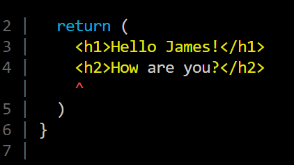

# JSX

<br>

## JSX란?

<br>

```jsx
const element = <h1>Hello, world!</h1>;
```

위의 문법은 문자열도, HTML도 아니다.

<br>

JSX라 하며 JavaScript를 확장한 문법이다. 

JSX라고 하면 템플릿 언어가 떠오를 수도 있지만, JavaScript의 모든 기능이 포함되어 있다.

<br>

JSX는 브라우저에 실행되기전에 코드가 웹팩으로 번들링되는 과정에서

바벨을 통행 일반 자바스크립트 형태의 코드로 변환된다.

JSX는 React **엘리먼트(element)** 를 생성한다.

<br>

# JSX 문법

<br>

## 1. 하나의 부모요소

컴포넌트에 여러요소가 있다면 반드시 부모 요소 하나로 감싸야한다.

<br>

```jsx
function App() {
  return (
    <h1>Hello James!</h1>
    <h2>How are you?</h2>
  )
}

export default App;
```

<br>



<br>

```jsx
function App() {
  return (
    <div>
      <h1>Hello James!</h1>
      <h2>How are you?</h2>
    </div>
  )
}

export default App;
```

<br>

부모 요소 하나로 감싸주어 정상 작동한다.

<br>

항상 하나의 부모요소를 넣어야한다.

하지만 의미없는 태그를 넣기 싫다면

React 16v부터 지원하는 Fragment 기능을 사용할 수 있다.

<br>

```jsx
import { Fragment } from "react";

function App() {
  return (
    <Fragment>
      <h1>Hello James!</h1>
      <h2>How are you?</h2>
    </Fragment>
  )
}

export default App;
```

<br>

or

Fragment를 생략해도된다.

```jsx
function App() {
  return (
    <>
      <h1>Hello James!</h1>
      <h2>How are you?</h2>
    </>
  )
}

export default App
```

<br>

## 2. JSX에 표현식 포함하기

<br>

```html
<div id="root"></div>
```

```jsx
const nameObj = {
  oldName : 'james',
  newName : 'Alex'
};

const newPerson = ({oldName, newName}) => oldName + ' and ' +newName;

const element = (
  <h1>
    Hello,{newPerson(nameObj)}
  </h1>);

ReactDOM.render(element, document.getElementById('root'));
```

<br>

JSX의 중괄호 안에는 유효한 모든 JavaScript 표현식을 넣을 수 있다. 

예를 들어 `2 + 2, newPerson(nameObj)` 등은 모두 유효한 JavaScript 표현식이다.

<br>

가독성을 좋게 하기 위해 JSX를 여러 줄로 나눌때는 필수는 아니지만, 

자동 세미콜론 삽입을 피하고자 괄호로 묶는 것을 권장한다.

```jsx
const element = (
  <h1>
    Hello,{newPerson(nameObj)}
  </h1>);

const element = <h1>
    Hello,{newPerson(nameObj)}
  </h1>;

```

<br>

**조건문을 사용하고싶은경우**

삼항조건 연산자를 사용하면된다.

```jsx
function App() {
  const name = 'james';
  return (
    <>
      <h1>Hello {name === 'james' ? name : 'james가 아니다.'}!</h1>
      <h2>How are you?</h2>
    </>
  )
}

export default App;
```

<br>

`if else`문이 아니라 단순 `if` 으로 사용하고 싶은 경우에는

<br>

논리합 연산자를 사용하면된다.

<br>

```jsx
function App() {
  const name = 'jams';
  return (
    <>
			// 만약 james **면** name을 출력한다.
      <h1>Hello {name === 'james' && name}!</h1> 
      <h2>How are you?</h2>
    </>
  )
}

export default App;
```

<br>

## 3. undefined를 반환하면 안된다.

<br>

```jsx
function App() {
  const name = undefined;
  return name;
}

export default App;
```

<br>

이러한 경우 논리곱 연산자로 undefiend일때 다른값으로 지정해주면된다.

```jsx
function App() {
  const name = undefined;
  return name || 'james 이다.'
}

export default App;
```

<br>

만약 값이 undefiend일때 보여주고 싶은 값이 있으면 뒤의 피연산자로 넣으면된다.

```jsx
function App() {
  const name = undefined;
  return <h1>{name || 'james 가 아니다!'}</h1>
}

export default App;
```

<br>

## 4. JSX도 표현식이다.

<br>

표현식은 값으로 표현가능하다.

<br>

때문에 컴파일이 끝나면, 

JSX 표현식이 JavaScript 함수 호출이 되고 **JavaScript 객체로 인식된다.**

<br>

즉, JSX를 `if` 구문 및 `for loop` 안에 사용하고, 변수에 할당하고, 인자로서 받아들이고, 함수로부터 반환할 수 있다.

<br>

```jsx
const nameObj = {
  oldName : 'james',
  newName : 'Alex'
};

const newPerson = ({oldName, newName}) => oldName + ' and ' +newName;

// const element = (
//   <h1>
//     Hello,{newPerson(nameObj)}
//   </h1>);

function getGreeting(nameObj) {
  if (nameObj) {
    return <h1>Hello, {newPerson(nameObj)}!</h1>;
  }
  return <h1>Hello, Stranger.</h1>;
}

ReactDOM.render(getGreeting(nameObj), document.getElementById('root'));
```

<br>

## 5. JSX 속성 정의

속성에 따옴표를 이용해 문자열 리터럴을 정의할 수 있다.

```jsx
const element = <div tabIndex="0"></div>;
```

<br>

중괄호를 사용하여 어트리뷰트에 JavaScript 표현식을 삽입할 수도 있다.

```jsx
const element = </img>;
```

<br>

어트리뷰트에 JavaScript 표현식을 삽입할 때 중괄호 주변에 따옴표를 입력하지 말아야 한다.

<br>

따옴표(문자열 값에 사용) 또는 중괄호(표현식에 사용) 중 하나만 사용하고, 

동일한 어트리뷰트에 두 가지를 동시에 사용하면 안된다.

<br>

JSX는 HTML보다는 JavaScript에 가깝기 때문에, React DOM은 HTML 어트리뷰트 이름 대신 `camelCase` 프로퍼티 명명 규칙을 사용한다.

예를 들어, JSX에서 `class`는 `[className](https://developer.mozilla.org/ko/docs/Web/API/Element/className)`가 되고 tabindex는 `[tabIndex](https://developer.mozilla.org/en-US/docs/Web/API/HTMLElement/tabIndex)`가 된다.

<br>

이렇게 클래스로 css파일에 있는 클래스안의 css속성을 정의해 넣어줄 수 도 있다.

```jsx
function App() {
  return <h1 className = 'styleCss'>James is the best frontEnd developer!</h1>
}

export default App;
```

<br>

속성안에는 스타일 객체가 들어간다.

```jsx
const nameObj = {
  oldName : 'james',
  newName : 'Alex'
};

const newPerson = ({oldName, newName}) => oldName + ' and ' +newName;

const element = (
  <h1>
    Hello,{newPerson(nameObj)}
  </h1>);

function getGreeting(nameObj) {
  if (nameObj) {
		// style="color : red"
    return <h1 style={{color : "red"}}>Hello, {newPerson(nameObj)}!</h1>;
  }
  return <h1>Hello, Stranger.</h1>;
}

ReactDOM.render(getGreeting(nameObj), document.getElementById('root'));
```

<br>

DOM요소에 스타일을 적용할때에는 객체 형태로 넣어주어야한다.

또한 카멜케이스로 작성해야한다.ex) `background-color =⇒ backgroundColor`

<br>

```jsx
function App() {
  const styleCss = {
    color : 'skyblue',
    fontSize : '100px',
    backgroundColor : 'tomato'
  }
  return <h1 style={ styleCss }>James is the best frontEnd developer!</h1>
}

export default App;
```

<br>

## 6. JSX로 자식 정의

<br>

태그가 비어있다면 XML처럼 /> 를 이용해 닫아주어야한다.

```jsx
const element = ;
```

<br>

HTML에서는 input 태그는 닫히는 태그가 아니다.

하지만 JSX에서는 반드시 닫아주어야 한다.

```jsx
function App() {
  return (
    <>
      <h1 className = 'styleCss'>James is the best frontEnd developer!</h1>
      <input/>
    </>
  )
}

export default App;
```

<br>

JSX 태그는 자식을 포함할 수 있다.

```jsx
const element = (
  <div>
    <h1>Hello!</h1>
    <h2>Good to see you here.</h2>
  </div>
);
```

<br>

```jsx
const newPerson = ({oldName, newName}) => oldName + ' and ' +newName;

const element = (
  <div>
    <h1>
      Hello,{newPerson(nameObj)}
    </h1>
    <p>I'm pretty okay!</p>
  </div>
);

ReactDOM.render(element, document.getElementById('root'));
```

<br>

## 7. 주석

자바스크립트에서 주석은 `//` 과같이 사용한다.

<br>

하지만 JSX에서는 주석을 작성할때 다르다.

`{/*...*/}` 으로 작성해야한다.

단축키는 VScode에서 `Alt`  + `Shift` + `a` 이다.

```jsx
function App() {
  return (
    <> {/* 이것은 주석입니다. */}
      <h1 className = 'styleCss'>James is the best frontEnd developer!</h1>
      <input/> 
    </>
  )
}

export default App;
```

<br>

## 8. JSX는 객체를 표현한다.

<br>

Babel은 JSX를 React.createElement() 호출로 컴파일한다.

<br>

이 두가지 예제는 똑같다.

하지만 Babel이 JSX 컴파일하면 두번째 예시처럼 만든다.

```jsx
const element = (
  <h1 className="greeting">
    Hello, world!
  </h1>
);
```

<br>

```jsx
const element = React.createElement(
  'h1',
  {className: 'greeting'},
  'Hello, world!'
);
```

<br>

Babel로 컴파일 하기전에, JSX 코드를 작성하는 것이 아니라

두번째 코드 처럼 작성해도 된다.

<br>

하지만 매번 위코드 처럼 사용한다면 명시적이고 한눈에 파악하기 힘들다.

때문에 JSX를 사용하면 매우편하게 개발할 수 있다.

<br>

`React.createElement()`는 버그가 없는 코드를 작성하는 데 도움이 되도록 몇 가지 검사를 수행하며, 기본적으로 다음과 같은 객체를 생성한다.

<br>

```jsx
const element = {
  type: 'h1',
  props: {
    className: 'greeting',
    children: 'Hello, world!'
  }
};
```

<br>

이러한 객체를 **“React 엘리먼트”** 라고 하며, 이를 화면에 표시하려는 항목에 대한 설명이라고 생각할 수 있다. 

<br>

React는 이러한 객체를 읽은 후 DOM을 구성하고 최신으로 유지하는 데 이러한 객체를 사용한다.