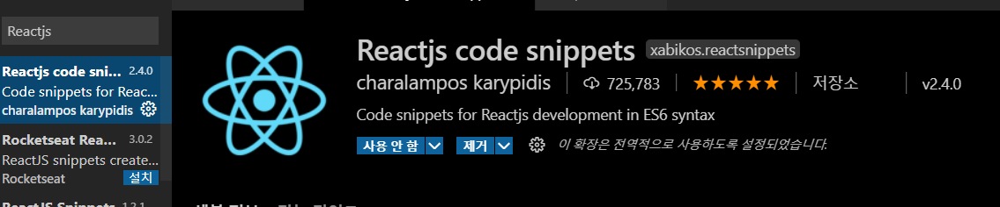
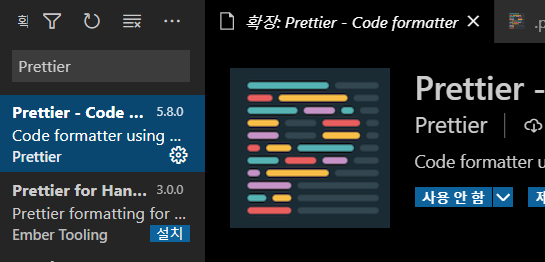
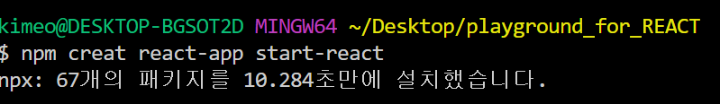

# React 환경설정

<br>

# 1. ESlint 설치

<br>

[ESlint 설치방법](https://github.com/Alex-Eojin/-TIL/blob/master/GIt/eslint.md)

<br>

creat-react-app 을한경우 

1 . `npm add eslint-config-airbnb` 을 해준다.

2 . package.json에서 설정을 해준다.

```jsx
"eslintConfig": {
    "extends": ["react-app", "airbnb"]
  },
```

3 . 옵션 룰 정해주기.

```jsx
"eslintConfig": {
    "extends": ["react-app", "airbnb"],
    "rules": {
      "react/prefer-stateless-function": 0,
      "react/jsx-filename-extension": 0,
      "react/jsx-one-expression-per-line": 0,
			"linebreak-style": 0
    }
  },
```

<br>

## 2. Reactjs Code Snippets 설치

<br>

리액트 컴포넌트 및 라이프사이클 함수를 작성할 때 단축단어를 간편하게 설정할 수 있도록 도와준다.

<br>



<br>

## 3. Prettier 설치

<br>



[Prettier 환경설정](https://github.com/Alex-Eojin/-TIL/blob/master/Tool/prettier.md)

<br>

## 4. creat-react-app으로 프로젝트 생성

<br>

creat-react-app으로 웹팩과 바벨의 설치를 생략하고 한번에 프로젝트 작업환경을 만들어 주는 도구이다.

<br>

- 웹팩 → 파일에서 import 를 이용해서 다른 모듈을 불러온다. 브라우저에서 웹팩을 사용할때, import로 불러온 모듈을 모두 하나로 합쳐서 파일을 생성해준다. 이러한 과정에서 최적화를 이룬다.
- 바벨 → 최신 자바스크립트 문법으로 작성된 코드를 바벨을 이용하여 크로스 브라우징을 하게 해준다.(ES5 문법으로 컴파일해준다.)

<br>

### 4.1 npm creat react-app <프로젝트이름>

```bash
npm creat react-app <프로젝트이름>
```

<br>

or 

<br>

```bash
npx creat react-app <프로젝트이름>
```

<br>



<br>

npx을 하게되면 현재 최근 버전인 리액트 버전으로 받게된다.

<br>

프로젝트이름을 입력한 파일이 생성된다.

<br>

이후 리액트 개발전용 서버를  `npm start` 하면 실행할 수 있다.

<br>

## CDN JSX 사용환경설정

JSX를 사용하기 위해서는 Babel을 이용하여 컴파일을 해주어야한다.

<br>

### 1. HTML파일에 DOM 컨테이너를 설치한다.

React가 DOM 컨테이너 안에 내용을 추가해준다. (루트)

<br>

### 2. 스크립트 태그 추가

`<script>` 태그 3개를 닫는 태그인 `</body>` 앞에 추가해준다.

```jsx
<script src="https://unpkg.com/react@17/umd/react.development.js" crossorigin></script>
<script src="https://unpkg.com/react-dom@17/umd/react-dom.development.js" crossorigin></script>
<script src="https://unpkg.com/babel-standalone@6/babel.min.js"></script>

</body>
```

<br>

위의 코드는 개발용으로 만들어진 CDN이다.

처음 두 태그는 React를 실행시킨다.

세번째 태그는 바벨CDN을 불러와 컴파일 시킨다.

<br>

### 3. <script type="text/babel"></script>

`<script type="text/babel"></script>` 스크립트 파일을 타입을 바벨로 컴파일하게 지정해준다.

<br>

하지만 위 방법은 간단한 공부목적과 데모 사이트를 만들때 사용한다.

<br>

때문에 `type="text/babel"` 을 제거하고 자동으로 `<script>` 태그를 변환시켜줄 JSX전처리기를 만들면된다.

### 3-1. JSX 전처리기 설치

1. `npm init -y` 실행
2. `npm install babel-cli@6 babel-preset-react-app@3` 실행

<br>

### 3-2 JSX 전처리기 실행하기

src 폴더를 만들고 다음 터미널 명령어를 실행하면된다.

```bash
npx babel --watch src --out-dir . --presets react-app/prod
```

<br>

--watch src : src폴더를 계속 —watch(지켜보면서 달라진부분을 비교한다)

<br>

--out-dir : output파일을 다른폴더에 만든다.