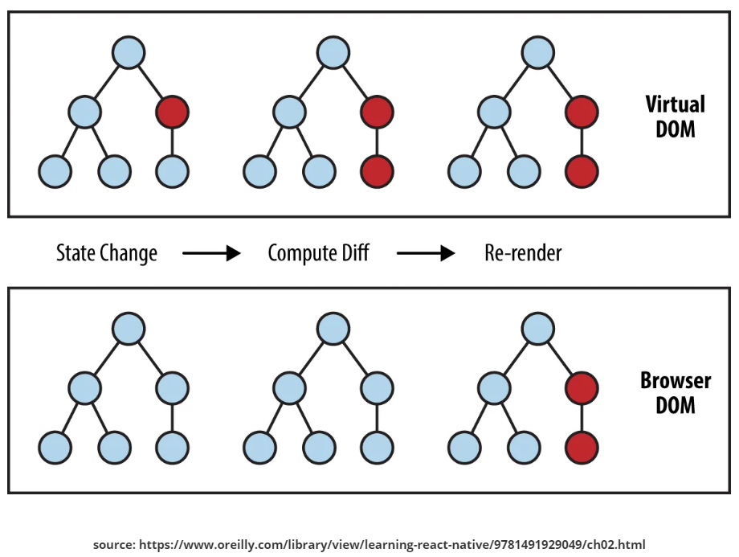

# React

<br>

## 프론트엔드의 라이브러리, 프레임워크 생겨난 배경

웹개발은 서버를 중심으로 개발이 됬었다.

서버에서 미리 만들어 두었던 웹페이지를 클라이언트에 제공했다.

<br>

하지만 점차 시간이 지나 개인 사용자들의 컴퓨터의 성능이 향상됬다

또한 페이지를 부분적으로 갱신할 수 있는 구글의 AJAX 기술로

서버는 API역활을 집중하게 됬다.

<br>

추가로 필요한 데이터를 클라이언트가 서버쪽에 요청하고

이미 화면렌더링된 화면에서 일부분만 추가하여 렌더링을 했다.

<br>

즉, 클라이언트의 성능이 향상되어 

서버 중심으로 개발에서

클라이언트 중심으로 개발로 발전하게 되었다.

<br>

그러다 보니 프론트엔드의 로직이 복잡해져 

라이브러리, 프레임워크를 적극적으로 활용하게 되어

체계적으로 관리했다.

<br>

때문에 최근에는 데스크톱 애플리케이션(슬랙, 아톰, vscode..등등),

모바일 애플리케이션(페이스북, 디스코드.. 등등) 

자바스크립트로 웹 뿐만아니라 큰 규모의 애플리케이션도 만들 수 있게 됬다.

<br>

## React는 무엇일까?

<br>
### 기존뷰가 아닌 새로운 랜더링

규모가 큰 애플리케이션에서 복잡한 코드를 정교하게 찾아서 변경해야하는 방식은 개발자가 끊임없이 집중하고, 신경써야한다.

<br>

페이스북은 어떠한 데이터가 변할때, **기존 뷰를 없애고 새로 랜더링 하는 방식으로 만들었다.**

이렇게 하면 기존 애플리케이션의 구조가 간단해진다.

<br>

하지만 이렇게 새로 랜더링을 하면 성능과 랜더링을 하면 끊김 현상이 발생할것이다.

**때문에** 

**초기 렌더링 과정**에서 render()함수를 통해 실제 페이지에 DOM요소를 주입하는 과정을 한뒤,

<br>

이후 **재조정(reconciliation) 과정** 즉, 업데이트 과정을 거칠때,

새롭게 만든 모든 요소를 바로 DOM에 반영하는것이 아니다.

<br>

**초기 렌더링 과정**에서 만들었던 컴포넌트 정보와

**재조정(reconciliation) 과정**의 컴포넌트 정보와 비교한다.

<br>



<br>

비교후, 둘의 차이를 알아내 최소한의 연산으로 DOM트리를 업데이트하여

성능면에서 더 나아지게 만들었다.

<br>

### 선언형

React는 상호작용이 많은 UI를 만들 때 생기는 어려움을 줄여준다.

React는 데이터가 변경됨에 따라 적절한 컴포넌트만 효율적으로 갱신하고 렌더링한다.

<br>

### 컴포넌트 기반

스스로 상태를 관리하는 캡슐화된 컴포넌트를 만든다.

컴포넌트 로직은 템플릿이 아닌 JavaScript로 작성된다. 

따라서 다양한 형식의 데이터를 앱 안에서 손쉽게 전달할 수 있고, DOM과는 별개로 상태를 관리할 수 있다.

<br>

React 컴포넌트는 render()라는 메서드를 구현하는데, 이것은 데이터를 입력받아 화면에 표시할 내용을 반환하는 역할을 한다. 

이 예제에서는 XML과 유사한 문법인 JSX(Javascript + XML)를 사용한다. 

컴포넌트로 전달된 데이터는 render() 안에서 **this.props**를 통해 접근할 수 있다.

<br>

```bash
class HelloMessage extends React.Component {
  render() {
    return (
      <div>
        Hello {this.props.name}
      </div>
    );
  }
}

ReactDOM.render(
  <HelloMessage name="Taylor" />,
  document.getElementById('hello-example')
);
```

<br>

JSX를 컴파일하려면 Babel을 이용해야한다.

### React는 기술 스택의 나머지 부분에는 관여하지 않는다.

기술 스택의 나머지 부분에는 관여하지 않기 때문에

기존 코드를 다시 작성하지 않고도 React의 새로운 기능을 이용해 개발할 수 있다.

React는 라이브러리로 굉장히 자유롭게 사용할 수 있다.

<br>

**그렇다면 XML은 무엇일까?**

eXtensible Markup Language의 약자

XML은 데이터 저장과 전송을 목적으로 만들어진 마크업 언어이다.

<br>

### Virtual DOM 사용

<br>

### Why? Virtual DOM 사용?

브라우저에서 서버로부터 HTML을 전달받으면

브라우저의 렌더 엔진이 이를 파싱하고 DOM 노드(Node) 로 이뤄진 트리를 만든다.

<br>

CSS로 만든 CSSOM과 DOM Tree가 합쳐

브라우저에 화면에 랜더링 되는 노드들만 나타내는 Render Tree를 생성한다.

<br>

Render Tree에서 DOM 트리에 새로운 노드가 추가되면 그과정에서 

랜더링이 다시 되는 Reflow, Repaint가 일어난다.

<br>

**이때**

100개의 노드를 하나하나 수정했을때 레이아웃 계산 및 리랜더링을 100번 다시한다.

<br>

때문에 100번이라는 리패인트,리패인팅 발생으로 인한 비용이 많으므로

<br>

만약 DOM에 다른점이 있다면 가상돔을 사용해 변화 되었던 노드들을 가상돔에서 바뀐점을 비교하며 교체를 하고

<br>

모든것이 바뀐뒤 실제 DOM에서 단한번 랜더링을 하게되 기존의 수많은 레이아웃 계산과 리랜더링을 단 한번으로 막아줄 수 있다.

<br>

**재조정 과정**

1 . 데이터가 업데이트 되면 Virtual DOM에 리렌더링을 한다.

2 . 이전의 Virtual DOM에 있던 내용과 현재 내용을 비교한다.

3 . 바뀐 부분만 실제 DOM에 적용한다.

<br>

리액트는 Virtual DOM을 사용한다고 해서 무조건 적으로 성능이 좋은것은 아니다.

만약 매우 간단한 페이지일때(단순 라우팅을 하는 정적인 페이지)인경우 오히려 리액트를 사용하지 않는 면이 더 성능이 좋다.

<br>

**리액트는 지속적으로 데이터가 업데이트가 되는 대규모 애플리케이션을 위한 용도로 만들어졌다.**