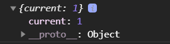

# Ref

<br>

ref(reference)는 리액트에서 DOM에 이름을 다는 것을 말한다.

<br>

**리액트 컴포넌트에 id를 사용하면 안되는 이유**

id는 유일해야하는데 컴포넌트가 여러번 사용되면 중복된 id를 가지는 경우가 생겨난다.

<br>

때문에 이러한 문제를 위해서 ref를 쓴다.

<br>

**ref는 DOM을 직접 다뤄야할때 사용되어야한다.**

예를들어

1. 특정 input에 포커스 주기
2. 스크롤 조작하기
3. 등등..

<br>

## ref를 사용하는 방법

ref를 사용하는 방법은 2가지가 있다.

<br>

### 1. 콜백함수를 이용한 ref설정

<br>

ref를 달고자하는 요소에 ref라는 콜백함수를 props로 전달해주면된다.

콜백함수는 인수로 ref값을 받고 내부에서 ref를 컴포넌트의 멤버변수(인스턴스의 변수)로 설정해준다.

```jsx
<input ref={(ref) => this.input = ref} />
```

<br>

this.input은 input 태그를 가리키게된다.

<br>

## 2. createRef로 ref 설정

리액트에 내장되어있는 createRef라는 함수를 사용하면 ref를 만들수있다.

<br>

creatRef를 사용해서 멤버변수로 담아주고

ref를 달고자하는 요소에 ref props로 넣어주면된다.

```jsx
import React, { Component } from 'react';

class ValidationSample extends Component {
  input = React.createRef();
  render() {
    return (
      <div>
        <input ref={this.input} />
      </div>
    );
  }
}

export default ValidationSample;
```

<br>

ref를 설정해준 DOM에 접근하려면 this.input.current로 조회하면된다.

```jsx
import React, { Component } from 'react';
import './ValidationSample.css';

class ValidationSample extends Component {
  state = {
    password: '',
    clicked: false,
    validated: false,
  };

  handleChange = (e) => {
    this.setState({
      password: e.target.value,
    });
  };

  handleButtonClick = () => {
    this.setState({
      clicked: true,
      validated: this.state.password === '0000',
    });
    this.input.focus();
  };

  render() {
    return (
      <div>
        <input
          type="password"
          value={this.state.password}
          onChange={this.handleChange}
          className={
            this.state.clicked
              ? this.state.validated
                ? 'success'
                : 'failure'
              : ''
          }
          ref={(ref) => (this.input = ref)}
        />
        <button onClick={this.handleButtonClick}>검증하기</button>
      </div>
    );
  }
}

export default ValidationSample;
```

<br>

## 컴포넌트에 ref설정

리액트에서는 컴포넌트에도 ref를 달 수 있다.

주로 DOM을 컴포넌트 외부에서 사용할 때 쓴다.

ex) 내부의 메서드, 멤버변수에도 접근할수있다.

ex) this.mycoponent.input

```jsx
<MyComponent
  ref={(ref) => {this.myComponent=ref}}
/>
```

<br>

컴포넌트 외부에서 컴포넌트 내부의 메서드를 사용하려고 할때

화살표함수 문법을 사용하여 아예 새로운 함수를 만들고

내부 메서드를 실행해야한다.

```jsx
render() {
    return (
      <div>
        <ScrollBox ref={(ref) => this.scrollBox=ref}/>
        <button onClick={() => this.scrollBox.scrollToBottom()}>
          맨 밑으로
        </button>
      </div>
    );
  }
```

<br>

```jsx
import React, { Component } from 'react';
class ScrollBox extends Component {
  scrollToBottom = () => {
    const { scrollHeight, clientHeight } = this.box;
    this.box.scrollTop = scrollHeight - clientHeight;
  };

  render() {
    const style = {
      border: '1px solid black',
      height: '300px',
      width: '300px',
      overflow: 'auto',
      position: 'relative',
    };
    const innerStyle = {
      width: '100%',
      height: '650px',
      background: 'linear-gradient(white, black)',
    };
    return (
      <div
        style={style}
        ref={(ref) => {
          this.box = ref;
        }}
      >
        <div style={innerStyle} />
      </div>
    );
  }
}
export default ScrollBox;
```

<br>

컴포넌트 내부에서 DOM에 직접 접근해야할때는 ref를 사용해야한다

하지만 먼저 ref를 사용하지 않고 기능을 구현할수있는지 반드시 고려하고 사용해야한다.

<br>

또한 서로 다른 컴포넌트끼리 ref를 교환해서 사용하면 복잡해지므로 사용하면 안된다.

<br>

### 함수형 컴포넌트의 useRef Hook

<br>

**사용법**

```jsx
const refContainer = useRef(initialValue);

// useRef는 객체를 반환한다.
// 반환된 객체의 current키의 값은 initialValue이 된다.
```

<br>

useRef Hooks는 함수형 컴포넌트에서 ref를 쉽게 사용할 수 있도록 해준다.

useRef를 사용하여 ref를 설정하면 useRef를 통해 만든 객체안의 current 값이 실제 엘리먼트를 가리킨다.

<br>



<br>

### 로컬변수

<br>

이 기능은 클래스에서 인스턴스 필드를 사용하는 방법과 유사하다.

<br>

함수형 컴포넌트에서 로컬변수로 useRef를 활용할 수 있다.

함수형 컴포넌트안에 useRef의 값은 렌더링과 상관없이 변경할 수 있다.

<br>

**리액트에서 props와 state가 변경되면 업데이트가된다.**

**하지만 useRef로 변수에 할당한 값이 변경되어도 업데이트가 되지 않는다.**

<br>

예제코드)

```jsx
import React, { useRef } from 'react';

const App = () => {
  const number = useRef(1);
  const onClick = () => {
    number.current += 1;
  };
  
  console.log(number.current);

  return (
    <>
      <h1>{number.current}</h1>
      <button onClick={onClick}>+1</button>
    </>
  );
};

export default App;
```

<br>

### 컴포넌트 ref등록

<br>

등록하고 싶은 컴포넌트의 props로 ref를 넣어주면된다.

```jsx
import React, { useRef } from 'react';

const App = () => {
  const inputEl = useRef(null);

  return <input ref={inputEl} type="text" />;
};

export default App;
```

<br>

current의 값으로 input 엘리먼트를 가리킨다.