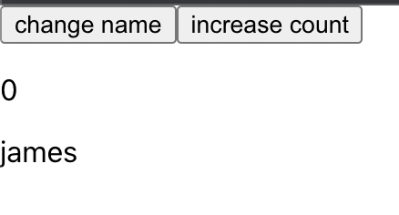
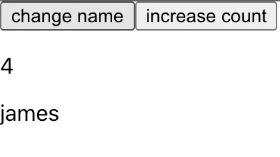
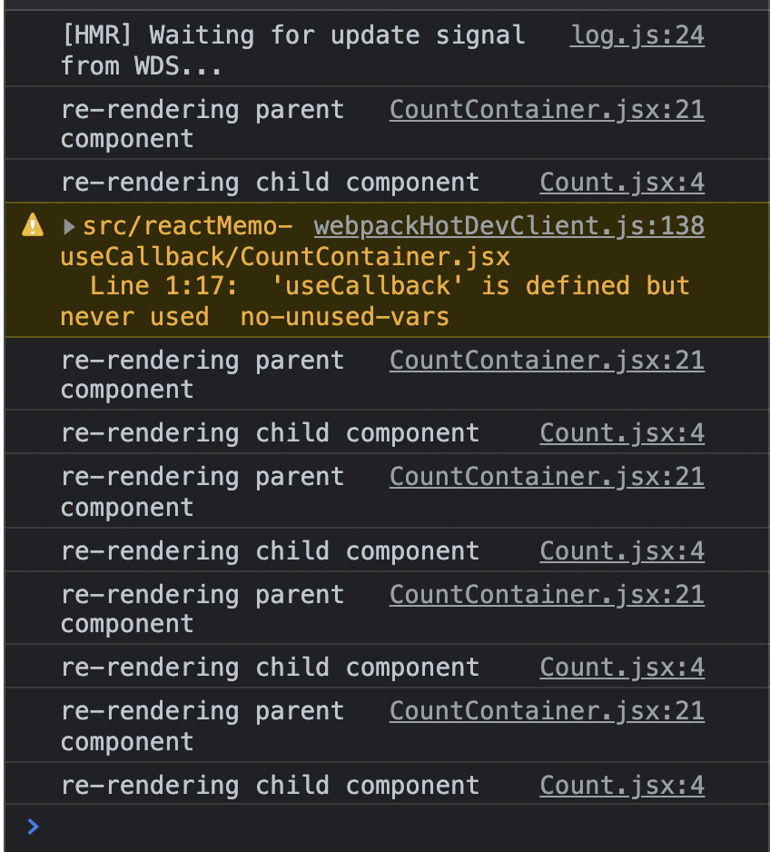
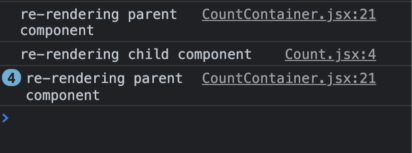

# useCallback / React.memo

<br>

## useCallback

useCallback은 두가지 인수를 받는다.

- 첫번째로 콜백함수
- 두번째로 의존성 배열,

<br>

의존성 배열의 값이

- 변경되면 콜백함수가 다시 정의되서 호출된다.
- 변경되지 않으면 이전에 정의한 콜백함수가 리턴되서 사용된다.

<br>

```jsx
const memoizedCallback = useCallback(() => {
  doSomething(a, b);
}, [a, b]);
```

<br>

### useCallback 동작 원리(추측)

useCallback의 내부 로직을 약간 추측해보자면

내부적으로 useCallbakc이 호출되면 React의 Hook에 대한 정보를 저장하는 배열안에 의존성 배열과 콜백함수가 들어간다.

<br>

컴포넌트가 리렌더링 되서 재호출 되게되면 useCallback이 호출되고 이전에 저장된 React의 Hook 배열의 의존성 배열값과 현재 의존성 배열값을 비교한다.

만약 같다면 그대로 이전에 저장한 콜백함수(메모이제이션된 함수)를 반환해 사용하고 다르다면 현재 들어온 useCallback을 사용하는 로직이라고 추측된다.

<br>

따라서 useCallback은 불필요한 렌더링을 방지하기위해 사용하는 최적화 함수라고 할 수 있다.

<br>

※ 메모이제이션 : 동일한 계산을 반복해야 할 때, 이전에 계산한 값을 메모리에 저장함으로써 동일한 계산의 반복 수행을 제거하여 프로그램 실행 속도를 빠르게 하는 기술이다.

<br>

## useCallback을 언제 사용하는 것일까?

함수들은 컴포넌트가 리렌더링 될 때 마다 새로 만들어진다.

<br>

함수를 선언하는 것으로 메모리, CPU 리소스를 사용하기는 하지만

많이 차지 하지 않는 작업은 아니기 때문에 **함수를 새로 선언한다고 해서 크게 성능에 문제가 생길이유는 없다.**

<br>

그렇다면 useCallback은 언제 사용하는 것일까?

<br>

`**React.memo**` 를 사용해서 컴포넌트가 불필요하게 리렌더링 되지 않게 **성능 최적화**를 위해서 같이 사용되어진다.

<br>

잠깐 먼저 `**React.memo**`에 대해서 공부해보자

<br>

## React.memo

<br>

컴포넌트에 동일한 props를 부모로 부터 전달 받는다면 컴포넌트를 리렌더링 하지 않는다.

하지만 state가 변경된다면 리렌더링이 다시 된다.

<br>

React.memo는 HOC이다.

최적화를 하려는 컴포넌트를 인수로 넣어 props가 변경되지 않는다면, 이전에 메모이징(Memoizing)한 컴포넌트의 결과를 재사용한다.

<br>

props는 얕은 비교만을 수행하는 것이 기본 알고리즘이다.

따라서 깊은 비교 또는 다른 알고리즘 비교방식을 사용하고 싶다면 두번째 인자에 별도의 비교 함수를 넣어 사용할 수 있다.

```jsx
function MyComponent(props) {
  /* props를 사용하여 렌더링 */
}
function areEqual(prevProps, nextProps) {
  /*
  nextProp가 prevProps와 동일한 값을 가지면 true를 반환하고, 그렇지 않다면 false를 반환
  */
}
export default React.memo(MyComponent, areEqual);
```

<br>

### React.memo는 모든 컴포넌트에 적용해야 할까?

모든 컴포넌트가 성능 최적화 되면 좋겠지만

- React.memo를 사용할때의 코드
- 메모이제이션용 메모리
- 최적화를 진행하는데 비교하는 알고리즘 연산에 대한 비용

이러한 점이 필요하기 때문에 무분별한 사용 하는것은 옳지 않다.

<br>

그럼 언제 사용해야 할까

- 함수형 컴포넌트에 전달된 **props에 항상 같은 결과가 렌더링 될때**
- **UI 로직이 긴 경우의** 컴포넌트
- **깊은 비교를 필요하지 않은 컴포넌트** 인 경우

<br>

React.memo와 같은 성능 최적화 기능을 사용할때는 퍼포먼스 측정을 해보는 것이 좋다.

항상 사용했다가 컴포넌트가 바뀌지 않는 경우도 있기 때문이다.

<br>

## React.memo with useCallback

React.memo는 props를 통해 비교한뒤 값이 달라진다면 컴포넌트를 리렌더링 한다고 했다.

<br>

만약 A라는 부모 컴포넌트가 B라는 자식 컴포넌트에게 함수를 전달하면 어떨까?

함수를 전달한다면 함수의 참조값을 전달한다.

<br>

이때 A 부모 컴포넌트가 리렌더링이 된다고 하자.

저절로 A 컴포넌트의 **함수들도 다시 정의되어 변수에 바인딩**된뒤 B 컴포넌트에게 props로 전달한다.

실제로 전달되어진 함수의 내부 로직 또는 내부의 특정값이 변경되어진 점이 없다하더라도,

B 컴포넌트의 참조값은 당연히 변경되어져 있으므로 B 컴포넌트도 따라서 리렌더링 된다.

<br>

코드를 직접보면 이해가 간다. 예시를 보자

<br>

### useCallback을 사용하지 않았을때

<br>

부모 컴포넌트 CountContainer.jsx

```jsx
import React, { useCallback, useState } from "react";
import Count from "./Count";

const NAME = {
  james: "james",
  alex: "alex",
};

function CountContainer() {
  const [count, setCount] = useState(0);
  const [name, setName] = useState(true);

  const increaseCount = () => {
    setCount(count + 1);
  };

  const changeName = () => {
    setName(!name);
  };

  console.log("re-rendering parent component");
  return (
    <>
      <Count changeName={changeName} />
      <button onClick={increaseCount}>increase count</button>
      <p>{count}</p>
      <p>{name ? NAME.james : NAME.alex}</p>
    </>
  );
}

export default CountContainer;
```

<br>

자식 컴포넌트 Count.jsx

```jsx
import React from "react";

function Count({ changeName }) {
  console.log("re-rendering child component");
  return (
    <>
      <button onClick={changeName}>change name</button>
    </>
  );
}

export default React.memo(Count);
```

<br>

부모 컴포넌트에 count state를 증가시키는 버튼이 있다.

자식 컴포넌트에는 changName 함수를 props로 전달받아 name state를 변경시키는 버튼이 있다.

자식 컴포넌트는 `React.memo` 로 감싸져있다.

<br>

**부모 컴포넌트에서 count 증가 버튼 클릭시 프로세스**

1. 부모 컴포넌트의 **state가 변경되었으므로 리렌더링이** 된다.
2. 부모 컴포넌트들의 **함수들도 다시 정의되어진다**.
3. 자식 컴포넌트에게 참조값이 변경된 **changName 함수를 props로 전달한다.**
4. 자식 컴포넌트는 `React.memo` 를 통해 **props 변경을 확인한다.**
5. changName은 내부 로직 또는 내부 변수값이 변경이 없더라도 참조값이 변경되어서 달라졌다고 비교하기 때문에 **자식 컴포넌트가 리렌더링 된다.**

<br>

**increase count 버튼 클릭시**

**부모 컴포넌트와 자식 컴포넌트가 똑같이 리렌더링 되는 모습**







<br>

이렇게 함수들을 props로 전달하는 과정에서 정의된 함수 컴포넌트의 참조값이 변경되어서 자식 컴포넌트들이 모두 리렌더링 된다.

한마디로 React.memo는 의미가 없어졌다.

<br>

이러한 문제를 useCallback으로 해결 가능하다.

<br>

## useCallback 사용

<br>

부모 컴포넌트 CountContainer.jsx

```jsx
import React, { useCallback, useState } from "react";
import Count from "./Count";

const NAME = {
  james: "james",
  alex: "alex",
};

function CountContainer() {
  const [count, setCount] = useState(0);
  const [name, setName] = useState(true);

  const increaseCount = () => {
    setCount(count + 1);
  };

  const changeName = useCallback(() => {
    setName(!name);
  }, [name]);

  console.log("re-rendering parent component");
  return (
    <>
      <Count changeName={changeName} />
      <button onClick={increaseCount}>increase count</button>
      <p>{count}</p>
      <p>{name ? NAME.james : NAME.alex}</p>
    </>
  );
}

export default CountContainer;
```

<br>

자식 컴포넌트 Count.jsx

```jsx
import React from "react";

function Count({ changeName }) {
  console.log("re-rendering child component");
  return (
    <>
      <button onClick={changeName}>change name</button>
    </>
  );
}

export default React.memo(Count);
```

<br>

이제 부모 컴포넌트에서 increase count 버튼을 클릭해도 chnageName 함수는 재 정의 되지 않아 참조값이 변경되지 않는다.

따라서 자식 컴포넌트에 props로 전달해도 React.meo는 같은 값으로 비교해서 자식 컴포넌트는 리렌더링이 되지 않는다!

<br>

**increase count 버튼을 클릭해도**

**부모 컴포넌트만 리렌더링 되고 자식 컴포넌트는 리렌더링 되지 않는 모습**




<br>

## 정리

- React.memo를 사용하여 함수를 props로 전달받는 경우
- 부모 컴포넌트에 해당 함수를 useCallback 으로 감싸 주기

<br>

참고

- [https://ko.reactjs.org/docs/hooks-reference.html#usecallback](https://ko.reactjs.org/docs/hooks-reference.html#usecallback)
- [https://react.vlpt.us/basic/18-useCallback.html](https://react.vlpt.us/basic/18-useCallback.html)
- [https://velog.io/@shin6403/React.memo-useCallback-사용으로-렌더링-최적화-하기feat.React-NativeRedux](https://velog.io/@shin6403/React.memo-useCallback-%EC%82%AC%EC%9A%A9%EC%9C%BC%EB%A1%9C-%EB%A0%8C%EB%8D%94%EB%A7%81-%EC%B5%9C%EC%A0%81%ED%99%94-%ED%95%98%EA%B8%B0feat.React-NativeRedux)
- [https://velog.io/@velopert/using-redux-in-2021#리렌더링-최적화를-memoized-selector-사용하기](https://velog.io/@velopert/using-redux-in-2021#%EB%A6%AC%EB%A0%8C%EB%8D%94%EB%A7%81-%EC%B5%9C%EC%A0%81%ED%99%94%EB%A5%BC-memoized-selector-%EC%82%AC%EC%9A%A9%ED%95%98%EA%B8%B0)
- [https://ko.reactjs.org/docs/react-api.html#reactmemo](https://ko.reactjs.org/docs/react-api.html#reactmemo)
