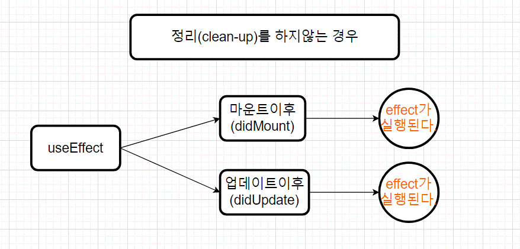

# useEffect

<br>

useEffect는 **컴포넌트가 렌더링 될때** 마다 특정 작업을 수행하도록 설정해준다.

컴포넌트가 렌더링이 된후 실행된다.

<br>

Effect Hook을 사용하면 함수 컴포넌트에서 side effect를 수행할 수 있다.

<br>

데이터 가져오기, 구독(subscription) 설정하기, 수동으로 리액트 컴포넌트의 DOM을 수정하는 것까지 이 모든 것이 side effects이다.

<br>

리액트 컴포넌트에는 일반적으로 **두 종류의 side effects가 있다.**

<br>

## 1. 정리(cleen up)를 이용하지 않는 Effects

<br>

정리라는것은 업데이트뒤 작업을 정리라고 한다.

<br>

1 **. 정리를 안한다는것**

<br>

리액트가 DOM을 업데이트한 뒤 추가로 코드를 실행할 필요가 없는것

ex)

네트워크 리퀘스트, DOM 수동 조작, 로깅 등은 정리(clean-up)가 필요 없는 경우들이다.

<br>

### 클래스 컴포넌트의 sideEffect

<br>

클래스 컴포넌트에서는 개념적으로 렌더링이 된이후에 sideEffect를 처리해야 하는경우 componentDidMount, componentDidUpdate을 둘다 써주어야한다.

<br>

**즉, 마운트된 단계인지 아니면 업데이트 단계인지 상관없이 sideEffect를 처리하고싶을때 두 함수를 불러와야한다.**

예시 코드)

```jsx
import React from 'react';

class Example extends React.Component {
  constructor(props) {
    super(props);
    this.state = {
      count: 0,
    };
  }

  componentDidMount() {
    document.title = `You clicked ${this.state.count} times`;
    console.log('DidMount');
  }
  componentDidUpdate() {
    document.title = `You clicked ${this.state.count} times`;
    console.log('DidUpdate');
  }

  render() {
    return (
      <div>
        <p>You clicked {this.state.count} times</p>
        <button onClick={() => this.setState({ count: this.state.count + 1 })}>
          Click me
        </button>
      </div>
    );
  }
}

export default Example;
```

<br>

### 함수형 컴포넌트의 sideEffect 처리(useEffect)

<br>

Hook 예시)

```jsx
import React, { useState, useEffect } from 'react';

function Example() {
  const [count, setCount] = useState(0);

  useEffect(() => {
    document.title = `You clicked ${count} times`;
  });

  return (
    <div>
      <p>You clicked {count} times</p>
      <button onClick={() => setCount(count + 1)}>
        Click me
      </button>
    </div>
  );
}
```

useEffect 하나의 함수로 처리 가능하다.

<br>

**그렇다면 useEffect가 하는일은 무엇일까?**

useEffect Hook을 이용하여 우리는 리액트에게 컴포넌트가 렌더링 이후에 어떤 일을 수행해야하는 지를 말한다. 

<br>

리액트는 우리가 넘긴 함수를 기억했다가(이 함수를 ‘effect’라고 부른다. useEffect의 콜백함수) **DOM 업데이트를 수행한 이후에 불러낼 것이다.**

<br>

위의 경우에는 effect(useEffectt에 전달한 콜백함수)를 통해 문서 타이틀을 지정하지만, 이 외에도 데이터를 가져오거나 다른 명령형(imperative) API를 불러내는 일도 할 수 있다.

<br>

**useEffect를 컴포넌트 안에서 불러내는 이유는 무엇일까?**

useEffect를 컴포넌트 내부에 둠으로써 effect를 통해 count state 변수(또는 그 어떤 prop에도)에 접근할 수 있게 된다. 

<br>

함수 범위(스코프) 안에 존재하기 때문에 특별한 API 없이도 값을 얻을 수 있다.

<br>

Hook은 자바스크립트의 클로저를 이용하여 리액트에 한정된 API를 고안하는 것보다 자바스크립트가 이미 가지고 있는 방법을 이용하여 문제를 해결한다.

<br>

**useEffect는 렌더링 이후에 매번 수행되는 걸까?**

기본적으로 첫번째 렌더링과 이후의 모든 업데이트에서 수행된다.

<br>

마운팅과 업데이트라는 방식으로 생각하는 대신 effect를 렌더링 이후에 발생하는 것으로 생각하는 것이 더 쉬울 것이다.

<br>

리액트는 effect가 수행되는 시점에 이미 **DOM이 업데이트되었음을 보장한다.**

<br>

**useEffect 특징**

useEffect에 전달된 함수가 모든 렌더링에서 다르다.

리렌더링하는 때마다 모두 이전과 다른 effect로 교체하여 전달한다.

<br>

**팁!**

componentDidMount 혹은 componentDidUpdate와는 달리 useEffect에서 사용되는 effect는 브라우저가 화면을 업데이트하는 것을 차단하지 않는다. 

이를 통해 애플리케이션의 반응성을 향상해줍니다.

<br>

즉, 화면에 업데이트 하는 내용을 바로바로 보여준다.

<br>



<br>

## 2. 정리(clean-up)를 이용하는 Effects

<br>

리액트가 DOM을 업데이트한 뒤 추가로 코드를 실행하는 것

ex) 

리액트가 DOM을 바꾸고 난 뒤 문서 타이틀을 업데이트하는것 .. 등등

<br>

**외부 데이터를 받을때 그데이터가 계속해서 들어오는지에대한 메모리 누수가 발생하지 않도록 정리하는 것이 중요하다.**

<br>

### 클래스 컴포넌트 경우

<br>

예제 코드)

```jsx
class FriendStatus extends React.Component {
  constructor(props) {
    super(props);
    this.state = { isOnline: null };
    this.handleStatusChange = this.handleStatusChange.bind(this);
  }

  componentDidMount() {
    ChatAPI.subscribeToFriendStatus(
      this.props.friend.id,
      this.handleStatusChange
    );
  }
  componentWillUnmount() {
    ChatAPI.unsubscribeFromFriendStatus(
      this.props.friend.id,
      this.handleStatusChange
    );
  }
  handleStatusChange(status) {
    this.setState({
      isOnline: status.isOnline
    });
  }

  render() {
    if (this.state.isOnline === null) {
      return 'Loading...';
    }
    return this.state.isOnline ? 'Online' : 'Offline';
  }
}
```

<br>

API를 불러와서 componentDidMount로 구독 한뒤 다음 랜더링이 되기전에 componentWillUnmount로 메모리 누수가 일어나지 않게 비구독을 했다.

<br>

### 함수형 컴포넌트의 Hook을 이용한 경우

<br>

Hook을 이용하면 클래스형 컴포넌트와 다르게 useEffect 하나의 함수로 처리가 가능하다.

<br>

추가와 제거를 하는 코드는 둘과의 연결성이 높아 useEffect에 이렇게 하나의 Hook으로 처리 가능하게 만들었다.

```jsx
import React, { useState, useEffect } from 'react';

function FriendStatus(props) {
  const [isOnline, setIsOnline] = useState(null);

  useEffect(() => {
    function handleStatusChange(status) {
      setIsOnline(status.isOnline);
    }
    ChatAPI.subscribeToFriendStatus(props.friend.id, handleStatusChange);
    // effect 이후에 어떻게 정리(clean-up)할 것인지 표시합니다.
    return function cleanup() {
      ChatAPI.unsubscribeFromFriendStatus(props.friend.id, handleStatusChange);
    };
  });

  if (isOnline === null) {
    return 'Loading...';
  }
  return isOnline ? 'Online' : 'Offline';
}
```

<br>

**effect에서 함수를 반환하는 이유는 무엇일까?** 

이는 effect를 위한 추가적인 정리(clean-up) 메커니즘이다.

함수를 반환하므로써 위의 예제에서 구독(subscription)의 추가와 제거를 위한 로직을 묶어둘 수 있게 한다.

<br>

또한 반환되어진 함수가 호출되어 정리하는것은 리액트 컴포넌트가 마운트가 해제되어진 시점때 실행되어진다.

<br>

이둘의 처리순서는 다르지만 둘의 코드의 연관성이 있기때문에 이렇게 구현 되어졌다.

구독(subscription)의 추가와 제거가 모두 하나의 effect에서 구현할 수 있다.

<br>

**리액트가 effect를 정리(clean-up)하는 시점은 정확히 언제일까?** 

리액트는 컴포넌트가 마운트 해제되는 때에 정리(clean-up)를 실행한다.

즉, 업데이트가 되기전에 실행된다.

<br>

하지만 위의 예시에서 보았듯이 effect는 한번이 아니라 렌더링이 실행되는 때마다 실행된다. 

<br>

리액트가 다음 차례의 effect를 실행하기 전에 이전의 렌더링에서 파생된 effect 또한 정리하는 이유가 바로 이 때문이다.

<br>

반환되어지는 함수인 clean-up함수는 기명함수가 아니라 무명함수로 만들어도된다. 또는 화살표함수로 해도된다. 즉, 함수이면 된다.

<br>

**요약!**

useEffect가 컴포넌트의 렌더링 이후에 다양한 side effects를 표현할 수 있다.

**1 . effect에 정리(clean-up)가 필요한 경우에는 함수를 반환한다.**

**2 . 정리(clean-up)가 필요 없는경우 아무것도 반환하지 않는다.** 

<br>

즉, 그다음 업데이트 되기전 effect가 일어나기전 effect와 관련된 어떤 작업을 하고싶을때 실행되는 것이다. 그래서 네이밍 자체도 "정리" 라고 한다.

<br>

이렇게 effect Hook은 두가지 경우 한개의 API로 통합한다!

<br>


<br>

## 정리

### 마운트된 경우만 실행할때

<br>

useEffect는 **마운트** 와 **업데이트** 가 될때 실행된다.

마운트가 됬을 때만 실행하려면 useEffect 함수의 두번째 인수에 빈배열을 넣으면된다.

<br>

```jsx
useEffect(() => {
    console.log("마운트가 완료되었습니다.");
  }, []);
```

<br>

처음 컴포넌트가 생긴 경우에만 호출되고

그 이후에 업데이트 되어도 실행되지 않는다.

<br>

### 특정값이 업데이트 될때만 실행할때

<br>

useEffect를 사용할 때, 특정값만 변경될 때 호출하고 싶다면

두번째 인수에 검사하고 싶은 값을 넣어주면 된다.

```jsx
useEffect(() => {
    console.log(name);
  }, [name]);
```

<br>

name state가 변경될 때만 useEffect가 실행된다.

<br>

useState로 관리하는 state를 넣어주어도 되고

또는

props로 전달받은 값을 넣어 주어도 된다.

<br>

### 언마운트 업데이트 직전 작업 처리시 실행

<br>

useEffect는 렌더링이되고 난후 실행된다.

두번째 파라미터는 조건에따라 실행된다.

<br>

만약 컴포넌트가 **언마운트** 나 **업데이트 되기전** 에 호출하고 싶다면 useEffect에서 cleenup(뒷정리)함수를 반환해주어야한다.

<br>

```jsx
useEffect(() => {
    console.log("effect");
    console.log(name);
    return () => {
      console.log("cleenUp");
      console.log(name);
    };
  }, [name]);
```

<br>

오직 언마운트될 때만 호출하고 싶다면 useEffect 함수의 두번째 파라미터에 빈배열을 넣으면된다.