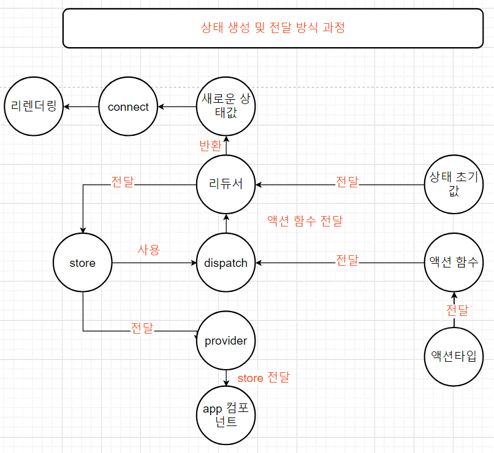
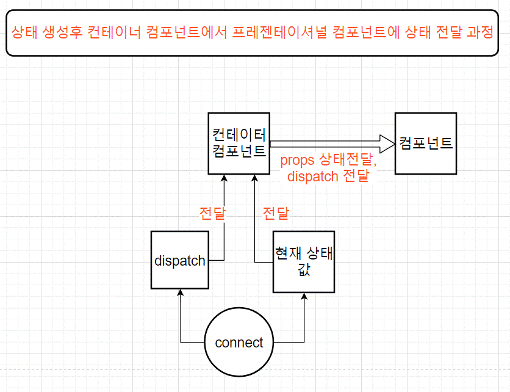
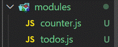
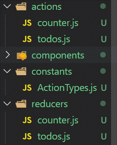
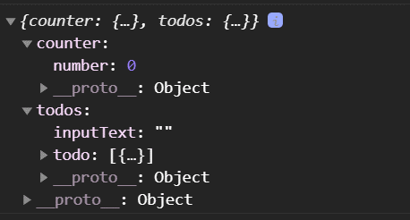

# 리덕스

<br>

리액트 애플리케이션에서 리덕스를 사용하면, 상태 업데이트에 관한 로직을 모듈로 따로 분리해서

컴포넌트 파일과 별개로 관리 할 수 있어 유지보수에 유리하다.

<br>

여러 컴포넌트간 상태를 공유할때 또한 굉장히 효율적인 작업을 할 수 있다.

<br>

이전에는 store의 내장함수 dispatch와 subscirbe으로 사용했는데

리액트에서는 주로 react-redux 라이브러리를 사용해서 connect와 provider를 사용하여 작업을 처리한다.

<br>

## 리덕스 파일 분리 패턴

리액트 프로젝트에서 리덕스를 사용할때 가장 많이 사용하는 패턴은 프레젠테이셔널 컴포넌트와 컨테이너 컴포넌트를 분리하는 것이다.

<br>

### 프레젠테이셔널 컴포넌트란?

상태관리가 이루어지지 않고, 그저 props를 받아와서 화면에 UI를 보여주기만 하는 컴포넌트를 말한다.

즉, 상태관리를 제외한 렌더링을 이곳에서 작업하면된다.

<br>

프레젠테이셔널 컴포넌트는 src/components 경로에 저장

<br>

### 컨테이너 컴포넌트란?

리덕스와 연동되어 있는 컴포넌트로, 리덕스로부터 상태를 받아오기도 하고 리덕스 스토어에 액션을 디스패치 해준다.

<br>

이러한 패턴을 사용하면 코드의 재사용성이 높아지고 정확하게 나눠서 작업을 하므로 

UI를 작성할때 좀더 집중해서 할 수 있다.

<br>

컨테이너 컴포넌트는 src/containers 경로에 저장

<br>

**정리**

컨테이너 컴포넌트는

프레젠테이셔널 컴포넌트에 props로 상태를 전달해준다.

<br>

컨테이너 컴포넌트는 리덕스 스토어의 모듈에서 스토어의 상태를 받아온다.

<br>



<br>



<br>

## 리덕스 애플리케이션 상태 관리 예제

<br>

### 프레젠테이셔녈 컴포넌트 작성

<br>

components/Counter.js 

```jsx
import React from 'react';

const Counter = ({ number, onIncrease, onDecrease }) => {
  return (
    <div>
      <h1>{number}</h1>
      <div>
        <button onClick={onIncrease}>+1</button>
        <button onClick={onDecrease}>-1</button>
      </div>
    </div>
  );
};

export default Counter;
```

<br>

오로지 Counter UI를 작성하기 위한 용도이므로 프레젠테이셔널 컴포넌트이므로

컴포넌트 폴더안에 만들어서 미리 상태들을 JSX안에 넣어놔 기획을 짜 놓는다.

<br>

componets/Todos.js

```jsx
import React from 'react';

const TodosItems = ({ onToggle, onRemove }) => {
  return (
    <div>
      <input type="checkbox" onClick={onToggle} />
      <span>예제 테스트</span>
      <button onClick={onRemove}>삭제</button>
    </div>
  );
};

const Todos = ({ onSubmit, onInsert }) => {
  return (
    <div>
      <form onSubmit={onSubmit}>
        <input />
        <button onClick={onInsert}>등록</button>
      </form>
      <div>
        <TodosItems />
        <TodosItems />
        <TodosItems />
      </div>
    </div>
  );
};

export default Todos;
```

<br>

Todos 컴포넌트도 마찬가지로 오로지 화면에 보여질 UI만 을 위해서 컴포넌트 폴더안에서 만들어준다.

미리 UI를 작성하면서 상태값을 넣어주어 어떤 상태값을 만들지에 대한 기획을 해놓는다.

<br>

또한 Todos 컴포넌트안의 TodosItems를 뺴놓았는데

Todos안에 예시로 만들어놓은뒤 TodosItems으로 뺴놓는것이 만들기에 좋다.

<br>

또한TodosItems 컴포넌트를 따로 파일을 두개로 분리해도 되고 아니면 하나로 작성해도 상관없다.

<br>

### 리덕스 코드 작성

<br>

리덕스를 사용할때는

1. 액션의 타입
2. 액션 생성 함수
3. 리듀서 코드

를 작성해야한다. 

<br>

이코드들을 각각 다른 파일에 작성하는 방법과, 기능별로 묶어서 하나의 파일에 작성하는 방법이있다.

<br>



<br>

위의 사진처럼 actions, constatns, reducers 세개의 디렉토리를 만들어

그안에 리덕스 기능별로 파일을 만든다.

각각 종류별로 다른파일을 정리해서 편리하다.

리덕스 공식 문서에서도 사용되는 가장 기본적인 방식이다.

<br>

하지만 새로운 액션을 만들때마다 세 종류의 파일을 모두 수정해야 하므로 불편하기도 하다.

<br>

### Ducks 패턴

<br>



위 사진 처럼 액션타입, 액션 생성 함수, 리듀서 함수를 기능별로 하나의 컴포넌트 단위에 파일 하나에 몰아서 다 작성 하는 방식을 **Ducks 패턴** 이라고 한다.

<br>

첫번째의 방식이 불편한 개발자들이 자주 사용한다.

<br>

이렇게 Ducks 패턴을 사용하여 액션타입, 액션 생성함수, 리듀서를 작성한 코드를 **모듈** 이라고 한다.

<br>

### Counte 모듈 만들기

<br>

modules/counter.js

```jsx
const INCREASE = 'counter/INCREASE';
const DECREASE = 'counter/DECREASE';
```

<br>

액션타입은 대문자로 정의해야한다.

또한 문자열 내용은 **'모듈 이름 / 액션 이름'** 과 같은 형태로 작성한다.

이유는 문자열안에 모듈이름을 넣음으로써, 나중에 프로젝트가 커졌을때 액션의 이름이 충돌되 지 않게 해준다.

<br>

```jsx
export const increase = () => ({
  type: INCREASE,
});

export const decrease = () => ({
  type: DECREASE,
});
```

<br>

export라는 키워드를 사용해서 다른 파일에서 불러와 사용할 수 있다.

<br>

본격적으로 리덕스를 사용하여 상태를 관리할때 4가지를 만들면된다.

1. 액션 타입 정의
2. 액션 생성 함수 정의 
3. 초기 상태 생성
4. 리듀서 함수 정의

<br>

이중에서 액션 타입 정의는

말그대로 이벤트를 발생시키는 함수를 타입이름으로 정의 하면된다.

<br>

modules/counter.js

```jsx
// 액션 타입 정의
const INCREASE = 'counter/INCREASE';
const DECREASE = 'counter/DECREASE';

// 액션 생성 함수
export const increase = () => ({
  type: INCREASE,
});

export const decrease = () => ({
  type: DECREASE,
});

// 초기 상태
const initialState = {
  number: 0,
};

//  리듀서 함수(state, action)
const counter = (state = initialState, action) => {
  switch (action.type) {
    case INCREASE:
      return { number: state.number + 1 };
    case DECREASE:
      return { number: state.number - 1 };
    default:
      return state;
  }
};

export default counter;
```

<br>

액션 생성함수를 export 한 이유는 다른파일에서 dispatch시켜 액션을 실행시켜야 하기 때문이다.

<br>

default로 export 한 경우에는 다른파일에서 import 한것이 counter이 되게한다.

<br>

그냥 export를 하게 된경우는 import한 당시에 디스트럭처링 문법으로 불러와야한다.

<br>

### todos 모듈 만들기

<br>

마찬가지로 modules 폴더에 todos를 만드는 Ducks 패턴으로 한다.

```jsx
// 액션 타입정의
const INSERT = 'todos/INSERT'; // 새로운 todo를 등록한다.
const TOGGLE = 'todos/TOGGLE'; // checkbox의 true, false를 바꾼다.
const REMOVE = 'todos/REMOVE'; // todo를 제거한다.

// 액션 생성함수
let id = 1;

export const insert = (inputText) => ({
  type: INSERT,
  todo: {
    id: id++,
    text: inputText,
    checked: false,
  },
});

export const toggle = (id) => ({
  type: TOGGLE,
  id,
});

export const remove = (id) => ({
  type: REMOVE,
  id,
});

// 초기값 정의
const initialState = {
  inputText: '',
  todo: [
    {
      id: 1,
      text: '리덕스 기초 배우기',
      checked: false,
    },
  ],
};

// 리듀서 함수

const todos = (state = initialState, action) => {
  switch (action.type) {
    case INSERT:
      return {
        ...state,
        todo: [...state.todo, action.todo],
      };
    case TOGGLE:
      return {
        ...state,
        todo: state.todo.map((todo) =>
          todo.id === action.id ? { ...todo, checked: !todo.checked } : todo,
        ),
      };
    case REMOVE:
      return {
        ...state,
        todo: state.todo.filter((todo) => todo.id !== action.id),
      };
    default:
      return state;
  }
};

export default todos;
```

<br>

컴포넌트에서 호출하므로 액션 생성 함수의 파라미터의 값은 컴포넌트의 props에서 값을 받아올 것 이다.

<br>

리듀서 함수가 호출후에 새로운 객체가 반환되어지면 connect에 의해서 리렌더링이 되게된다.

이전에는 store.subscribe으로 dispatch마다 subscirbe 함수가 호출되었지만

<br>

react-redux에서 connect함수에 의해서 리렌더링이 되게된다.

<br>

### 여러개의 리듀서 합치기 (루트 리듀서 **combineReducer)**

<br>

createStore에서는 하나의 리듀서만 사용해야한다.

프로젝트에서 리듀서를 여러개 만들게 되었을때는 여러개의 리듀서를 하나로 합쳐주어야한다.

<br>

**combineReducer**이라는 유틸 함수를 사용하면 쉽게 처리 가능하다.

<br>

modules 디렉토리에 index.js 파일을 만들어 그안에 합쳐준다.

<br>

modules/index.js

```jsx
import { combineReducers } from 'redux';
import counter from './counter';
import todos from './todos';

const rootReducer = combineReducers({
  counter,
  todos,
});

export default rootReducer;
```

<br>

파일이름을 index.js로 해주면 이 파일을 다른 파일에서 import할때

디렉터리 이름만 입력하면 불러올 수 있다.

<br>

```jsx
import rootReducer from './modules'
```

<br>

## 리액트 UI에 리덕스 적용하기

<br>

스토어를 만든뒤 애플리케이션에 리덕스를 적용하면된다.

src 디렉터리의 index.js에서 이루어진다.

```jsx
import React from 'react';
import ReactDOM from 'react-dom';
import './index.css';
import App from './App';
import reportWebVitals from './reportWebVitals';
import { createStore } from 'redux';
import rootReducer from './modules';
import { Provider } from 'react-redux';

const store = createStore(rootReducer);

ReactDOM.render(
  <Provider store={store}>
    <App />
  </Provider>,
  document.getElementById('root'),
);

// If you want to start measuring performance in your app, pass a function
// to log results (for example: reportWebVitals(console.log))
// or send to an analytics endpoint. Learn more: https://bit.ly/CRA-vitals
reportWebVitals();
```

<br>

스토어를 만든뒤 리액트 컴포넌트에서 스토어를 사용할 수 있도록

react-redux에서 제공하는 Provider 컴포넌트로 APP 컴포넌트를 감싸 주어야한다.

<br>

Provider 컴포넌트를 사용할땐 store를 props로 전달 해주어야한다.

그렇게 되었을때 APP 컴포넌트에서 store을 사용할 수 있게된다.

<br>

### Redux DevTools 설치

크롬 확장 프로그램에서 Redux DevTools을 설치 해주면 리덕스 상태를 알수 있다.

<br>

설치

```jsx
npm i redux-devtools-extension
```

<br>

createStore 두번째 매개변수에 composeWithDevtools()함수를 넣어주면된다.

```jsx
const store = createStore(rootReducer, composeWithDevtools());
```

<br>

### 컨테이너 컴포넌트 만들기

<br>

컴포넌트에서 리덕스 스토어를 통해 원하는 상태를 받아오고,

액션도 디스패치해주어야한다.

<br>

**리덕스 스토어와 연동된 컴포넌트를 컨테이너 컴포넌트** 라고 한다.

<br>

컨테이너 컴포넌트를 리덕스 스토어에 연동시켜 주어야한다.

<br>

react-redux의 connect 함수를 사용하면 스토어와 연동되어진다.

연동되어진다 라는 의미는 

1. state 상태를 props로 넘겨준다.
2. 액션 생성함수를 props로 넘겨준다.

<br>

사용방법

```jsx
connect(mapStateToProps, mapDispatchToProps)(연동할 컴포는트, 즉 컨테이너 컴포넌트)
```

**mapStateToProps** → 리덕스 스토어안의 **state** 를 컴포넌트의 props로 넘겨준다.

```jsx
const mapStateToProps = (state) => ({ number: state.counter.number });
```

<br>

파라미터는 스토어안의 state이다.

반환값을 새로운 객체로 만들어 전달해줄 state를 만든다.

이제 컨테이너 컴포넌트는 state를 받아 올 수 있다.

<br>

**여기서 주의!!!!**

<br>

rootReducer에서 combineReducers함수로 리듀서를 여러개에서 하나로 합쳤다.

<br>

때문에 스토어에 저장된 state는 counter와 todos 2개로 나뉘어진다.

따라서 state.number 가아닌

```jsx
const mapStateToProps = (state) => ({ number: state.number });
```

<br>

state.counter.number로 해주어야한다.

```jsx
const mapStateToProps = (state) => ({ number: state.counter.number });
```

<br>

**state 값**



<br>

**mapDispatchToProps** → 리덕스 스토어안의 dispatch(액션 생성 함수)를 컴포넌트의 props로 넘겨준다.

```jsx
const mapDispatchToProps = (dispatch) => ({
  increase() {
    console.log('increase');
  },
  decrease() {
    console.log('decrease');
  },
});
```

<br>

containers/CounterContainer.js

```jsx
import React from 'react';
import { connect } from 'react-redux';
import Counter from '../components/Counter';
import { decrease, increase } from '../modules/counter';

const CounterContainer = ({ number, increase, decrease }) => {
  return <Counter number={number} increase={increase} decrease={decrease} />;
};

const mapStateToProps = (state) => ({ number: state.counter.number });
const mapDispatchToProps = (dispatch) => ({
  increase() {
    dispatch(increase());
  },
  decrease() {
    dispatch(decrease());
  },
});

export default connect(mapStateToProps, mapDispatchToProps)(CounterContainer);\
```

**주의사항!**

잊지말고 container 컴포넌트에 props 디스트럭처링 할당으로 리액트 컴포넌트 안에 할당해주기!

<br>

### connect 두번째 파라미터 **mapDispatchToProps 생략**

<br>

액션 생성 함수를 호출하고 dispatch로 감싸 주어야 하는 작업을 더 간단하게 만들 수 있다.

<br>

**첫번째 방법**

bindActionCreators 유틸 함수를 사용하면된다.

<br>

예제 바뀐후

```jsx
const mapDispatchToProps = (dispatch) =>
  bindActionCreators(
    {
      increase,
      decrease,
    },
    dispatch,
  );
```

<br>

**두번째 방법**

함수 형태가 아닌 액션 생성 함수로 이루어진 객체 형태로 넣어주어도 된다.

<br>

connect 함수가 내부적으로 bindActionCreators 작업을 대신해준다.

```jsx
const mapDispatchToProps = { decrease, increase };
```

<br>

container/TodoContainer

```jsx
import React from 'react';
import { connect } from 'react-redux';
import Todos from '../components/Todos';
import { changeInput, insertTodo, toggle, remove } from '../modules/todos';

const TodosContainer = ({
  toggle,
  inputValue,
  todos,
  changeInput,
  insertTodo,
  remove,
}) => {
  return (
    <Todos
      todos={todos}
      inputValue={inputValue}
      changeInput={changeInput}
      insertTodo={insertTodo}
      toggle={toggle}
      remove={remove}
    />
  );
};

export default connect(
  ({ todos }) => ({
    inputValue: todos.inputValue,
    todos: todos.todos,
  }),
  {
    changeInput,
    insertTodo,
    toggle,
    remove,
  },
)(TodosContainer);
```

<br>

components/todos

```jsx
import React from 'react';

const TodosItems = ({ todo, toggle, remove }) => {
  return (
    <div>
      <input
        readOnly={true}
        type="checkbox"
        checked={todo.checked}
        onClick={() => toggle(todo.id)}
      />
      <span>{todo.text}</span>
      <button onClick={() => remove(todo.id)}>삭제</button>
    </div>
  );
};

const Todos = ({
  remove,
  todos,
  inputValue,
  changeInput,
  insertTodo,
  toggle,
}) => {
  const onSubmit = (e) => {
    e.preventDefault();
    insertTodo(inputValue);
    changeInput('');
  };
  return (
    <div>
      <form onSubmit={onSubmit}>
        <input
          value={inputValue}
          onChange={(e) => {
            changeInput(e.target.value);
          }}
        />
        <button type="submit">등록</button>
      </form>
      <div>
        {todos.map((todo) => (
          <TodosItems
            remove={remove}
            toggle={toggle}
            key={todo.id}
            todo={todo}
          />
        ))}
      </div>
    </div>
  );
};

export default Todos;
```

<br>

정말 많이 느끼는 것은 액션 생성함수를 container에서 import할때

<br>

1. 컨테이너 컴포넌트에 디스트럭처링 할당
2. connect 첫번째 or 두번째 import해주기
3. 리액트 컴포넌트의 props로 넣어주기
4. components props에서 받아오기

<br>

등등 너무 많이 props로 전달하다보면 너무 많이 헷갈린다.

지금까지 Todo와 counter 예제를 만들어 보았다.

<br>

좋은사실은 더 편하게 만들 수 있는 방법이 있다.

<br>

## 리덕스 더 간편하게 사용하기

<br>

### redux-actions

<br>

1. 액션 생성 함수를 더 짧은 코드로 작성할 수 있다.
2. switch / case 문이 아닌 handleAction라는 함수를 사용한다.

<br>

설치방법

```bash
npm i redux-actions
```

<br>

사용방법

1 . 액션 생성 함수 간편하게 사용하기 createAction(액션 타입 변수, 액션 생성 함수에 파라미터가 필요한경우 함수작성)

```jsx
// 액션 생성 함수
export const increase = () => ({
  type: INCREASE,
});

export const decrease = () => ({
  type: DECREASE,
});

// redux-actions
export const increase = createAction(INCREASE);
export const decrease = createAction(DECREASE);
```

<br>

전)

```jsx
const changeInput = (inputValue) => ({
  type: CHANGEINPUT,
  inputValue,
});

export const insertTodo = (inputText) => ({
  type: INSERT,
  todo: {
    id: id++,
    text: inputText,
    checked: false,
  },
});

export const toggle = (id) => ({
  type: TOGGLE,
  id,
});

export const remove = (id) => ({
  type: REMOVE,
  id,
});
```

<br>

후) todos.js

```jsx

export const changeInput = createAction(
  CHANGEINPUT,
  (inputValue) => inputValue,
);

export const insertTodo = createAction(INSERT, (inputText) => ({
  id: id++,
  text: inputText,
  checked: false,
}));

export const toggle = createAction(TOGGLE, (id) => id);

export const remove = createAction(REMOVE, (id) => id);
```
<br>


**주의사항!**

두번째 파라미터의 함수의 필요한 데이터를 넣어주는 경우 파라미터에 값을 넣어 전달한다.

이때 리듀서에서 id값을 조회 한다고 할때 action.payload로 조회하게 된다.

<br>

때문에 두번째 파라미터인 콜백함수가 반환하는 값 자체가 payload에 들어가게 된다.

<br>

밑의 코드에서 action.payload 했을때 {id : ... , text: ..., checked : ...} 가 나온다.

```jsx
export const insertTodo = createAction(INSERT, (inputText) => ({
  id: id++,
  text: inputText,
  checked: false,
}));
```

<br>

밑의 코드는 action.payload 했을때 {todo: ...} 이 나온다.

```jsx
export const insertTodo = createAction(INSERT, (inputText) => ({
  todo: {
    id: id++,
    text: inputText,
    checked: false,
  },
}));
```

<br>

그냥 action.id가 아니다! 꼭 주의하자!

<br>

**2 . 리듀서 함수 간편하게 사용하기**

<br>

counter.js

```jsx
//  리듀서 함수(state, action)
const counter = (state = initialState, action) => {
  switch (action.type) {
    case INCREASE:
      return { number: state.number + 1 };
    case DECREASE:
      return { number: state.number - 1 };
    default:
      return state;
  }
};

// redux-actions
const counter = handleActions(
  {
    [INCREASE]: (state, action) => ({
      number: state.number + 1,
    }),
    [DECREASE]: (state, action) => ({
      number: state.number - 1,
    }),
  },
  initialState,
);
```

<br>

리듀서를 만들때 **handleActions()**  함수를 사용한다.

<br>

**첫번째 파라미터** 에는 객체안에서 메서드를 정의해준다.

정의한 메서드는 키 이름으로 액션 타입 변수를 넣어준다.

따라서 대괄호안에 넣어주어야 변수를 참조 가능하므로 변수로 넣어준다.

<br>

키의 벨류로는 함수를 적어준다. 함수의 state, action순으로 파라미터 값으로 넣어준다.

이후 반환한 값이 액션에 따라 반환되는 새로운 객체를 입력하면 된다.

<br>

**두번째 파라미터** 에는 초기 상태값을 넣어준다.

<br>

**꼭 주의 하기!**

리듀서 함수에서 createAction으로 만든 액션 함수는 파라미터로 받아 온 값을 객체 안에 넣었을때

원하는 이름을 들어가는 것이아니다.

<br>

액션 생성함수는 액션에 필요한 추가 데이터를 모두 payload라는 이름으로 사용하기 때문에 

**action.id, action.todo 가아니라 action.payload로 값을 조회해야한다.**

<br>

리듀스 함수 예제 전)

```jsx
const todos = (state = initialState, action) => {
  switch (action.type) {
    case CHANGEINPUT:
      return {
        ...state,
        inputValue: action.inputValue,
      };
    case INSERT:
      return {
        ...state,
        todos: [...state.todos, action.todo],
      };
    case TOGGLE:
      return {
        ...state,
        todos: state.todos.map((todo) =>
          todo.id === action.id ? { ...todo, checked: !todo.checked } : todo,
        ),
      };
    case REMOVE:
      return {
        ...state,
        todos: state.todos.filter((todo) => todo.id !== action.id),
      };
    default:
      return state;
  }
};
```

<br>

리듀스 함수 예제 후)

```jsx
const todos = handleActions(
  {
    [CHANGEINPUT]: (state, action) => ({
      ...state,
      inputValue: action.payload,
    }),
    [INSERT]: (state, action) => ({
      ...state,
      todos: [...state.todos, action.payload],
    }),
    [TOGGLE]: (state, action) => ({
      ...state,
      todos: state.todos.map((todo) =>
        todo.id === action.payload ? { ...todo, checked: !todo.checked } : todo,
      ),
    }),
    [REMOVE]: (state, action) => ({
      ...state,
      todos: state.todos.filter((todo) => todo.id !== action.payload),
    }),
  },
  initialState,
);
```

<br>

handleActions로 만들다 보면 쉬워진다.

<br>

## Hooks 사용하여 컨테이너 컴포넌트 만들기

<br>

connect 함수를 사용하는 대신 react-redux에서 제공하는 Hooks를 사용할 수 있다.

<br>

### useSelector

connect 함수에서 mapStateToProps와 형태가 같다.

```jsx
const number = useSelector(상태 선택 함수)
```

<br>

변경 전)

```jsx
import React from 'react';
import { connect } from 'react-redux';
import Counter from '../components/Counter';
import { decrease, increase } from '../modules/counter';

const CounterContainer = ({ number, increase, decrease }) => {
  return <Counter number={number} increase={increase} decrease={decrease} />;
};

const mapStateToProps = (state) => ({ number: state.counter.number });
const mapDispatchToProps = { decrease, increase };

export default connect(mapStateToProps, mapDispatchToProps)(CounterContainer);
```

<br>

변경 후)

```jsx
import React from 'react';
import { connect, useSelector } from 'react-redux';
import Counter from '../components/Counter';
import { decrease, increase } from '../modules/counter';

const CounterContainer = () => {
  const number = useSelector((state) => state.counter.number);
  return <Counter number={number} increase={increase} decrease={decrease} />;
};

export default CounterContainer;
```

<br>

위와 같이 state를 넘겨줄때 connect를 사용하는 대신에 useSelector()를 사용하여 그안에 파라미터 값으로 콜백함수를 넘겨준다.

<br>

넘겨주는 콜백함수의 파라미터 state는 rootReducer에 의해 합쳐져 있으므로 state.counter로 시작해야한다. 그이후 반환값이 number 변수에 할당되어 Counter 컴포넌트에 props로 전달해 들어가게된다.

<br>

### useDispatch

<br>

state상태를 전달하는 Hook가 있었으니 dispatch를 보내주는 Hook도 있어야한다.

Action을 dispatch하는 Hook도 있다.

```jsx
const CounterContainer = () => {
  const number = useSelector((state) => state.counter.number);
  const dispatch = useDispatch();
  return (
    <Counter
      number={number}
      increase={() => dispatch(increase())}
      decrease={() => dispatch(decrease())}
    />
  );
};

export default CounterContainer;
```

<br>

useDispatch()함수를 변수에 할당한다.

변수를 컴포넌트의 props에 전달하고자 하는 dispatch를 함수의 반환값으로 넣어주고 그 파라미터 값으로 액션 생성 함수를 넣어주면된다.

```jsx
const dispatch = useDispatch();
dispatch(액션 생성 함수);

```

<br>

컴포넌트 성능 최적화를 해야할때 상황이면 useCallback을 사용해야한다.

useDispatch()함수를 사용할 때는 useCallback과 함께 사용하는 습관을 들어야한다.

```jsx
const onIncrease = useCallback(() => dispatch(increase()), [dispatch]);
const onDecrease = useCallback(() => dispatch(decrease()), [dispatch]);
```

```jsx
const TodosContainer = () => {
  const { inputValue, todos } = useSelector(({ todos }) => ({
    inputValue: todos.inputValue,
    todos: todos.todos,
  }));

  const dispatch = useDispatch();
  const onChangeInput = (inputValue) => dispatch(changeInput(inputValue));
  const onInsertTodo = (text) => dispatch(insertTodo(text));
  const onToggle = (id) => dispatch(toggle(id));
  const onRemove = (id) => dispatch(remove(id));

  return (
    <Todos
      todos={todos}
      inputValue={inputValue}
      changeInput={onChangeInput}
      insertTodo={onInsertTodo}
      toggle={onToggle}
      remove={onRemove}
    />
  );
};
```

위 예제와 같이 액션 생성 함수에 파라미터가 와야한다면 dispatch에 넣은 액션생성함수의 파라미터에 넣어주어야한다.

<br>

위처럼 많은 dispatch를 해야할경우 **useActions** 유틸 Hook을 만들어서 사용가능하다.

<br>

### useStore

<br>

useStore Hooks는 컴포넌트 내부에서 리덕스 스토어 객체를 직접 사용할 수 있다.

```jsx
const store = useStore();
store.dispatch({type : 'SAMEPLE'})
store.getState()
```

<br>

### Hooks를 사용하는 점과 connect 함수와의 차이점

<br>

connect 함수를 사용하여 컨테이너 컴포넌트를 만들경우, 해당 컨테이너 컴포넌트의 부모컴포넌트가 리렌더링 될때마다 해당 컨테이너 컴포넌트의 props가 바뀌지 않는다면 리렌더링이 자동으로 방지되어 성능이 최적화 된다.

<br>

useSelector를 사용하면 최적화가 되지 않아 React.memo를 컨테이너 컴포넌트에 사용해 주어야한다.

```jsx
export default React.memo(TodosContainer);
```

<br>

리덕스를 사용하면 리액트 컴포넌트에서 완벽하게 분리 시킬수 있어 유지 보수성이 높다. 또한 개발자 경험도 향상 시켜준다.

하지만 규모가 작은 프로젝트 일경우는 리덕스를 사용하면 오히려 프로젝트의 복잡도가 높아진다.