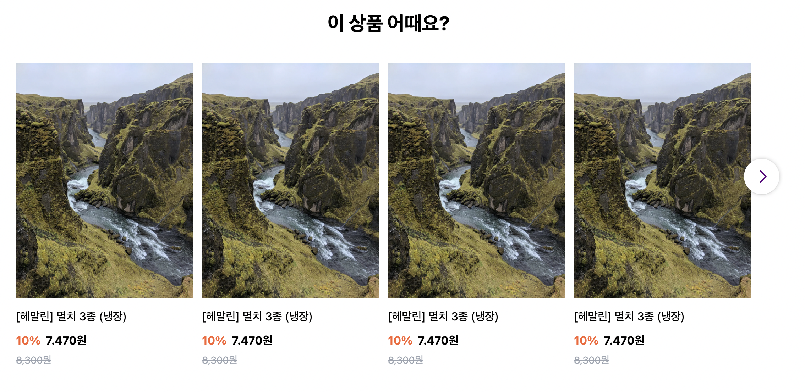

# 여러 이미지가 캐러셀 페이지 하나에 들어가게 구현한 캐러셀

<br>

캐러셀 하나 페이지마다 여러개의 이미지가 있는경우의 캐러셀 구현

<br>

container > box > contents

<br>

container 안에 box들인 캐러셀 페이지별로 구성하게 하고

박스별로 contenst들인 img가 들어간 html 레이아웃 구성을 했다.

<br>

## 코드 구현방법

1. 캐러셀 하나페이지(box)에 들어갈 이미지들(contents)을 css로 작업하여 넣어준다.

<br>

2. 하나의 캐러셀 페이지(box)에서 들어갈 이미지 개수를 각각 배열의 요소가 배열로서 존재한 데이터를 받아온다.

ex)

```jsx
const imgArr = [
  [
    "https://cdn.pixabay.com/photo/2020/12/09/04/01/iceland-5816353_1280.jpg",
    "https://cdn.pixabay.com/photo/2020/12/09/04/01/iceland-5816353_1280.jpg",
    "https://cdn.pixabay.com/photo/2020/12/09/04/01/iceland-5816353_1280.jpg",
    "https://cdn.pixabay.com/photo/2020/12/09/04/01/iceland-5816353_1280.jpg",
  ],
  [
    "https://cdn.pixabay.com/photo/2020/12/09/04/01/iceland-5816353_1280.jpg",
    "https://cdn.pixabay.com/photo/2020/12/09/04/01/iceland-5816353_1280.jpg",
    "https://cdn.pixabay.com/photo/2020/12/09/04/01/iceland-5816353_1280.jpg",
    "https://cdn.pixabay.com/photo/2020/12/09/04/01/iceland-5816353_1280.jpg",
  ],
  [
    "https://cdn.pixabay.com/photo/2020/12/09/04/01/iceland-5816353_1280.jpg",
    "https://cdn.pixabay.com/photo/2020/12/09/04/01/iceland-5816353_1280.jpg",
    "https://cdn.pixabay.com/photo/2020/12/09/04/01/iceland-5816353_1280.jpg",
    "https://cdn.pixabay.com/photo/2020/12/09/04/01/iceland-5816353_1280.jpg",
  ],
  [
    "https://cdn.pixabay.com/photo/2020/12/09/04/01/iceland-5816353_1280.jpg",
    "https://cdn.pixabay.com/photo/2020/12/09/04/01/iceland-5816353_1280.jpg",
    "https://cdn.pixabay.com/photo/2020/12/09/04/01/iceland-5816353_1280.jpg",
    "https://cdn.pixabay.com/photo/2020/12/09/04/01/iceland-5816353_1280.jpg",
  ],
];
```

<br>

3. 받아온 데이터 배열을 imgArr.map메소드를 통하여 li태그로 큰 각각 box들을 만들어준다.

<br>

4. imgArr.map 에서 한번더 map 메소드를 사용하여 각각 box안에 contens들을 만들어준다.

```jsx
<div className="overflow-hidden">
  <ul ref={containerRef} className="w-r-735">
    {imgArr.map((imgs) => (
      <li className="w-r-105 float-left">
        {imgs.map((img) => (
          <div className="inline-block h-r-49.6 w-r-24.9 mr-r-1.3 ">
            <Link to>
              
              <p className="text-r-1.6 mt-5 mb-4">[헤말린] 멸치 3종 (냉장)</p>
            </Link>
            <span className="font-bold">
              <span className="text-r-1.6 mr-3 text-discount-100">10%</span>
              <span className="text-r-1.6">7.470원</span>
            </span>
            <p className="text-r-1.4 mt-2 text-gray-400 line-through">
              8,300원
            </p>
          </div>
        ))}
      </li>
    ))}
  </ul>
</div>
```

<br>

5. 전체적인 ul 작업을 완성한뒤 각각 버튼을 만들어 좌우로 캐러셀을 이동시게 만들어준다.

```jsx
<button
    onClick={(e) => prevButton(e)}
    style={{ display: 'none' }}
    ref={prevButtonRef}
    className="absolute z-50 w-r-6 h-r-6 bg-r-6 left- bg-sm-pre-button left-r--3 top-r-13 focus:outline-none"
  />
  <div className="overflow-hidden">
    <ul ref={containerRef} className="w-r-735">
      ...
    </ul>
  </div>
  <button
    onClick={(e) => nextButton(e)}
    ref={nextButtonRef}
    className="z-50 absolute w-r-6 h-r-6 bg-r-6 bg-sm-next-button right-r--3 top-r-13 focus:outline-none"
  />
</div>
```

<br>

6. prev 버튼은 처음에 화면에 보여질때 `display : none` 으로 처음에 좌측에는 넘어가지 않게 사용자가 보이게 만들어준다.

<br>

7. 버튼을 클릭했을때 이벤트가 여러번 발생하지 않게 onAnimate 를 변수로 방지한다.

```jsx
const SmallCarousel = ({ title, subtitle, bgGray }) => {
let cur = 0;
let onAnimate = false;
const containerRef = useRef(null);
  const prevButtonRef = useRef(null);
  const nextButtonRef = useRef(null);

  useEffect(() => {
    containerRef.current.style.transitionDuration = '0.5s';
    containerRef.current.style.transitionProperty = 'all';
    containerRef.current.style.transitionTimingFunction = 'ease-in-out';
  });

return (...)

function prevButton(e) {
    if (onAnimate) return;
    onAnimate = true;
    if (cur === 1) {
      containerRef.current.style.transform = `translateX(-${
        (cur - 1) * 1050
      }px)`;
      e.target.disabled = true;
      e.target.style.display = 'none';
    } else {
      nextButtonRef.current.disabled = false;
      nextButtonRef.current.style.display = '';
      containerRef.current.style.transform = `translateX(-${
        (cur - 1) * 1050
      }px)`;
    }
    --cur;

    setTimeout(() => {
      onAnimate = false;
    }, 500);
  }
```

<br>

8. 조건문으로 2번페이지에서 1번페이지로이동할때는 가장 첫번째 캐러셀 페이지 이미지이므로 transform으로 먼저 이동시킨뒤 버튼을 사용하지 못하게 disabled을 true값으로 만들고 화면상해도 버튼이 보이지 않게 한다.

<br>

8-1 그 이외의 이전 캐러셀 페이지로 이동할때는

prev버튼과 마찬가지로, next버튼도 가장마지막 캐러셀페이지였을때 버튼이 보이지 않고 사용불가하게 만들었으므로

disabled값을 false로 만들고 이전에 보이지 않게 `display : none` 으로 되어있던것을 다시 보이게 초기화 한고 이동시키게 해준다.

<br>

8-2 그이후 prev 버튼은 cur 값을 감소시켜준다.

<br>

9. next버튼도 prev와 같은 메커니즘으로 구현하면 된다.

```jsx
function nextButton(e) {
  if (onAnimate) return;
  onAnimate = true;
  if (cur === imgArr.length - 2) {
    containerRef.current.style.transform = `translateX(-${(cur + 1) * 1050}px)`;
    e.target.style.display = "none";
    e.target.disabled = true;
  } else {
    containerRef.current.style.transform = `translateX(-${(cur + 1) * 1050}px)`;
    prevButtonRef.current.disabled = false;
    prevButtonRef.current.style.display = "";
  }
  ++cur;

  setTimeout(() => {
    onAnimate = false;
  }, 500);
}
```

<br>

### 모든 코드 구현

```jsx
import { useEffect } from "react";
import { useRef } from "react";
import { Link } from "react-router-dom";

const SmallCarousel = ({ title, subtitle, bgGray }) => {
  let cur = 0;
  let onAnimate = false;
  const containerRef = useRef(null);
  const prevButtonRef = useRef(null);
  const nextButtonRef = useRef(null);

  useEffect(() => {
    containerRef.current.style.transitionDuration = "0.5s";
    containerRef.current.style.transitionProperty = "all";
    containerRef.current.style.transitionTimingFunction = "ease-in-out";
  });

  const imgArr = [
    [
      "https://cdn.pixabay.com/photo/2020/12/09/04/01/iceland-5816353_1280.jpg",
      "https://cdn.pixabay.com/photo/2020/12/09/04/01/iceland-5816353_1280.jpg",
      "https://cdn.pixabay.com/photo/2020/12/09/04/01/iceland-5816353_1280.jpg",
      "https://cdn.pixabay.com/photo/2020/12/09/04/01/iceland-5816353_1280.jpg",
    ],

    [
      "https://cdn.pixabay.com/photo/2020/12/09/04/01/iceland-5816353_1280.jpg",
      "https://cdn.pixabay.com/photo/2020/12/09/04/01/iceland-5816353_1280.jpg",
      "https://cdn.pixabay.com/photo/2020/12/09/04/01/iceland-5816353_1280.jpg",
      "https://cdn.pixabay.com/photo/2020/12/09/04/01/iceland-5816353_1280.jpg",
    ],

    [
      "https://cdn.pixabay.com/photo/2020/12/09/04/01/iceland-5816353_1280.jpg",
      "https://cdn.pixabay.com/photo/2020/12/09/04/01/iceland-5816353_1280.jpg",
      "https://cdn.pixabay.com/photo/2020/12/09/04/01/iceland-5816353_1280.jpg",
      "https://cdn.pixabay.com/photo/2020/12/09/04/01/iceland-5816353_1280.jpg",
    ],

    [
      "https://cdn.pixabay.com/photo/2020/12/09/04/01/iceland-5816353_1280.jpg",
      "https://cdn.pixabay.com/photo/2020/12/09/04/01/iceland-5816353_1280.jpg",
      "https://cdn.pixabay.com/photo/2020/12/09/04/01/iceland-5816353_1280.jpg",
      "https://cdn.pixabay.com/photo/2020/12/09/04/01/iceland-5816353_1280.jpg",
    ],
  ];

  return (
    <div className={`${bgGray ? "bg-kg-500" : ""}`}>
      <div className="container h-r-65.2">
        <Link
          to=""
          className="block font-bold text-r-2.8 text-center pt-r-7.9 pb-r-3.5"
        >
          {title}
          {subtitle && (
            <p className="pt-4 font-normal text-r-1.6 text-gray-400 leading-8">
              {subtitle}
            </p>
          )}
        </Link>
        <div className="relative">
          <button
            onClick={(e) => prevButton(e)}
            style={{ display: "none" }}
            ref={prevButtonRef}
            className="absolute z-50 w-r-6 h-r-6 bg-r-6 left- bg-sm-pre-button left-r--3 top-r-13 focus:outline-none"
          />
          <div className="overflow-hidden">
            <ul ref={containerRef} className="w-r-735">
              {imgArr.map((imgs) => (
                <li className="w-r-105 float-left">
                  {imgs.map((img) => (
                    <div className="inline-block h-r-49.6 w-r-24.9 mr-r-1.3 ">
                      <Link to>
                        
                        <p className="text-r-1.6 mt-5 mb-4">
                          [헤말린] 멸치 3종 (냉장)
                        </p>
                      </Link>
                      <span className="font-bold">
                        <span className="text-r-1.6 mr-3 text-discount-100">
                          10%
                        </span>
                        <span className="text-r-1.6">7.470원</span>
                      </span>
                      <p className="text-r-1.4 mt-2 text-gray-400 line-through">
                        8,300원
                      </p>
                    </div>
                  ))}
                </li>
              ))}
            </ul>
          </div>
          <button
            onClick={(e) => nextButton(e)}
            ref={nextButtonRef}
            className="z-50 absolute w-r-6 h-r-6 bg-r-6 bg-sm-next-button right-r--3 top-r-13 focus:outline-none"
          />
        </div>
      </div>
    </div>
  );

  function prevButton(e) {
    if (onAnimate) return;
    onAnimate = true;
    if (cur === 1) {
      containerRef.current.style.transform = `translateX(-${
        (cur - 1) * 1050
      }px)`;
      e.target.disabled = true;
      e.target.style.display = "none";
    } else {
      nextButtonRef.current.disabled = false;
      nextButtonRef.current.style.display = "";
      containerRef.current.style.transform = `translateX(-${
        (cur - 1) * 1050
      }px)`;
    }
    --cur;

    setTimeout(() => {
      onAnimate = false;
    }, 500);
  }

  function nextButton(e) {
    if (onAnimate) return;
    onAnimate = true;
    if (cur === imgArr.length - 2) {
      containerRef.current.style.transform = `translateX(-${
        (cur + 1) * 1050
      }px)`;
      e.target.style.display = "none";
      e.target.disabled = true;
    } else {
      containerRef.current.style.transform = `translateX(-${
        (cur + 1) * 1050
      }px)`;
      prevButtonRef.current.disabled = false;
      prevButtonRef.current.style.display = "";
    }
    ++cur;

    setTimeout(() => {
      onAnimate = false;
    }, 500);
  }
};

export default SmallCarousel;
```


