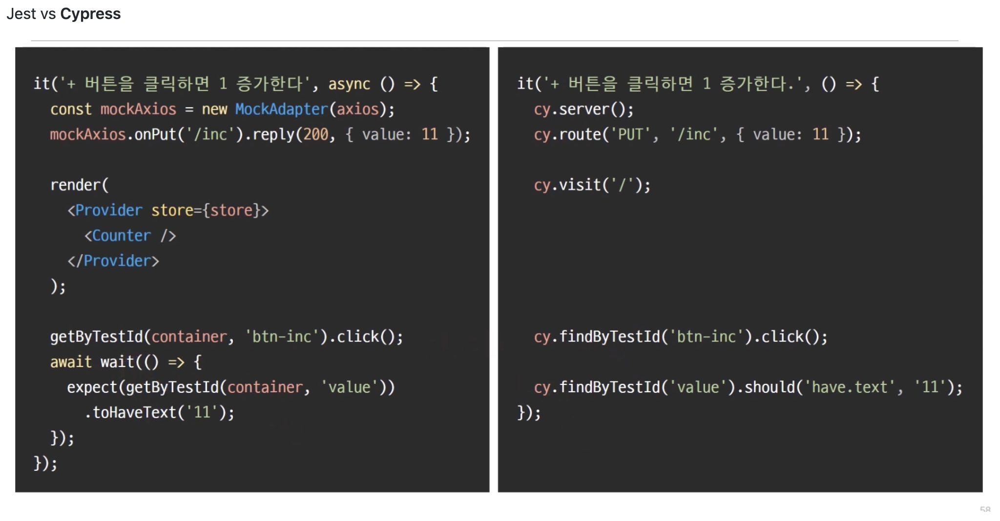
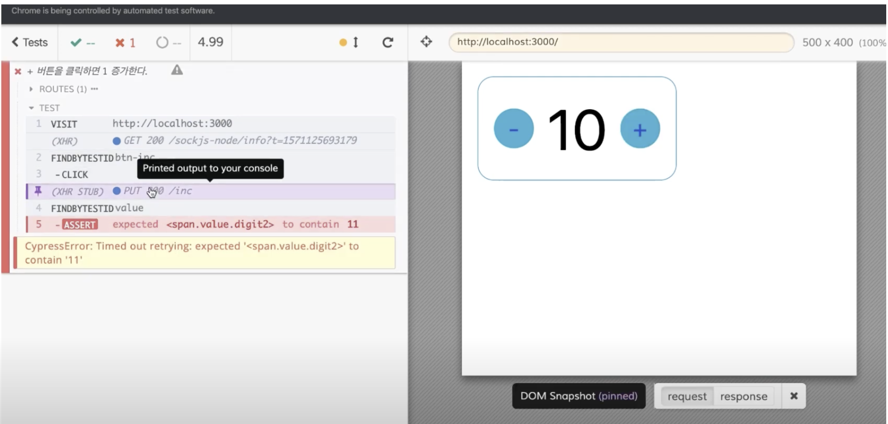

- [Cypress 란?](#cypress-란)
  - [단위 테스트](#단위-테스트)
  - [E2E 테스트](#e2e-테스트)
    - [E2E 테스트 코드 어떻게 만들어야할까?](#e2e-테스트-코드-어떻게-만들어야할까)
  - [정리](#정리)

# Cypress 란?

Cypress는 **E2E 테스트를 위한 도구**이다.(Cypress를 사용하면 모든 유형의 테스트를 작성할 수는 있다.)

 

기능 테스트를 할때, 크게 **테스트의 단위를 두가지로** 나눌 수 있다.(더 있지만)

1. **단위** 테스트(unit test)
2. **E2E** 테스트(End to End Test)

 

※ **[프론트엔드 TDD에 대해 읽어보면 좋은 글](https://github.com/FE-Lex-Kim/-TIL/blob/master/%EC%9B%B9%20%EC%A7%80%EC%8B%9D/%ED%94%84%EB%A1%A0%ED%8A%B8%EC%97%94%EB%93%9C%20TDD.md)**

 

## 단위 테스트

단위 테스트는 **작은 기능별로 테스트**를 하는 것을 말한다.

단위 테스트는 **코드 내부의 동작** 하나하나를 자세히 테스트할때 쓰인다.

 

단위 테스트는 **테스트 코드를 작성할 내용이 굉장히 많다.**

**따라서 그 만큼의 시간적 자원 비용이 많이든다는 단점**이 있다.

복잡한 로직이 없는 단위에서도 불필요하다는 단점이 있다.

 

## E2E 테스트

E2E 테스트는 End to End Test의 약자이다.

말 그대로, **‘끝에서 부터 끝까지 테스트’ 라는 의미이다.**

 

더 자세히 설명하게 된다면, **사용자가 직접 애플리케이션을 사용하는 동작을 통째로 테스트 하는 것을 말한다.**

- 개발의 거의 마지막 단계로 가장 중요한 테스트이다.

 

**장점**

- 여러가지 기능들을 통합해서 테스트하므로, 그 만큼 **테스트 코드를 작성하는데 있어 시간적 비용을 아낄수 있다.**
- 단위테스트의 단점이였던 **기능과 기능 사이의 연결되는 부분에 대한 테스트를 못하는 부분까지 다 커버해서 테스트 가능함**
- **사용자 입장에서 테스트를 진행**하므로 일부분을 수정했을때, 다른곳에서 **사이드 이펙트가 발생 같은 문제를 확인하는데 효과적이다.**

 

이러한 E2E 테스트 도구들중 **Cypress**는 굉장히 강력하게 추천할만하다.

- 브라우저 내부에서 실행히 가능해, **디버깅 도구와 익스텐션을 사용할 수 있다는 장점이 있다.**
- UI 개발 환경이 **시각적으로 보여져 더 직관적으로 볼 수 있다는 장점도 있다.**(커맨드 라인 환경에서의 테스트 보다)

 

### E2E 테스트 코드 어떻게 만들어야할까?

테스트 코드는 **특정 기능이 동작한 후**, **변경되는 값들이 올바르게 들어갔는지 검사**하면 된다.

- API 요청 이후, 데이터를 잘 받았는지
- 사용자가 이벤트 발생후 특정 값이 변경되었는지
- **.. 등등 기능적인 면을 테스트한다.**

 

## 정리

- 단위 테스트보다 **E2E 테스트가 보다 효율적이고 전체적인 테스트**가 가능하다.
- E2E 테스트 도구중 **Cypres가 여러 장점을 가지고 있어 추천**한다.
- E2E 테스트 코드는 **특정 기능이 동작한 후, 변경되는 값들이 올바르게 들어갔는지 검사**하면 된다.

 

참고

- [https://docs.cypress.io/guides/overview/why-cypress](https://docs.cypress.io/guides/overview/why-cypress)
- [https://jbee.io/react/testing-2-react-testing/](https://jbee.io/react/testing-2-react-testing/)
- [https://velog.io/@averycode/Cypress](https://velog.io/@averycode/Cypress)
- [https://soobing.github.io/dev/cypress-with-react/](https://soobing.github.io/dev/cypress-with-react/)
- [https://www.js2uix.com/frontend/cypress-study-step1/](https://www.js2uix.com/frontend/cypress-study-step1/)
- [https://www.youtube.com/watch?v=LcGHiFnBh3Y&t=1872s](https://www.youtube.com/watch?v=LcGHiFnBh3Y&t=1872s)
