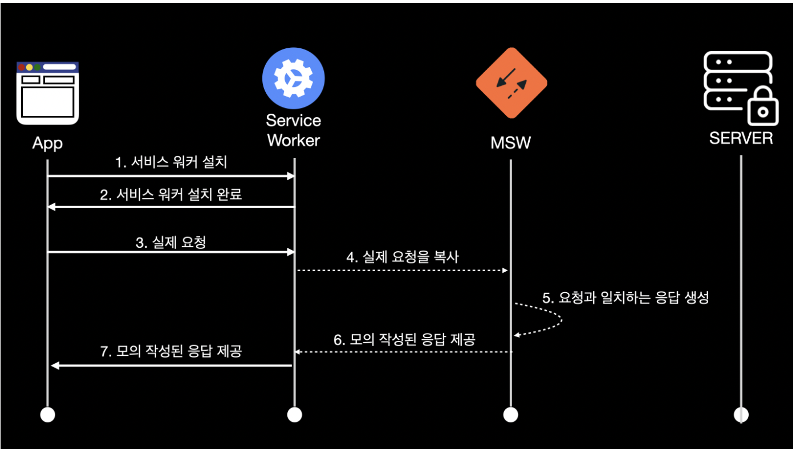

- [MSW](#msw)
    - [MSW 장점](#msw-장점)
  - [MSW 사용](#msw-사용)
    - [1. **설치**](#1-설치)
    - [2. Mock API를 작성할 handlers.js 파일을 `“src/mocks/”` 에서 생성한다.](#2-mock-api를-작성할-handlersjs-파일을-srcmocks-에서-생성한다)
    - [3. Mock API 핸들링할 핸들러를 만든다.](#3-mock-api-핸들링할-핸들러를-만든다)
    - [4. 핸들러를 MSW에서 사용할수 있게 통합해준다.](#4-핸들러를-msw에서-사용할수-있게-통합해준다)
    - [5. `"src/mocks/"` 에서 “browser.js” 파일을 생성해준다.](#5-srcmocks-에서-browserjs-파일을-생성해준다)
    - [6. Service worker 실행시켜주기.](#6-service-worker-실행시켜주기)
    - [7. MSW 동작하는지 확인하기.](#7-msw-동작하는지-확인하기)

<br>

# MSW

프론트엔드는 백엔드와 동시에 작업하는 경우가 많다.

**백엔드 API가 다 완성될 때까지 기다린다면, 개발, 테스트, 디버깅 등등 개발 완성도를 높이기 위해서는 시간이 모자르다.**

<br>

따라서 백엔드 API가 완성되기전, 대기시간 동안 프론트엔드는 목 서버를 운영해서 작업하는 것이 효율적일 수 있다.

<br>

### MSW 장점

Mock 서버를 사용할때는, 백엔드 API 스펙을 사전 협의해서 문서를 제공 받아야한다.

<br>

문서를 바탕으로 Mock를 통해 개발을 진행한 후, **실제 API가 완성된 다음에는 실제 API에 맞게 변형 시켜주어야 한다.**

<br>

**Mock Service Worker은 실제 요청 API를 가로채어(네트워크 수준에서 가로챔) Mock 서버를 실행시켜주는 Mock 라이브러리 이다.**

- Service Worker란 메인 스레드와 분리되어 백그라운드 스레드에서 실행시킬 수 있는 기술이다.
- MSW에서는 Service Worker을 통해 네트워크 요청을 가로챈다.

<br>



이미지 출처 : [https://tech.kakao.com/2021/09/29/mocking-fe/](https://tech.kakao.com/2021/09/29/mocking-fe/)

<br>

이렇게 백엔드 API가 완성되지 않았어도 Mocking을 통해 프론트엔드 개발을 진행 할 수 있다.

<br>

**MSW를 사용한 프로젝트 개발 방식**


이미지 출처 : [https://tech.kakao.com/2021/09/29/mocking-fe/](https://tech.kakao.com/2021/09/29/mocking-fe/)

<br>

## MSW 사용

<br>

### 1. **설치**

```bash
$npm install msw -D
$yarn add msw --dev
```

<br>

### 2. Mock API를 작성할 handlers.js 파일을 `“src/mocks/”` 에서 생성한다.


<br>

### 3. Mock API 핸들링할 핸들러를 만든다.

```jsx
// src/mock/handlers.js
import { rest } from "msw";

export const handlers = [
  rest.get("/user", (req, res, ctx) => {
    return res(
      ctx.status(200),
      ctx.delay(400),
      ctx.json({
        username: "admin",
      })
    );
  }),
];
```

- `res.get` : HTTP GET 메서드를 사용한다는 의미이다.(post, put으로 사용해도된다.)
- `res.get(”/user”)` : API URL을 적어 주면된다. `/user` API URL을 요청할때, 가로채게된다.
- `ctx.status(200)` : 200 응답 상태를 설정했다.
- `ctx.delay(400)` : 4000ms 응답 시간을 설정했다.
- `ctx.json(…)` : 응답 바디에 값을 설정했다.

<br>

응답 함수의 arguments 값 들의 의미는 다음과 같다.

- `req` : request의 정보들을 담고있다.
- `res` : Mock 응답을 생성할 유틸리티 함수이다.
- `ctx` : status code, headers, body.. 등등 mock 응답을 설정할 함수이다.

<br>

### 4. 핸들러를 MSW에서 사용할수 있게 통합해준다.

브라우저와 Node 환경에서 요청 핸들러가 공유 되어지게 통합해주는 과정을 거친다.

**Service Worker는 Node에서 실행할 수 없기 때문에, 브라우저와 Node 환경을 통합해주는 과정을 거친다.**

<br>

**Service Worker를 위한 JS를 생성할 폴더를 지정해준다.**

```bash
$npx msw init (Public_Dir) --save
```

- Public_Dir에는 나의 Public directory를 넣어주면된다. 예를 들어 `npx msw init public/ --save`
- **“public directory”란?** : public directory는 보통 **나의 서버의** root directory를 의미한다. **`./build`**, **`./public`**, or **`./dist` → 여기서 사용되는 public directory는 Git에 Commit 되어진다.**
- 설치하게 되면 Publick Dir에 JS가 생성된다.


<br>

### 5. `"src/mocks/"` 에서 “browser.js” 파일을 생성해준다.

<br>

browser 파일을 생성해주어 브라우저에서 핸들러를 사용할 수 있게 통햅해준다.

```jsx
// src/mocks/browser.js
import { setupWorker } from "msw";
import { handlers } from "./handlers";

// This configures a Service Worker with the given request handlers.
export const worker = setupWorker(...handlers);
```

- `setupWorker` 함수를 msw package에서 불러온다.
- **이전에 `handler.js`에서 정의한 핸들러를 사용하기 위해 worker 인스턴스를 생성한다.**

<br>

### 6. Service worker 실행시켜주기.

`src/mocks/browser.js` 파일을 node 환경에서 계속해서 import 되어지게 한다.

<br>

**src/index.js에 아래의 코드를 추가 해주면된다.**

```jsx
// src/index.js
import React from "react";
import ReactDOM from "react-dom";
import App from "./App";

if (process.env.NODE_ENV === "development") {
  const { worker } = require("./mocks/browser");
  worker.start();
}

ReactDOM.render(<App />, document.getElementById("root"));
```

<br>

### 7. MSW 동작하는지 확인하기.

이제 `fetch(’/user”)` 코드로 불러와보자.

**MSW가 정상적으로 동작한다면, 크롬 콘솔에 [MSW] Mocking enabled. 이라는 메세지를 확인할 수 있다.**


<br>

참고

- [https://mswjs.io/docs/](https://mswjs.io/docs/)
- [https://tech.kakao.com/2021/09/29/mocking-fe/](https://tech.kakao.com/2021/09/29/mocking-fe/)
