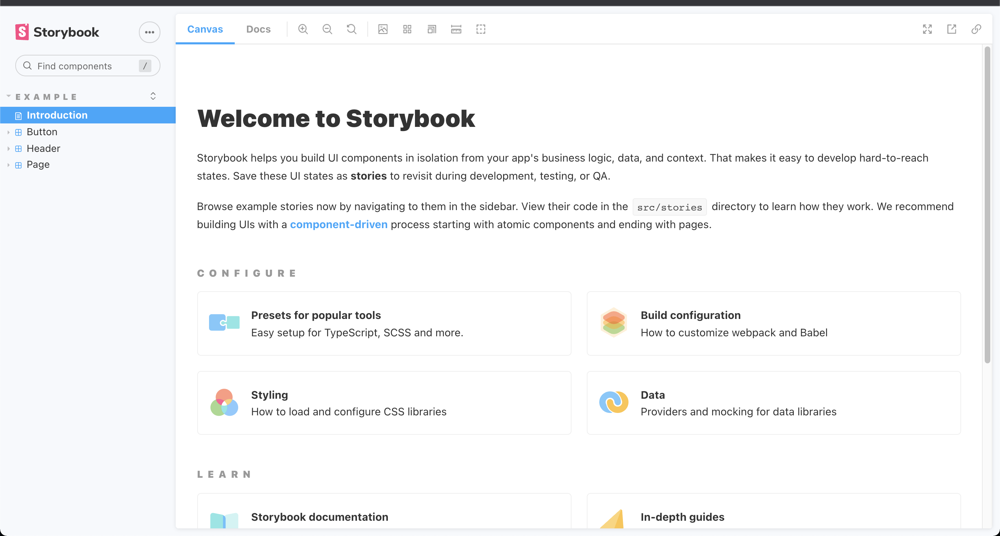
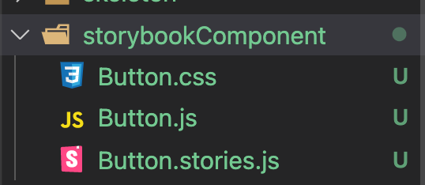
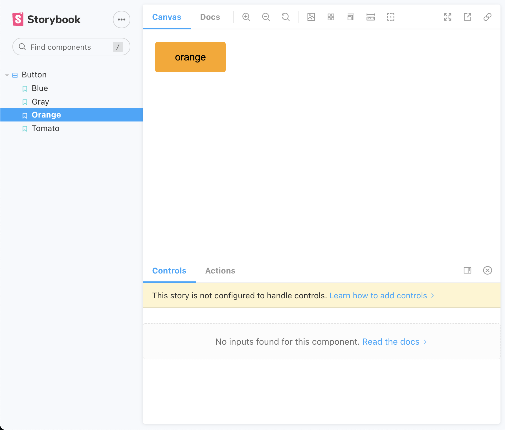
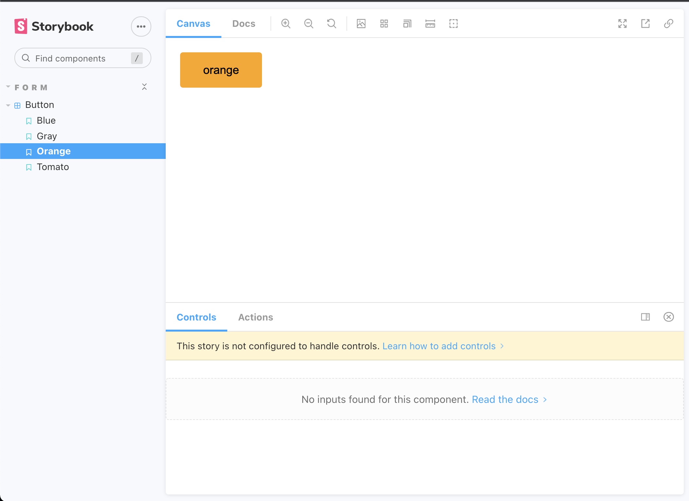

# Storybook

<br>

## Storybook이란?

Storybook은 UI 테스팅 도구이다.

Storybook은 [컴포넌트 기반 개발(Component-Driven Development)](https://www.componentdriven.org/)으로 UI를 만들기에 좋다.

<br>

**상태별 UI가 변화되는것을 테스트 하기위해서 각각 다른 상태를 넣어 컴포넌트를 비교해야한다.**

UI가 상태별로 변화한 것을 확인하기 위해 라우터를 각각 다르게 설정해서 테스팅할 수 밖에 없다.

<br>

이런 테스트를 할때 **StoryBook**이 굉장히 유용하다.

- **내가 원하는 케이스를 미리 등록해둔뒤**, 빠르게 해당 컴포넌트만 보고 테스트를 할 수 있다.
- 테스트 도구는 아니지만, 각 **상태별 UI를 등록해놨기 때문에 시각적 테스트에 용이하다.**
- **디자이너와 커뮤니케이션을 할때, StoryBook을 사용**해서, 상태별, 페이지별 컴포넌트를 공유하기 용이하다.

<br>

**설치방법**

```bash
npx sb init
```

<br>

설치후 몇몇의 파일들이 추가되어 있다.

- .storybook : Storybook **설정 파일이 포함되어 있다.**
- src/stories : **Storybook 예제 컴포넌트**

<br>

storybook을 실행시켜보자

```bash
npm run storybook
```

<br>

storybook에 설정된 환경에따라 해당 로컬 주소로 새로운 브라우저가 띄어진다.



storybook을 최초에 설치했을때, **같이 추가된 stories 파일들이 좌측에 있다.**

<br>

storybook의 기본 사용방법에 대해 알아보자.

<br>

## Writing Stories

UI 테스팅을 할 컴포넌트의 같은 **폴더구조에 같이 stories 파일을 만들어준다.**

ex)

- StoryBook../Button.js
- StoryBook../Button.stories.js



<br>

Button.js

```jsx
import React from "react";

const Button = ({ color, children }) => {
  return <button className={`button ${color}`}>{children}</button>;
};

export default Button;
```

<br>

Button.stories.js

```jsx
import React from "react";
import Button from "./Button";

export default {
  title: "Button",
  component: Button,
};

export const blue = () => <Button color="blue">Blue</Button>;
export const gray = () => <Button color="gray">gray</Button>;
export const orange = () => <Button color="orange">orange</Button>;
export const tomato = () => <Button color="tomato">tomato</Button>;
```

<br>

stories.js 파일에서 **하나의 컴포넌트는 다양한 스토리를 가지고있는 형식**으로 구성되어있다.

<br>

컴포넌트 하나에 **state별로 다르게 렌더링 됬을경우**를 테스팅하는 스토리를 하나가 아니라 **원하는 만큼 만들어 테스팅할 수 있다.**

<br>

**가장 먼저 만들려고하는 스토리들에 대한 정보를 주어야 한다.**

객체를 **export default**에서 생성해준다.

- `component`  : 스토리의 해당 **컴포넌트를 넣어준다.**
- `title` : Storybook 앱의 사이드바에서 컴포넌트를 참조하는 방법, 즉 **storybook앱에서 좌측에 보여지는 이름이다.**
- `excludeStories` : Storybook에서 스토리를 내보낼 때 렌더링에서 제외하는 것
- `argTypes` :  -- 각각의 스토리에서 [인수(args)](https://storybook.js.org/docs/react/api/argtypes)의 행동 방식을 정해준다.



<br>

Button.stories.js를 **storybook으로 인식할 수 있는 이유는 최초의 환경설정 때문이다.**

<br>

.storybook/main.js

```jsx
module.exports = {
  stories: ["../src/**/*.stories.mdx", "../src/**/*.stories.@(js|jsx|ts|tsx)"],
  addons: [
    "@storybook/addon-links",
    "@storybook/addon-essentials",
    "@storybook/preset-create-react-app",
  ],
  framework: "@storybook/react",
};
```

<br>

`stories` **프로퍼티의 값을 통해 어떤 파일이 story인지 분별한다.**

<br>

## Story 계층 만들기

**Stories가 굉장히 많아진다면, 각각 폴더를 통해 가독성을 높여 관리하기 쉽게해야한다.**

간단한 방법을 통해 폴더구조를 만들 수 있다.

<br>

```jsx
import React from "react";
import Button from "./Button";

export default {
  title: "Form/Button", // <------ 추가한 코드
  component: Button,
};

export const blue = () => <Button color="blue">Blue</Button>;
export const gray = () => <Button color="gray">gray</Button>;
export const orange = () => <Button color="orange">orange</Button>;
export const tomato = () => <Button color="tomato">tomato</Button>;
```

**title 프로퍼티에 `Form/` 를 추가해서 Button이 Form 폴더 안에 들어가게 했다.**

<br>



<br>

참고

- [https://storybook.js.org/tutorials/intro-to-storybook](https://storybook.js.org/tutorials/intro-to-storybook)
- [https://www.youtube.com/watch?v=BySFuXgG-ow&list=PLC3y8-rFHvwhC-j3x3t9la8-GQJGViDQk&index=1](https://www.youtube.com/watch?v=BySFuXgG-ow&list=PLC3y8-rFHvwhC-j3x3t9la8-GQJGViDQk&index=1)
