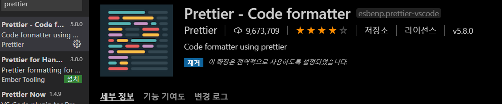
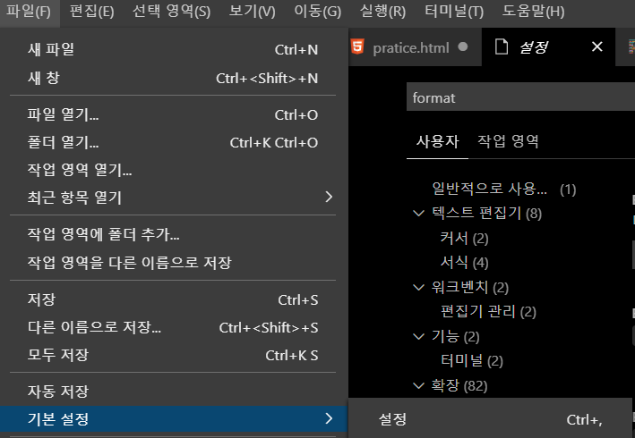
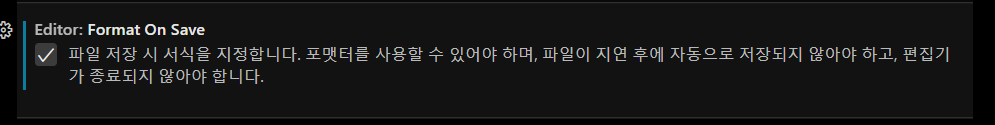

# Prettier

<br>

## Prettier 설치

<br>



<br>

npm을 통해서도 설치할 수 있다.

[https://prettier.io/docs/en/install.html](https://prettier.io/docs/en/install.html)

<br>

## .prettierrc 파일 생성

루트 디렉토리에 .prettierrc파일을 생성한다.

<br>

```jsx
{
  "singleQuote": true,
  "semi": true,
  "useTabs": false,
  "tabWidth": 2,
  "trailingComma": "all",
  "printWidth": 80
}
```

<br>

내용을 파일 안에 추가한다.

<br>

- 문자열을 사용 할 때에는 `'` 를 사용합니다.
- 코드는 `;` 로 끝나야합니다.
- 탭 대신에 스페이스를 사용합니다.
- 들여쓰기 크기는 2칸입니다.
- 객체나 배열을 작성 할 때, 원소 혹은 key-value 의 맨 뒤에있는 것에도 쉼표를 붙입니다.
- 한 줄이 80칸이 넘지 않도록 합니다

<br>

### 저장시 자동 정리해주기

<br>



<br>



<br>

### eslint-config-prettier 적용하기

이것을 사용하게 된다면 ESLint 는 자바스크립트 문법 관련된 것들만 관리하게 되고, 코드스타일 관련 작업은 prettier 가 담당하게 된다.

<br>

패키지 설치

```bash
$ npm i eslint-config-prettier
```

<br>

참고 : [https://velog.io/@velopert/eslint-and-prettier-in-react](https://velog.io/@velopert/eslint-and-prettier-in-react)
