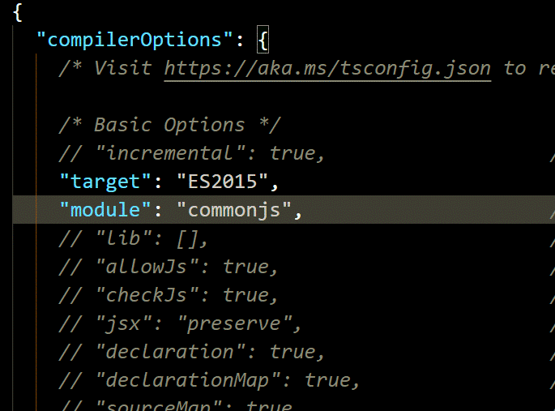
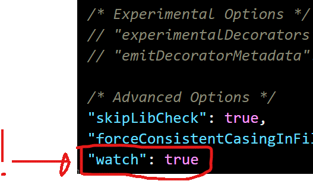

# TypeScript

<br>

## 1 . TypeScript 배경

<br>

자바스크립트는 1995년 넷스케이프사의 브렌던 아이크(Brendan Eich)가 자사의 웹브라우저인 Navigator 2에 탑재하기 위해 개발한 스크립트 언어이다.

초창기 자바스크립트는 웹페이지의 보조적인 기능을 수행하기 위해 **한정적인 용도**로 사용되었다.

<br>

### 1 - 1 자바스크립트가 중요한 언어로 바뀐 배경

<br>

### 1 . HTML5등장

HTML5가 등장하기 이전까지 웹 애플리케이션은 플래시, 실버라이트, 액티브엑스와 같은 플러그인에 의존하여 인터랙티브한 웹페이지를 구축해왔다.

HTML5가 등장함으로써 플러그인에 의존하던 구축 방식은 **자바스크립트로 대체**되었다.

<br>

### 2 . SPA(Single Page Application) 대세

AJAX의 활성화로 데스크탑 애플리케이션과 유사한 사용자 경험을 제공할 수 있는 **SPA(Single Page Application)** 가 대세가 되었다.

<br>

### 3 . 클라이언트의 성능 향상

과거 서버 측이 담당하던 **업무의 많은 부분이 클라이언트 측으로 이동**하게 되었고, 

자바스크립트는 웹의 어셈블리 언어로 불릴 만큼 중요한 언어로 그 위상이 높아지게 되었다.

<br>

### 1 - 2 자바스크립트의 단점

자바스크립트는 C나 Java와 같은 C-family 언어와는 구별되는 아래와 같은 특성이 있다.

<br>

- Prototype-based Object Oriented Language
- Scope와 this
- 동적 타입(dynamic typed) 언어 혹은 느슨한 타입(loosely typed) 언어

<br>

클래스 기반 객체지향 언어(Java, C++, C# 등)에 익숙한 개발자를 혼란스럽게 하며 

코드가 복잡해질 수 있고 디버그와 테스트 공수가 증가하는 등의 문제를 일으킬 수 있다.

<br>

이같은 문제를 극복하고자

TypeScript가 자바스크립트 대체 언어의 하나로써 자바스크립트(ES5)의 Superset(상위확장)이다. 

C#의 창시자인 덴마크 출신 소프트웨어 엔지니어 Anders Hejlsberg(아네르스 하일스베르)가 개발을 주도한 TypeScript는 Microsoft에서 2012년 발표한 오픈소스로, 정적 타이핑을 지원하며 ES6(ECMAScript 2015)의 클래스, 모듈 등과 ES7의 Decorator 등을 지원한다.

<br>

## 2. TypeScript의 장점

<br>

### 2.1 정적 타입

<br>

코드상으로는 어떤 타입의 인수를 전달하여야 하는지, 어떤 타입의 반환값을 리턴해야 하는지 명확하지 않다.

```jsx
function sum(a, b) {
  return a + b;
}
```

<br>

아래의 예제는 변수나 반환값의 타입을 사전에 지정하지 않는 자바스크립트의 동적 타이핑(Dynamic Typing)에 의한 것이다.

```jsx
function sum(a, b) {
  return a + b;
}

sum('x', 'y'); // 'xy'
```

<br>

```tsx
function sum(a: number, b: number) {
  return a + b;
}

sum('x', 'y');
// error TS2345: Argument of type '"x"' is not assignable to parameter of type 'number'.
```

<br>

명시적인 정적 타입 지정은 **개발자의 의도를 명확**하게 코드로 기술할 수 있다. 이는 **코드의 가독성**을 높이고 예측할 수 있게 하며 **디버깅을 쉽게 한다**.

<br>

## 2.2 도구의 지원

<br>

**IDE**와 같은 도구에 타입 정보를 제공함으로써 높은 수준의 인텔리센스(IntelliSense), 코드 어시스트, 타입 체크, 리팩토링 등을 지원받을 수 있으며 이러한 도구의 지원은 대규모 프로젝트를 위한 필수 요소이다.

<br>

**IDE란?**

통합 개발 환경(Integrated Development Environment, IDE)

공통된 개발자 툴을 하나의 그래픽 사용자 인터페이스(Graphical User Interface, GUI)로 결합하는 애플리케이션을 구축하기 위한 소프트웨어이다.

<br>

### 2.3 객체지향 프로그래밍 지원

인터페이스, 제네릭 등과 같은 강력한 객체지향 프로그래밍 지원은 크고 복잡한 프로젝트의 코드 기반을 쉽게 구성할 수 있도록 도와준다.

<br>

### 2.4 ES6 / ES Next 지원

TypeScript는 아직 ECMAScript 표준에 포함되지는 않았지만 표준화가 유력한 스펙을 선제적으로 도입하므로 새로운 스펙의 유용한 기능을 안전하게 도입하기에 유리하다.

<br>

### 함수형 프로그래밍?

<br>

타입스크립트는 딱히 자바스크립트에 비해 함수형 프로그래밍하기가 더 좋은 언어는 아니다라고 한다. 

하지만 함수형 프로그래밍에 나쁘다는 것은 아니다.

타입스크립트는 자바스크립트의 확장이기 때문에 자바스크립트로 할 수 있는 것을 할 수 없는 것은 아니다. 

문제가 되는 함수형 프로그래밍 부분의 번거로움을 감수한다면 함수형 프로그래밍의 장점과 타입스크립트의 장점을 동시에 가져갈 수 있다.

<br>

## 3. 개발환경 구축

<br>

TypeScript 파일(.ts)은 브라우저에서 동작하지 않으므로 **TypeScript 컴파일러를 이용해 자바스크립트 파일로 변환**해야 한다. 

이를 **컴파일** 또는 **트랜스파일링**이라 한다.

<br>

### 3.1 TypeScript 컴파일러 설치

<br>

전역에 TypeScript 설치한다.

<br>

```bash
$ npm install -g typescript
```

<br>

typeScript 버전 확인

```bash
$ tsc -v
Version 2.8.3
```

<br>

TypeScript 컴파일러(tsc)는 TypeScript 파일(.ts)을 자바스크립트 파일로 트랜스파일링한다.

<br>

tsc 명령어 뒤에 트랜스파일링 대상 파일명을 지정한다. 이때 확장자 .ts는 생략할 수 있다.

```bash
$tsc script
```

<br>

트랜스파일링을 한후에 같은 디렉토리에 자바스크립트 파일이 생성된다.

<br>

하지만 트랜스파일링된 파일은 ES3버전이다.

컴파일의 자바스크립트 기본 버전이 ES3이기 떄문이다.

<br>

트랜스파일링으로 자바스크립트 버전을 변경하려면 `-target` 또는 `-t`를 사용한다.

현재 tsc가 지원하는 자바스크립트 버전은 ‘ES3’(default), ‘ES5’, ‘ES2015’, ‘ES2016’, ‘ES2017’, ‘ES2018’, ‘ES2019’, ‘ESNEXT’이다.

<br>

EX) ES6버전으로 트랜스파일링을 실행하려면

```bash
$ tsc script -t ES2015
```

<br>

tsc 옵션 설정파일인 tsconfig.json가 생성되어 기본옵션을 설정할 수 있다.

```bash
$ tsc --init
message TS6071: Successfully created a tsconfig.json file.
```

<br>



<br>

`-watch` 또는 `-w` 옵션을 사용하면 트랜스파일링 대상 파일의 내용이 변경되었을 때 이를 감지하여 자동으로 트랜스파일링이 실행된다.

```bash
$ tsc --watch
```

<br>

tsconfig.json기본 옵션으로 추가할 수 있다.

<br>



tsc 명령어 뒤에 파일명을 지정하면 tsconfig.json이 무시된다

```bash
$ tsc person # ✘ tsconfig.json이 무시된다.
```

<br>

tsc명령어를 하면 폴더내의 모든 TypeScript파일이 트랜스파일링이 된다.

```bash
$ tsc
```

<br>

출처 : [[https://poiemaweb.com/typescript-introduction](https://poiemaweb.com/typescript-introduction)]