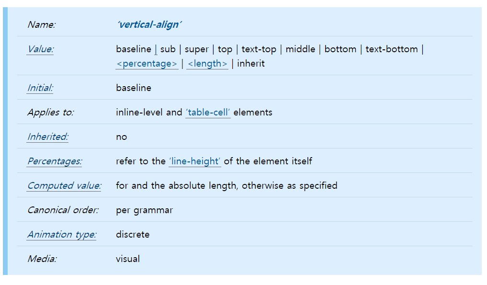
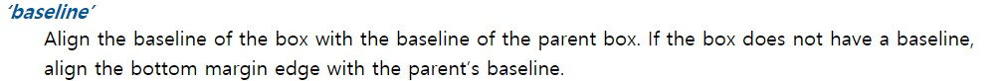
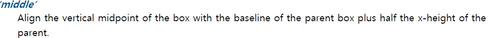
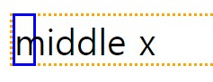
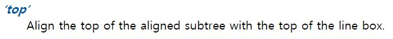
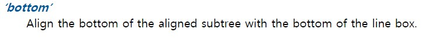

Vertical-align
===

이름 : vertical-align 
값 : 	baseline | sub | super | top | text-top | middle | bottom | text-bottom | percentage | length | inherit 
초기값: baseline 
적용하는 곳 : inline-level 과 table-cell 요소들 
상속 : X
percentage : 그요소의 line-hegiht 에따라 percentage를 적용한다.

---

>상자의 base-line을 부모 상자의 base-line에 맞춘다. 상자에 base-line이 없으면 아래쪽 margin 모서리를 부모의 base-line라고 생각하고 정렬한다.
---

>기존의 baseline과 글자 x의 height 가운데에서의 중간지점에 정렬한다.

---

---

----
aligend with : ~을 기준으로(맞춰) 정렬하다.

