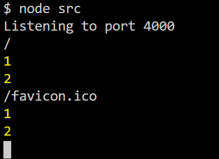
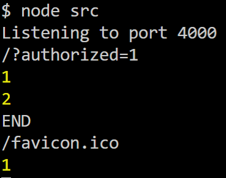

처음 자바스크립트는 웹 브라우저에서만 사용했었다.

<br>

점차 자바스크립트가 발전하면서 구글이 크롬 웹브라우저를 소개하면서 V8이라는 자바스크립트 엔진을 개발했다.

<br>

그이후 자바스크립트 엔진을 기반으로 웹브라우저 뿐만아니라 서버에서도 자바스크립트를 사용 할수 있게 한것이 Node.js이다.

<br>

# koa 기본

<br>

## Express vs koa

<br>

koa는 Express의 개발팀이 개발한 프레임워크이다. 기존의 Express에서 문제점을 개선하게 되면 내부설계가 완전히 바뀌어 아예 새로운 프레임워크를 개발했다.

<br>

### Express

<br>

Express는 미들웨어, 라우팅, 등등 다양한 기능이 자체적으로 내장되어있는 프레임워크 이다.

<br>

### koa

<br>

koa는 오로지 미들웨어 기능만 가지고 있다.

다른 기능들은 라이브러리를 적용하여 사용한다.

<br>

따라서 koa는 필요한 기능만 붙여서 서버를 만들기 때문에 Express보다 훨씬 가볍다.

<br>

또한 async / await 문법을 지원하기 떄문에 비동기 작업을 더 편리하게 할 수 있다.

<br>

## 설치

<br>

```bash
npm i koa
```

<br>

## koa 기본 사용법

<br>

### 서버 띄우기

<br>

```jsx
const koa = require('koa');

const app = new koa();

app.use((ctx) => {
  ctx.body = 'hello world';
});

app.listen(4000, () => {
  console.log('Listening to port 4000');
});
```

<br>

app.listen은 4000포트를 사용한다는 의미이다.

<br>

실행방법

```bash
node src
```

<br>

### 미들웨어

<br>

위의 예제에서 .use는 미들웨어 함수를 애플리케이션에 등록한다.

등록된 미들웨어는 중간과정에서 port에 보내기전에 작업을 처리한다.

<br>

미들웨어 함수는 두개의 파라미터를 받는다.

첫번째는 ctx라는 값이다.

두번째는 next이다

<br>

**ctx? 는 무엇일까?😯**

Context의 줄임말로 웹 요청과 응답에 관한 정보를 가지고있다.

<br>

**next는 무엇일까?😯**

next는 현재 처리중인 미들웨어의 다음 미들웨어를 호출한다.

만약 미들웨어를 등록하고 next 함수를 호출 하지 않으면, 그다음 미들웨어는 실행되지 않는다.

<br>

**팁!**

만약 다음 미들웨어를 처리할 필요가 없는경우 next를 생략하여 미들웨어를 작성한다.

<br>

ex) `ctx ⇒ {}`

**주의!**

미들웨어는 app.use를 사용하여 등록되는 순서대로 처리된다.

<br>

만약 두개의 미들웨어를 작성한다면?

예제 코드)

```jsx
const koa = require('koa');

const app = new koa();

app.use((ctx, next) => {
  console.log(ctx.url);
  console.log(1);
  next();
});

app.use((ctx, next) => {
  console.log(2);
  next();
});

app.use((ctx) => {
  ctx.body = 'hello world';
});

app.listen(4001, () => {
  console.log('Listening to port 4000');
});
```

<br>



<br>

다음과 같이 미들웨어를 등록한 순으로 처리되었다.

만약 next()를 해주지 않으면 다음 미들웨어는 실행되지 않는다.

<br>

**팁!**

조건부로 다음 미들웨어를 무시하게 만들 수 있다.

<br>

```jsx
app.use((ctx, next) => {
  console.log(ctx.url);
  console.log(1);
  if (ctx.query.authorized !== '1') {
    ctx.status = 401;
    return;
  }
  next();
});

app.use((ctx, next) => {
  console.log(2);
  next();
});
```

<br>

- http://localhost:4000/?authorized=1
- http://localhost:4000

<br>

첫번째 쿼리가 들어있으면 다음 미들웨어를 처리하지 않는다.

**쿠키 또는 헤더**를 통해서 처리 할 수 도있다.

<br>

### next()함수의 promise 반환

<br>

next() 호출하면 Express와 다르게 promise를 반환한다.

반환된 promise에 then메서드를 사용하여 후속처리를 한다고 했을때

<br>

다음 미들웨어가 작업이 완료된 후에 실행된다.



<br>

위와 같이 두번째 미들웨어의 작업이 마무리된뒤 실행된다.

<br>

### **async / await**

이전코드에서 async await를 사용하여 코드를 고칠 수 있다.

```jsx
app.use(async (ctx, next) => {
  console.log(ctx.url);
  console.log(1);
  if (ctx.query.authorized !== '1') {
    ctx.status = 401;
    return;
  }
  await next();
  console.log('END');
});
```

<br>

next()가 호출된후 다음 미들웨어가 실행되고 마무리된뒤

다음 코드인 `console.log('END')` 가 실행된다.

<br>

- 이 글은 책 리액트를 다루는 기술  보고 정리한 내용입니다.