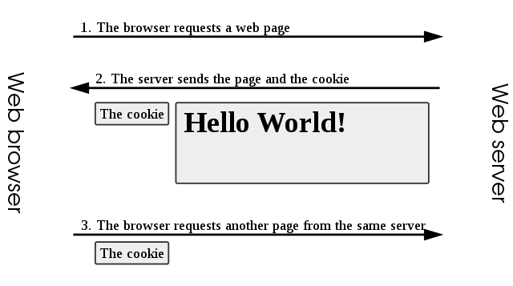

# Cookie

<br>

## **쿠키란 무엇일까?**

<br>

인터넷 사용자가 어떠한 웹사이트를 방문할 경우 

그 사이트가 사용하고 있는 서버를 통해 

인터넷 사용자의 컴퓨터에 설치되는 작은 기록 정보 파일을 말한다.

<br>

이 기록 파일에 담긴 정보는 인터넷 사용자가 같은 웹사이트를 방문할 때마다 읽히고 수시로 새로운 정보로 바뀐다.

<br>

도메인 별로 각각 브라우저에 문자열 데이터로 저장을한다. ex) 구글, 네이버

<br>



<br>

1. 브라우저에서 웹페이지를 요청한다
2. 서버에서 웹페이지와 쿠키를 보내준다.
3. 브라우저는 서버에 또 다른 페이지를 요청할때 쿠키를 다시 보낸다.

<br>

**쿠키 사양**

쿠키 지원을 위해 브라우저가 다음의 요건을 충족할 것을 명시한다.

- 4,096바이트 크기의 쿠키를 지원할 것
- 한 도메인 당 최소 50개 쿠키를 지원할 것(예: 각 웹사이트 당)
- 총 최소 3,000개 쿠키를 지원할 것.

<br>

**그렇다면 어떻게 주고받을까?**

쿠키는 `Set-Cookie` HTTP 헤더를 사용하여 설정되며 이는 웹 서버의 HTTP 응답을 통해 송신된다.

<br>

1. 브라우저에서 html 웹사이트 홈페이지의 페이지 요청을 한다.
2. 서버는 2개의 쿠키를 헤더와 함께 응답한다.

```jsx
HTTP/1.0 200 OK
Content-type: text/html
Set-Cookie: theme=light
Set-Cookie: sessionToken=abc123; Expires=Wed, 09 Jun 2021 10:18:14 GMT
```

<br>

하지만 첫번째 `Set-Cookie: theme=light` 는 `Expires` 또는 `Max-Age` 속성이 존재하지 않기 때문에 세션 쿠키로 간주된다.

<br>

세션쿠키는 브라우저가 닫힐 때 브라우저에 의해 삭제되는 구조다.

<br>

두번째 `Set-Cookie: sessionToken=abc123; Expires=Wed, 09 Jun 2021 10:18:14 GMT` sessionToken는 영구 쿠키로 간주된다.

<br>

`Expires` 또는 `Max-Age` 속성이 존재하기 떄문이다.

<br>

그중 `Expires` 는 브라우저가 특정 날짜와 시간에 삭제하도록 지시하는 `Expires` 속성을 포함하기 때문이다.

<br>

이러한 방식으로, 서버는 요청된 페이지를 송신함으로써 응답하며 여기에는 새 쿠키 추가, 기존 쿠키 수정, 쿠키 삭제를 위해 응답에 더 많은 Set-Cookie 헤더를 포함해서 보낸다.

<br>

쿠키 값은 페이지 요청에 응답하여 Set-Cookie 헤더를 포함시킴으로써 서버에 의해 수정이 가능하다.

<br>

쿠키의 값은 `,`와 `;`, 공백 문자를 제외한 인쇄 가능한 모든 ASCII 문자로 구성된다. 

`=` 는 이름과 값 사이를 구별하는 구분자 역활을 하므로써 쿠키의 이름으로 제외한다.

<br>

**자바스크립트로 쿠키 관리**

쿠키는 브라우저 내에서 실행되는 자바스크립트와 같은 스크립트 언어에 의해 설정할 수도 있다. 

자바스크립트에서 `document.cookie` 객체는 이 목적을 위해 사용된다.

`document.cookie = "temperature=20"`

 `temperature` 이라는 키와 `20` 이라는 값을 만든다.

<br>

**쿠키는 주로 세 가지 목적을 위해 사용된다.**

1 . **세션 관리(Session management)** 서버에 저장해야 할 로그인, 장바구니, 게임 스코어 등의 정보 관리

2 . **개인화(Personalization)** 사용자 선호, 테마 등의 세팅

3 . **트래킹(Tracking)** 사용자 행동을 기록하고 분석하는 용도