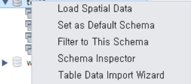
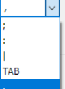

# CSV 파일로 테이블 생성

 

CSV 파일을 임포트(import)해서 테이블로 만들 수 있다.

 

**CSV란?**

Comma Separated Values의 약자로 모든 값들이 콤마(,)로 구분된 형식의 내용을 가진 파일을 말한다.

 

**생성방법**

1 . 데이터베이스에서 우클릭으로 Table Data import Wizard를 클릭한다.

 

2 . CSV가 있는 파일경로에서 불러온다.

 

3 . 테이블 이름을 원하는데로 입력한다.

 

4 . 설정에서 콤마를 기준으로 컬럼을 구분할수 있게 콤마로 설정한다.

 

 

5 . 그이후 next 누른뒤 finsih를 한다.

이후 새로고침한후 테이블을 확인하면 데이터가 있다.

엑셀로 저장된 데이터를 CSV파일로 추출할 수 있어,

파일을 SQL로 분석이 가능하다.