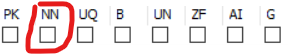
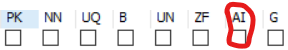
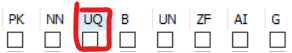
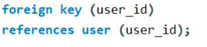
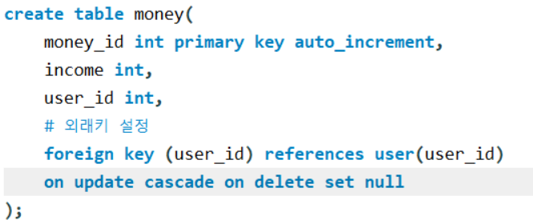

# Constraint : 제약조건

 

CONSTRAINT 제약_조건_이름 PRIMARY KEY (컬럼)

 

## PRIMARY KEY

컬럼에 비어 있는 값과 동일한 값을 저장할수 없습니다. 하나의 테이블에 하나의 컬럼만 조건을 설정할수 있습니다.

 

테이블에서 하나의 row를 고유하게 식별할수있도록 해주는 속성이다.

때문에 테이블에서 primary key(기본 키)로 각각의 row(개체)를 찾을 수 있게 설정해주어야한다.

 

PK의 체크박스를 눌러 설정해줄수있다.

 

PRIMARY KEY의 종류

1 . Natural Key

이미 개체가 가지고있는 속성을 Primary Key로 설정했을때는 Natural Key라고한다.

 

2 . Surrogate Key

인위적으로 생성한 컬럼이다.

Primary Key로 쓰기 위해 추가한 컬럼을 Surrogate Key라고 한다.

 

## NOT NULL

NULL 값 (비어있는 값)을 저장할 수 없다.

NULL은 인위적으로 값을 비게 하는것인데 이 컬럼에서는 값을 비어있지 못하게 설정을 해준다.

 

 

## Auto Increment

Surrogate Key는 보통 1부터 시작해서 1씩 증가하는 정수값을 갖는다.

DBMS에는 매번 새로운 row가 추가될 때마다 id 컬럼에 이전보다 1이 더 큰 정수를 자동으로 넣어주는 기능이 존재한다.

 

주로 테이블의 PRIMARY KEY 데이터를 저장할때 자동으로 숫자를 1씩 증가시켜 주는 기능으로 사용한다.

 

새로운 row들이 추가되면 Surrogate Key가 1씩 증가한다.

 

## UNIQUE

colum에서 같은 값을 저장할수 없게 해준다.

 

## FOREIGN KEY

다른 테이블과 연결되는 값이 있을때 같이 수정되어야 하거나

삭제되어야 하는등 같은 연관 관계가 있게 해줄때 설정하게 해준다.

 

foreign key (연결할 데이터  컬럼)
references user (테이블이름) (참조할 컬럼)

 

### **cascade**

**cascade** : 참조되는 테이블에서 삭제하거나 수정하면,

참조하는 테이블에서도 삭제하거나 수정

 

 

## DEFAULT

데이터를 저장할때 해당 컬럼에 별도의 저장값이 없으면 DEFAULT로 설정된 값이 저장된다.