# SQL(Structured Query Language)

## **SQL이란?**

SQL은 관계형 데이터베이스 관리 시스템(RDBMS)의 데이터를 관리하기 위해 설계된 특수 목적의 프로그래밍 언어이다.

자료의 검색과 관리, 데이터베이스 스키마 생성과 수정, 데이터베이스 객체 접근 조정 관리를 위해 고안되었다. 

많은 수의 데이터베이스 관련 프로그램들이 SQL을 표준으로 채택하고 있다.

모든 DBMS는 SQL프로그래밍 언어로 데이터를 다룬다.

왜 'Structured' 라는 단어가 붙었을까?

아마도 SQL의 조상인 SEQUEL이 나타내는 'Structured English Query Language'(사람들이 일상 생활에서 쓰는 영어 문장에 비해 좀더 구조화된 형식의 언어)에서 그대로 이어졌을 거라는 의견이 많다.

## **SQL 문법의 종류**

### 1 . DDL(Data Definition Language)

데이터 **정의어**

데이터 베이스, 테이블, 뷰, 인덱스등의 데이터 베이스 개체를 생성, 삭제, 변경에 사용
CREATE, DROP, ALTER, TRUNCATE

### 2 . DML(Data Manipulation Language)

데이터 **조작어**

데이터 검색, 삽입, 수정, 삭제등에 사용
SELECT, INSERT, UPDATE, DELETE
트랜젝션이 발생하는 SQL문

### 3 . DCL(Data Control Language)

데이터 **제어어**

사용자의 권한을 부여하거나 빼앗을때 사용
GRUNT, REVORKE, DENY

### **트랜젝션 이란?**

트랜잭션(Transaction)은 데이터베이스의 상태를 변환시키는 하나의 논리적 기능(task)을 수행하기 위한 작업의 단위 또는 한꺼번에 모두 수행되어야 할 일련의 연산들을 의미한다.

같은 논리적 기능을 서로 다르게 수행되는것이 아니라

같은 논리적 기능이였을떄 한번에 묶어서 수행할수있도록 한다.

 

## **SQL문**

### **SELECT FROM**

데이터를 검색할때 사용되는 문법이다.

SELECT <column_name_1>, <column_name_2>, ...
FROM <table_name>

ex) 

world 데이터베이스에서 city테이블이름에서

그아래에 있는 모든 데이터를 가져온다(*)

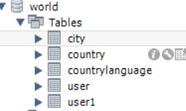

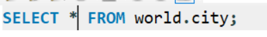

ex) code, name 컬럼을 country 테이블에서 가져온다.

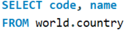

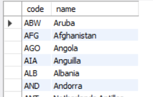

## USE

데이터 베이스 선택 

USE로 선택한 데이터베이스를 선택해서 

FROM 절에서 데이터베이스 선택해서 사용할 필요가 없다.

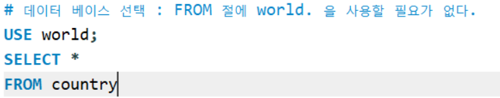

## alias

컬럼의 이름을 변경할수 있습니다.

컬럼의 이름이 변경된 상태로 테이블이 나온다.

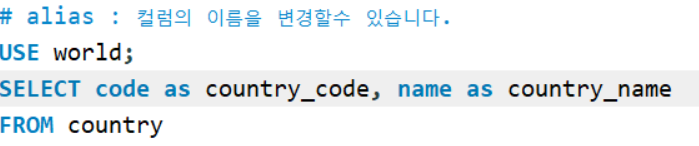

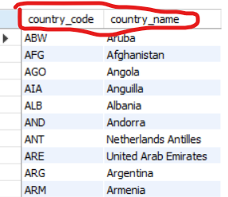

## SHOW, DESC

데이터 베이스, 테이블, 컬럼 리스트 확인

현재 어떤 데이터베이스를 가진지 표시해준다.

현재 선택한 데이터베이스에서 어떤 테이블들을 가진지 표시해준다.

현재 선택한 데이터베이스의 테이블에서 어떤 컬럼을 가진지 표시해준다.

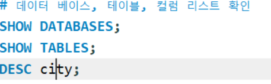

### WHERE

비교연산

특정 조건을 주어 데이터를 검색하는데 사용되는 문법

조건문

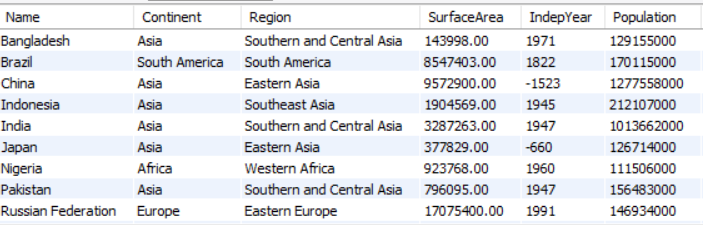

## AND, OR

논리 연산

WHERE에서 논리합,논리곱을 연산해서 결과가 나온게한다.

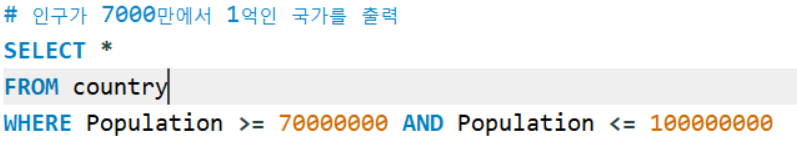

### BETWEEN

범위 연산

WHERE에서 사이의 값을 가져올때 사용한다

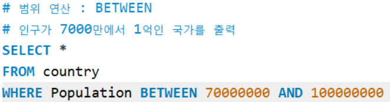

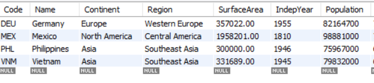

### IN, NOT IN

특정 조건을 포함 

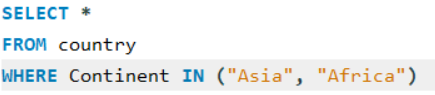

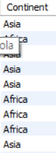

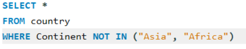

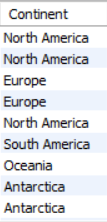

### LIKE

특정 문자열이 포함된 데이터 출력

(자바스크립트의 정규표현식 같이)

'-' : 글자숫자를 정해줌(EX 컬럼명 LIKE '홍_동')

'%' : 글자숫자를 정해주지않음(EX 컬럼명 LIKE '홍%')

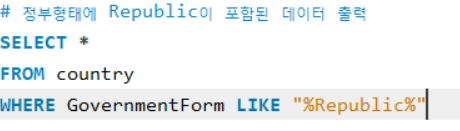

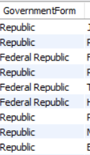

### ORDER BY

특정 컬럼의 값으로 데이터 정렬에 사용되는 문법

오름차순으로 정렬하고 싶으면 ASC를 ORDER BY 뒤에 써준다.

내림차순으로 정렬하고 싶으면 DESC를 ORDER BY 뒤에 써준다.

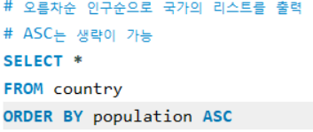

,(콤마)를 써서 정렬한후 되어진 결과뒤에 또다시 정렬할수있다.

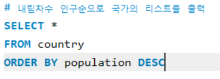

### LIMIT

LIMIT은 조회하는 데이터의 수를 제한할수 있다.

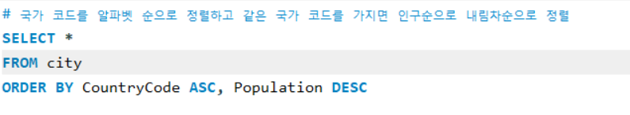

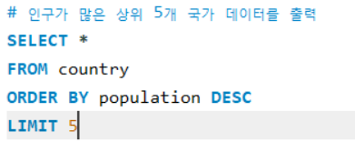

LIMIT 뒤에 5개는 제외하고 ,(콤마)뒤의 3개를 출력한다.

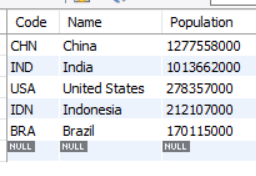

### GRUOP BY HAVING

GROUP BY는 여러개의 동일한 데이터를 가지는 특정 컬럼을 합쳐주는 역할을 하는 명령이다.

SQL에는 아래와 같은 그룹함수가 있다.

COUNT, MAX, MIN, AVG, VAR_SAMP, STDDEV

HAVING은 GROUP BY에서 반환되는 결과에 조건을 줄수 있다.

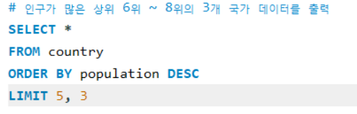

### COUNT

group by로 동일한 데이터의 컬럼을 합쳐준다.

count로 컬럼의 개수를 세어준다.

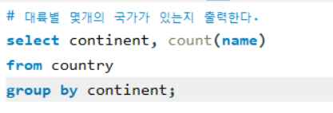

### SUM

컬럼의 값을 다 합해준다.

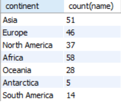

### MAX

컬럼의 최대값을 조회한다.

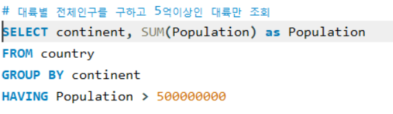

### MIN

컬럼의 최소값을 조회한다.

### AVG

컬럼의 평균값을 조회한다.

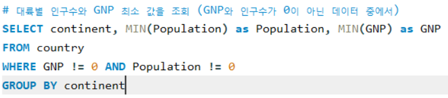

### CREATE USE ALTER DROP

DDL : 데이터 정의어

데이터베이스, 테이블 CRUD

### CREATE DATABASE

데이터 베이스 생성

CREATE DATABASE (만들려는 데이터베이스 이름)

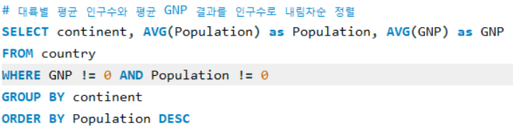

### database()

현재 데이터 베이스 확인

### CREATE TABLE

테이블생성

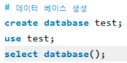

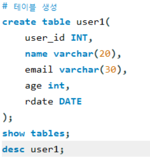

### 제약조건을 건채로 테이블생성

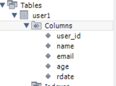

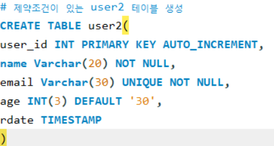

### SHOW VARIABLES LIKE "character_set_database"

사용중인 데이터베이스의 인코딩 방식 확인

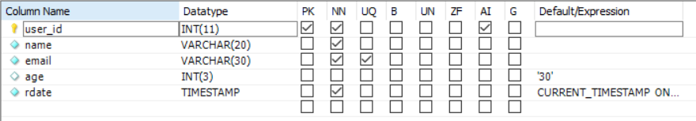

### ALTER DATABASE (데이터베이스이름) CHARACTER SET = (바꾸려는 인코딩방식)

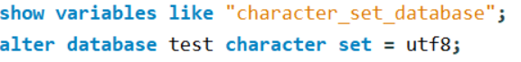

### ALTER TABLE (테이블이름) ADD (추가하고싶은 컬럼) (데이터타입)

user2 테이블에 TEXT 데이터 타입을 갖는 tmp 컬럼을 추가

### ALTER TABLE (테이블이름) MODIFY (수정하고 싶은 컬럼) (데이터타입)

user2 테이블에 INT 데이터 타입을 갖는 tmp 컬럼으로 수정

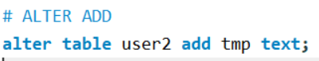

### ALTER TABLE (테이블이름) DROP (삭제하고 싶은 컬럼)

또는

drop database tmp;

DROP (데이터베이스) (삭제하고싶은 데이터베이스)

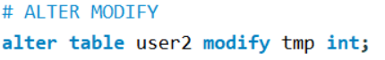

### 데이터베이스 생성 삭제 일련과정

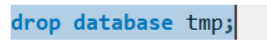

### 테이블 생성 삭제 일련과정

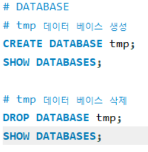

### INSERT INTO

기존의 테이블의 데이터를 덮어씌운다.

테이블 이름 뒤에 오는 컬럼이름은 생략이 가능하며 대신에 VALUES 뒤에 value 값이 순서대로 와야 한다.

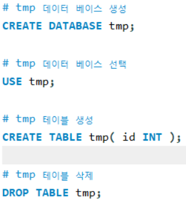

select한 결과 데이터를 덮어씌운다.

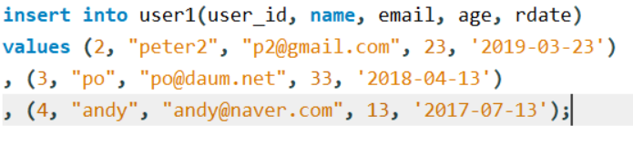

### UPDATE SET

업데이트시에는 항상 select-where로 변경할 데이터를 확인하고 update 해줘야 실수를 줄일수
있다.

또한 limit도 함께 사용해주면 좋다.

### DELETE, DROP, TRUNCATE

조건을 설정하여 데이터를 삭제할수 있습니다.

**DELETE → 조건을 설정한 데이터 삭제**

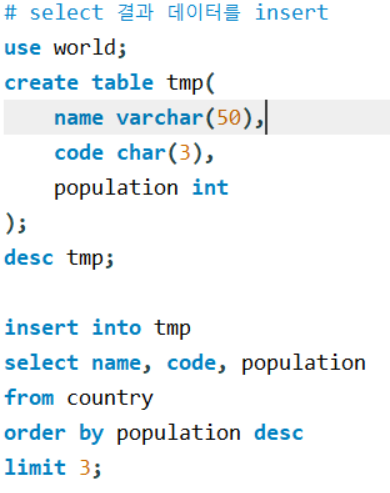

**DROP → 테이블 전체를 모두 삭제 (DLL)**

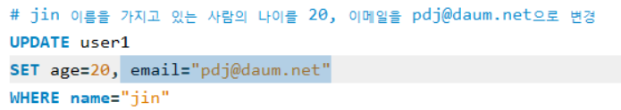

**TRUNCATE → 테이블 구조를 남기고 모든 데이터를 삭제**

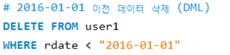

### JOIN

여러개의 테이블을 모아서 보여줄때 사용 된다.

inner, left, right, outer

### VIEW : 가상테이블

쿼리문을 조금더 간결하게 하기 위해서 사용한다.

수정이 불가능하고 인덱스와 같은 설정이 불가능하다.
