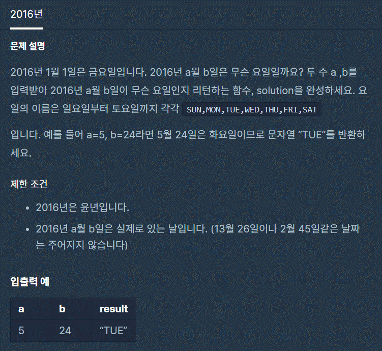

# 1. 2016년



```js
function solution(a, b) {
  var answer = '';
  var preMonthTotaldays;
  
  switch (a){
      case 3:
        preMonthTotaldays = (30 * (a - 1));
        break;
      case 2:
      case 4:
      case 5:
        preMonthTotaldays = (30 * (a - 1)) + 1;
        break;
      case 6:
      case 7:
        preMonthTotaldays = (30 * (a - 1)) + 2;
        break;
      case 8:
        preMonthTotaldays = (30 * (a - 1)) + 3;
        break;
      case 9:
      case 10:
        preMonthTotaldays = (30 * (a - 1)) + 4;
        break;
      case 11:
      case 12:
        preMonthTotaldays = (30 * (a - 1)) + 5;
        break;
      default:
        preMonthTotaldays = 0;
  }
  var curTotalDays = preMonthTotaldays + b - 1;
  switch(curTotalDays % 7){
    case 0:
      answer = 'FRI';
      break
    case 1:
      answer = 'SAT';
      break
    case 2:
      answer = 'SUN';
      break
    case 3:
      answer = 'MON';
      break
    case 4:
      answer = 'TUE';
      break
    case 5:
      answer = 'WED';
      break
    case 6:
      answer = 'THU';
      break
    default:
      answer = 'error'
  }
  return answer;
}
```

코드를 치면서도 내가 얼마나 끔찍하게 짰는지 보여 스스로에게 실망스러웠다.

실행은 잘되고 프로그래머스에서도 '정답입니다!' 하며 나에게 포인트를 주었지만 굉장히 부끄러웠다.

풀기는 했으니 더 나은 코드를 만들었다.

```js
function solution(a, b) {
  var monthDate = [31, 29, 31, 30, 31, 30, 31, 31, 30, 31, 30, 31];
  var dayOfWeek = ['FRI', 'SAT', 'SUN', 'MON', 'TUE', 'WED', 'THU'];

  var totalDate = 0;

  for (var i = 0; i < a - 1; i++) {
    totalDate += monthDate[i];
  }
  return dayOfWeek[(totalDate + b - 1) % 7];
}
```
굉장히 많은 시간이 걸렸지만 언젠가는 금방 풀날이 오길 기대하며


출처: 프로그래머스 코딩 테스트 연습, https://programmers.co.kr/learn/challenges