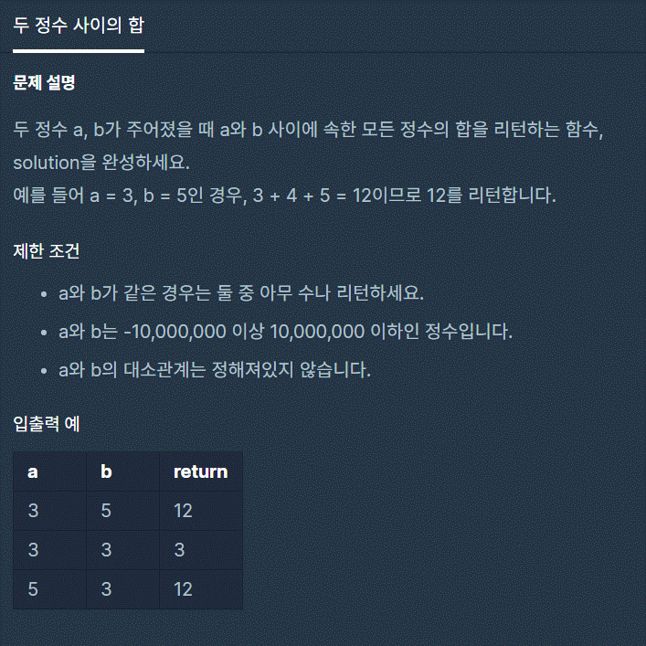

# 2. 두 정수 사이의 합
---



```js
function solution(a, b) {
    var answer = 0;
    if (a == b){
        return a;
    } else if(a < b){
        while(a <= b){
            answer += a;
            a++;
        }
    } else{
        while(b <= a){
            answer += b;
            b++;
        }
    }
    return answer;
}
```

제한조건에서 a와 b가 같을경우 아무수나 리턴하라는 조건으로
a와b가 같으면 a가 리턴하게 하였다.

b가 더 클경우 혹은 a가 더 큰 경우 작은 숫자가 반복문에서 반복할때마다 1씩 커지며<br>
answer에 자기의 값을 더하게 하였다.

```js
function solution(a, b) {
    var answer = 0;
    for (var i = Math.min(a,b); i <= Math.max(a,b); i++) answer += i;
    return answer;
}
```
다른 사람의 풀이에서는 더 간단하게 풀었다.
Math매소드를 사용하여 간단하게 풀었다.

출처: 프로그래머스 코딩 테스트 연습, https://programmers.co.kr/learn/challenges
