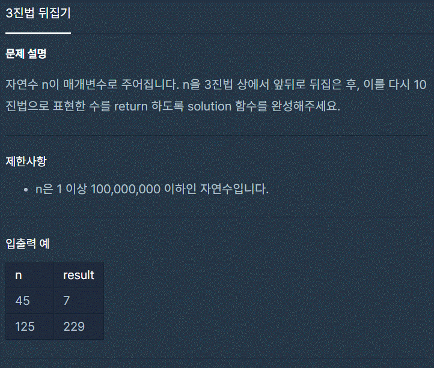

# 3진법 뒤집기

<br>



<br>

```jsx
function solution(n) {
  let rest = [];

  while (n !== 0) {
    rest = [n % 3, ...rest];
    n = Math.floor(n / 3);
  }
  return rest.reduce((acc, cur, i) => acc + cur * (3 ** i), 0);
}
```