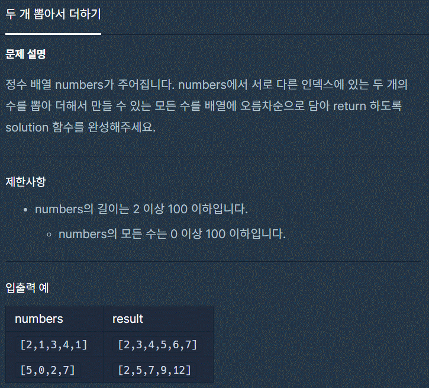

# 두 개 뽑아서 더하기



```jsx
function solution(numbers) {
  let answer = [];
  for (let i = 0; i < numbers.length; i++) {
    for (let j = i + 1; j < numbers.length; j++) {
      if (!answer.includes(numbers[i] + numbers[j])) {
        answer = [...answer, (numbers[i] + numbers[j])];
      }
    }
  }

  return answer.sort((a, b) => a - b);
}
```

출처: 프로그래머스 코딩 테스트 연습, [https://programmers.co.kr/learn/challenges](https://programmers.co.kr/learn/challenges)