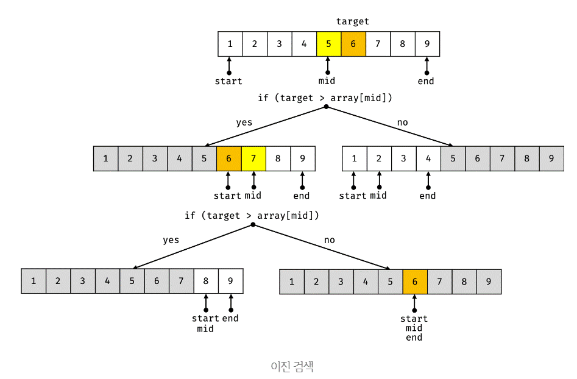

## 1.1 선형 검색

- 선형 검색(linear search)은 배열의 각 요소를 한 인덱스씩 순차적으로 접근하면서 동작한다.
 
- 선형 검색은 배열의 정렬 여부와 상관없이 동작하는 장점이 있지만, 배열의 모든 요소를 확인해야 하는 단점이 있다.

- 시간 복잡도: O(n)

선형 검색을 통해 주어진 배열(array)에 주어진 값(target)이 요소로 존재하는지 확인하여 존재하는 경우 해당 인덱스를 반환하고 존재하지 않는 경우 -1을 반환하는 함수를 구현하라. 단, 어떠한 빌트인 함수도 사용하지 않고 for 문을 사용하여 구현하여야 한다.

```js
function linearSearch(array, target) {
  for(let i = 0; i < array.length; i++){
    if(array[i] === target){
      return i;
    }
  }
  return -1;
}
console.log(linearSearch([1, 2, 3, 4, 5, 6], 1)); // 0
console.log(linearSearch([1, 2, 3, 4, 5, 6], 3)); // 2
console.log(linearSearch([1, 2, 3, 4, 5, 6], 5)); // 4
console.log(linearSearch([1, 2, 3, 4, 5, 6], 6)); // 5
console.log(linearSearch([1, 2, 3, 4, 5, 6], -1)); // -1
console.log(linearSearch([1, 2, 3, 4, 5, 6], 0)); // -1
console.log(linearSearch([1, 2, 3, 4, 5, 6], 7)); // -1
```

## 1.2 이진 검색

<br>

- 이진 검색(binary search)은 선형 검색과는 달리 정렬된 배열에서만 동작한다.

<br>

- 선형 검색은 배열의 모든 요소를 확인해야 하지만 이진 검색은 중간값과 검색 대상 값을 비교하여 검색 범위를 매번 반으로 줄여 나간다.

  - 검색 대상 값이 중간값보다 작은 경우 중간값보다 작은 쪽(왼쪽)을 검색 범위로 한정한다.
  - 검색 대상 값이 중간값보다 큰 경우 중간값보다 큰 쪽(오른쪽)을 검색 범위로 한정한다.
  - 검색 대상 값을 검색할 때까지 이와 같은 처러를 반복한다.

<br>

- 시간 복잡도: O(log n)



<br>

이진 검색을 통해 주어진 배열(array)에 주어진 값(target)이 요소로 존재하는지 확인하여 존재하는 경우 해당 인덱스를 반환하고 존재하지 않는 경우 -1을 반환하는 함수를 구현하라. 단, 아래의 빌트인 함수 이외에는 어떤 빌트인 함수도 사용하지 않아야 하며, while 문을 사용하여 구현하여야 한다.

<br>

- Math.floor: 전달받은 인수의 소수점 이하를 내림한 정수를 반환한다.

```js
function linearSearch(array, target) {
  let start = 0;
  let end = array.length - 1;
  let mid = Math.floor((start + end) / 2);
  while(target !== array[mid]){
    if(end < start){
      mid = -1;
      break;
    }
    if(target > array[mid]){
      start = mid + 1;
      mid = Math.floor((start + end) / 2);
    } else{
      end = mid - 1;
      mid = Math.floor((start + end) / 2);
    }
  }
  return mid;
}
console.log(linearSearch([1, 2, 3, 4, 5, 6], 1)); // 0
console.log(linearSearch([1, 2, 3, 4, 5, 6], 3)); // 2
console.log(linearSearch([1, 2, 3, 4, 5, 6], 5)); // 4
console.log(linearSearch([1, 2, 3, 4, 5, 6], 6)); // 5
console.log(linearSearch([1, 2, 3, 4, 5, 6], -1)); // -1
console.log(linearSearch([1, 2, 3, 4, 5, 6], 0)); // -1
console.log(linearSearch([1, 2, 3, 4, 5, 6], 7)); // -1
```

