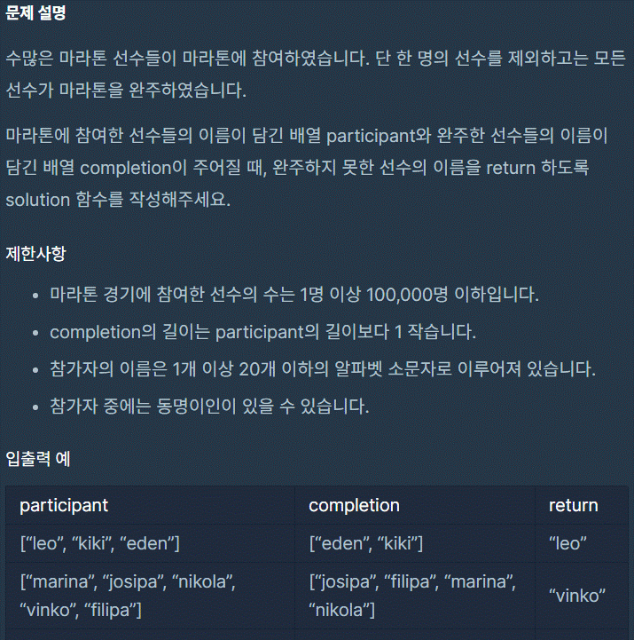

# 완주하지 못한 선수

<br>



```jsx
function solution(participant, completion) {
  participant.sort();
  completion.sort();

  for (let i = 0; i < participant.length; i++) {
    if (participant[i] !== completion[i]) {
      return participant[i];
    }
  }
}
```

<br>

다른사람 풀이

```jsx
const solution = (participant, completion) => {
  participant.find(name => !completion[name]--, completion.map(name => completion[name] = (completion[name] | 0) + 1));
}
```

<br>

**설명)**

1 . find의 두번째 콜백함수는 원래의미가 없다.

하지만 넣어준이유는 기존의 completion 배열의 값을 수정하기 위해서이다.

<br>

때문에 find의 두번쨰 콜백함수에 넣는것이아니라 코드 한줄위에 써주어도된다.

<br>

2 . 다시 두번째 콜백함수로 돌아가서 map을 써서 completion의 각 요소의 프로퍼티는 없으므로

`completion[name]` 에 할당하게 된다.

ex) 'kim' : 1 

<br>

만약 `completion[name]` 의 프로퍼티의 값과 키가 없는경우 undefined가 나오므로 단축평가(or)로

false인경우 0 + 1인 1로 할당하게된다.

<br>

하지만 이미 있다면 기존의 프로퍼티의 값에 + 1이된다.

<br>

3 . 두번째 콜백함수가 실행된뒤 completiond의 요소의 값이 바뀐후 

`participant.find` 인 find 고차배열함수는

true인 첫번째 요소를 반환한다.

<br>

`!completion[name]` 이 먼저 실행된고

`completion[name]—` 는 모든 연산이 끝난후 실행된다.

<br>

첫번째로 만약 `completion[name]`의 값이 undefinded 인경우 fasly에서 trusy로 불리언연산자로 바뀌게 되고

participant의 현재 요소가 반환된다.

<br>

즉, completion에는 없고 participant에만 있는 요소인경우,

<br>

두번째로 participant에서 중복된 이름의 값이 있는경우

뒤의 `- -` 감소연산자로 1로 줄어들게 된다.

<br>

그이후 한번더 찾을경우 `completion[name]`의 값이 0이므로 falasy에서 trusy로 바뀌어 그요소의 값을 반환한다.