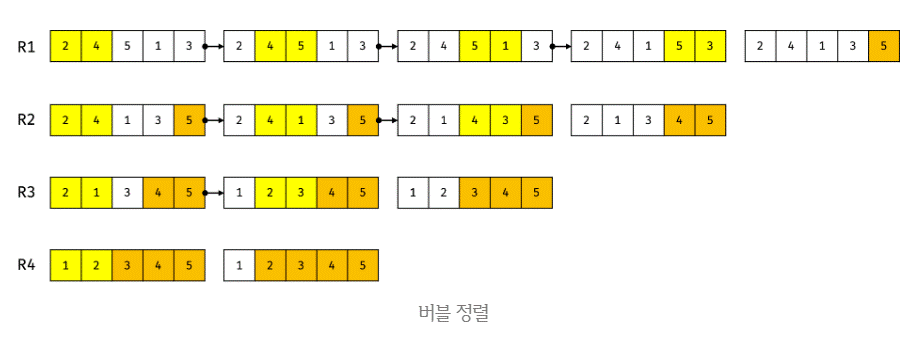

# 정렬

## 1. 정렬 확인

주어진 배열(array)이 정렬되어 있다면 true, 그렇지 않다면 false를 반환하는 함수를 구현하라. 단, 어떠한 빌트인 함수도 사용하지 않고 for 문을 사용하여 구현하여야 한다.

```js
function isSorted(array) {
  for(let i = 0; i < array.length - 1; i++){
    if(array[i] > array[i + 1]){
      return false
    }
  }
  return true;
}
console.log(isSorted([1, 2, 3, 4, 5])); // true
console.log(isSorted([2, 3, 4, 1, 5])); // false
```

## 2. 버블 정렬

버블 정렬(buble sort)은 순차적으로 배열을 순회하면서 인접한 두 요소를 비교하여 작은 요소를 왼쪽으로, 큰 요소를 오른쪽으로 교환한다.

버블 정렬은 가장 간단하지만 가장 느린 정렬 알고리즘이다.



시간 복잡도: O(n2)

버블 정렬을 통해 주어진 배열(array)을 정렬하는 함수를 구현하라. 단, 어떠한 빌트인 함수도 사용하지 않고 for 문을 사용하여 구현하여야 한다.
```js
function bubbleSort(array) {
  for(let i = array.length - 1; i > 0; i--){
    for(let j = 0; j < i; j++){
      let first = array[j];
      let second = array[j + 1];
      if(first > second){
        array[j] = second;
        array[j + 1] = first;
      }
    }
  }
  return array;
}
console.log(bubbleSort([2, 4, 5, 1, 3]));     // [1, 2, 3, 4, 5]
console.log(bubbleSort([5, 2, 1, 3, 4, 6]));  // [1, 2, 3, 4, 5, 6]
console.log(bubbleSort([3, 1, 0, -1, 4, 2])); // [-1, 0, 1, 2, 3, 4]
```

