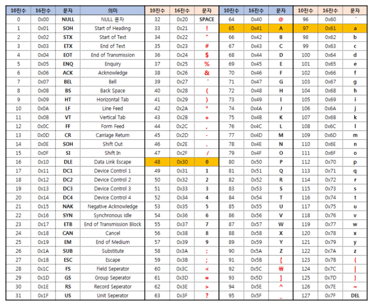

## 아스키 코드

 

**아스키코드(ASCII)** 는

**미국 정보 교환 표준부호**(American Standard Code for Information Interchange)의 

줄임말이다.

 

아스키코드는 **영문 알파벳**을 사용하는 **문자 인코딩**이다.

 

**어디에 사용될까?**

**컴퓨터와 통신장비**와 같은 곳에

**문자를 사용하는 많은 장치**에서 사용된다.

 

현대의 대부분의 **문자 인코딩**이 **아스키 코드에 기초**를 두고있다.

 

"컴퓨터의 기본 저장 단위는 1바이트(8비트)다

 

**하지만!**

아스키 코드는 **7비트** 즉, **128개의 고유한 값**만 사용한다.

 

**Why? 왜 아스키 코드는 7비트만 활용할까?** 

**1비트**를 **통신 에러 검출**을 위해 **사용**하기 때문이다.

 

그래서 **0~127**까지 각각 **고유한 값이 할당**되어 있는 걸 알 수 있다.

 

 

하지만..

 

**단점)**

오로지 **영문 알파벳만을 문자 인코딩**을 하다보니

비유럽 국가 특히 **한국, 중국, 일본과 같은 문자가 많은 국가**에서는 **여전히 제한적**이다.

 

**그렇기 때문에 생겨난 유니코드**

 
 

## 유니코드

 

**유니코드(Unicode)** 는

전 세계의 **모든 문자**를 **컴퓨터에서 일관되게 표현**하고

다룰 수 있도록 설계된 **산업 표준**이며,

**유니코드 협회(Unicode Consortium)** 가 **제정**한다.

 

**즉!**

**세계 언어의 문자를 정의**하기 위한 **국제 표준 코드** 이다!

 

**아스키코드**는 **7비트**인 2의 7승으로 **128개**만 **저장**이 가능했다.

→ 다른 언어들은 언어 개수가 훨 많기 때문에

 

**유니코드의 목적**

현존하는 **문자 인코딩 방법**들을 **모두 유니코드로 교체**하려는 것이다.

→ 위에 아스키코드는 **한정된 영문 알파벳**만 문자 인코딩을 해서 **제한적**이였다.

 
 

**유니코드는 용량이 어떻게 될까?**

**유니코드는 용량을 크게확장**한

**2byte** 인 2의 16승으로 **65536**개가 저장 가능한 **유니코드가 등장**했다!

 

**2byte의 영역**을 **기본다중언어판(BMP)** 이라 불렀다.

 

**하지만**

**기존 2바이트, 기본 다중언어판(BMP)** 만으로도 **더많은 언어**를 담기에는 **부족**했다.

 

**그렇기 때문에**

**유니코드 3.0**부터 **보충언어판(Supplementary Planes)** 을 추가로 정의했다.

 

**BMP(기본다중언어판, 기존의 2바이트 영역)의 일부**를

**상위대행**(high surrogates, **1024자**), **하위대행**(low surrogates, **1024자**)로 할당한 뒤

둘의 조합으로 **1024 x 1024 = 1,048,576** 약 **백만자가 넘는 문자**를 추가로 정의했다.

 

**2^16**(**65536**)개의 문자씩 담아 **17개 구역으로 분리**했다.

→1개의 기본언어판(BMP) + 16개의 보충언어판(SMP)

 

